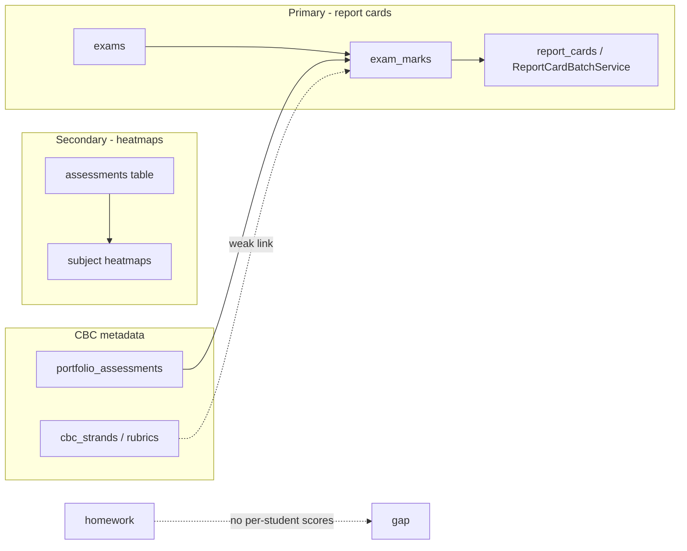
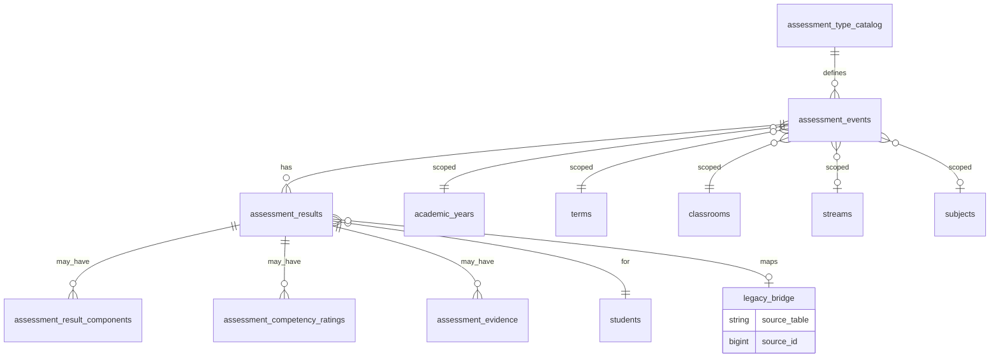
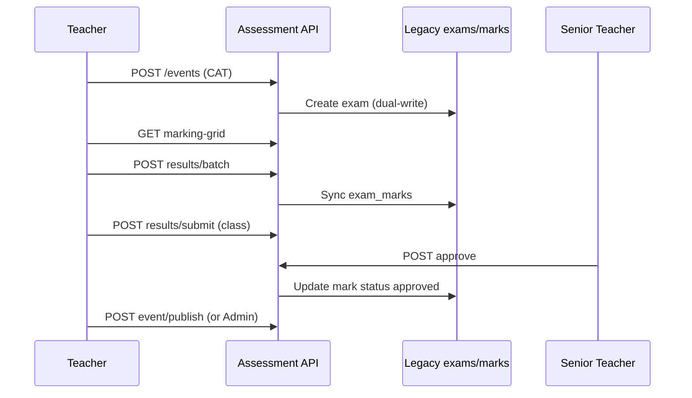
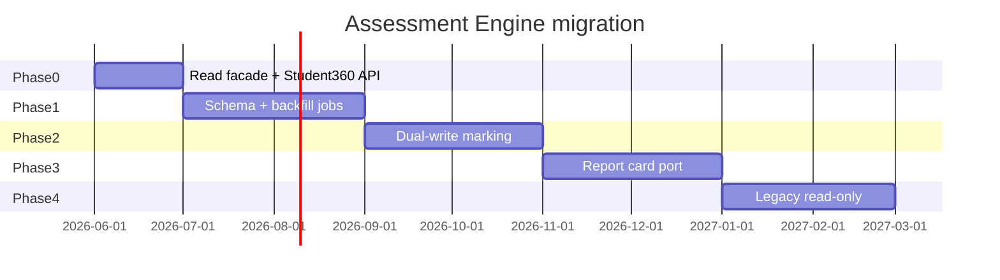

# Unified Assessment Engine — Design Specification

**Version:** 1.0  
**Date:** 2026-06-04  
**Status:** Architecture / transformation design (not implemented)  
**Audience:** Backend, mobile (Admin + Staff), product, academic leads  

**Related documents**

| Document | Relevance |
| --- | --- |
| [`docs/execution/student360-academic-audit.md`](../execution/student360-academic-audit.md) | Current API gaps for Student 360 academics |
| [`docs/system-audit/06-academic-audit.md`](../system-audit/06-academic-audit.md) | Dual-system diagnosis (`exams` vs `assessments` vs CBC) |
| [`docs/system-audit/10-future-state.md`](../system-audit/10-future-state.md) | Competency-first strategy |

---

## 1. Executive summary

The **Assessment Engine** is a single domain layer that models **all learner assessment events** (traditional exams, CATs, assignments, speed tests, projects, CBC formative/summative, portfolios, oral, practical) behind one consistent contract: **definition → capture → workflow → aggregation → reporting**.

**Design constraint (non-negotiable):** The engine **must not replace** the current `exams` / `exam_marks` system immediately. Legacy tables remain the **system of record** until Phase 4. New tables and APIs are introduced **alongside** legacy data, with explicit **legacy bridges** and **read facades** so Student 360, report cards, and teacher marking continue to work during migration.

**Outcomes for Student 360 (Admin App) and Staff App:**

| View | Engine deliverable |
| --- | --- |
| Assessment History | Chronological list of all `assessment_results` for a student (typed, filterable) |
| Exam History | Filtered history where `type ∈ {traditional_exam, cat, mock, …}` |
| Marks Timeline | Numeric score series (%, raw, grade) over time |
| Competency Timeline | Performance-level and strand/competency ratings over time |

---

## 2. Problem statement

Today the ERP runs **three parallel paths** (see academic audit):



| Gap | Impact |
| --- | --- |
| No student-scoped marks API | Student 360 must scrape class payloads or report cards only |
| Homework without scored submissions | “Assignments” not in academic history |
| CBC on marks is JSON + % mapping | Not outcome-level E.E./M.E./A.E./B.E. per sub-strand |
| `assessments` vs `exams` duplication | Inconsistent analytics and teacher UX |
| Speed tests / timed drills | Not modeled |
| Oral/practical as `assessment_method` enum only | No structured evidence or rubric workflow |

The Assessment Engine **unifies the read model and workflow** while **wrapping** legacy writes until cutover.

---

## 3. Design principles

1. **Strangler fig pattern** — New engine tables + APIs; legacy `exams`/`exam_marks` synced via adapters; no big-bang cutover.
2. **Event + result separation** — An *assessment event* (class/subject/term scope) has many *results* (per learner).
3. **Type plugin configuration** — Scoring mode, workflow, and report-card weight come from `assessment_type` + `scoring_profile`, not hard-coded per controller.
4. **Dual scoring tracks** — **Numeric** (%, grade, position) and **Competency** (performance level, strand outcomes) can coexist on one result.
5. **Evidence-first for non-written types** — Portfolio, oral, practical, project store `assessment_evidence` rows.
6. **Immutable published results** — Published/locked results versioned; corrections via adjustment records (audit).
7. **Scope-aware RBAC** — Same classroom/student scope rules as `ApiAcademicsController` and Senior Teacher supervision.
8. **Report card compatibility** — `ReportCardBatchService` consumes an **engine aggregation port** that defaults to legacy SQL until Phase 3.

---

## 4. Assessment type catalog

Canonical types (stored in `assessment_type_catalog.code`):

| Code | Display name | Scoring mode | Legacy mapping (Phase 0–2) |
| --- | --- | --- | --- |
| `traditional_exam` | Traditional Exam | Numeric (weighted) | `exams` where `type ∈ {midterm,endterm,mock,quiz}` and `is_cat = false` |
| `cat` | CAT (Continuous Assessment Test) | Numeric | `exams.is_cat = true`, `cat_number` |
| `assignment` | Assignment | Numeric / rubric | **New**; optional link `homework_id` |
| `speed_test` | Speed Test | Numeric (time-boxed) | **New** |
| `project` | Project | Rubric + numeric | `portfolio_assessments.portfolio_type = project` or new event |
| `cbc_formative` | CBC Formative | Competency levels | **New** primary; partial `exam_marks.competency_scores` |
| `cbc_summative` | CBC Summative | Mixed | `exams.exam_category = formative/summative` + marks |
| `portfolio` | Portfolio | Rubric / competency | `portfolio_assessments` (non-project types) |
| `oral` | Oral Assessment | Rubric / numeric | `exam_marks.assessment_method = oral` or new |
| `practical` | Practical Assessment | Component numeric | `exam_marks.assessment_method = practical`, `component_scores` |

**Modality flags** (on event): `physical`, `online`, `take_home`, `in_class`.

**Category** (aligns with existing `exams.exam_category`): `formative`, `summative`, `diagnostic`, `standardized`, `national`, `mock`.

---

## 5. Domain model



### 5.1 Core entities (new tables)

#### `assessment_type_catalog`

| Column | Type | Notes |
| --- | --- | --- |
| `id` | PK | |
| `code` | string unique | See §4 |
| `name` | string | |
| `scoring_mode` | enum | `numeric`, `competency`, `rubric`, `mixed`, `pass_fail` |
| `default_max_score` | decimal nullable | |
| `default_weight` | decimal nullable | For term aggregation |
| `workflow_profile` | string | e.g. `teacher_submit_senior_approve` |
| `report_card_bucket` | enum | `summative`, `formative`, `sba`, `co_curricular`, `exclude` |
| `is_active` | boolean | |

Seed rows for all nine types in §4.

#### `assessment_events`

Represents one assessable occasion (replaces mental model of “an exam” generically).

| Column | Type | Notes |
| --- | --- | --- |
| `id` | PK | |
| `uuid` | uuid unique | External API id |
| `assessment_type_id` | FK | → catalog |
| `title` | string | |
| `description` | text nullable | |
| `academic_year_id` | FK | |
| `term_id` | FK | |
| `classroom_id` | FK | |
| `stream_id` | FK nullable | |
| `subject_id` | FK nullable | Multi-subject events null |
| `learning_area_id` | FK nullable | CBC |
| `cbc_substrand_id` | FK nullable | CBC formative anchor |
| `created_by` | FK staff | |
| `assigned_to` | FK staff nullable | Marking owner |
| `starts_on` / `ends_on` | date nullable | |
| `due_at` | datetime nullable | Assignments |
| `duration_seconds` | int nullable | Speed tests |
| `max_score` | decimal | |
| `weight` | decimal | Term weight % |
| `sba_weight` | decimal nullable | From `exams.sba_weight` |
| `cat_number` | int nullable | 1–3 |
| `modality` | enum | |
| `exam_category` | enum nullable | |
| `status` | enum | `draft`, `open`, `marking`, `moderation`, `approved`, `published`, `locked` |
| `publish_results` | boolean | |
| `published_at` / `locked_at` | timestamp nullable | |
| `settings` | json | Type-specific (see §5.3) |
| `legacy_exam_id` | FK nullable unique | Bridge to `exams.id` |
| `legacy_homework_id` | FK nullable | Bridge to `homework.id` |
| `legacy_portfolio_batch_id` | nullable | Future |
| `timestamps` | | |

**Indexes:** `(term_id, classroom_id, subject_id)`, `(assessment_type_id, status)`, `(legacy_exam_id)`.

#### `assessment_results`

One row per **student × event** (optionally × subject if event is multi-subject via components).

| Column | Type | Notes |
| --- | --- | --- |
| `id` | PK | |
| `assessment_event_id` | FK | |
| `student_id` | FK | |
| `subject_id` | FK | Required when event is single-subject; else from component |
| `entered_by` / `updated_by` | FK users | Audit |
| `teacher_id` | FK staff nullable | |
| **Numeric track** | | |
| `score_raw` | decimal nullable | |
| `score_moderated` | decimal nullable | |
| `score_percent` | decimal nullable | Computed |
| `grade_label` | string nullable | |
| `descriptor` | string nullable | |
| **Competency track** | | |
| `performance_level_id` | FK nullable | → `cbc_performance_levels` |
| `pl_code` | string nullable | Denormalized E/M/A/B |
| **Workflow** | | |
| `status` | enum | `draft`, `submitted`, `approved`, `published` |
| `submitted_at` / `approved_at` | timestamp nullable | |
| `approved_by` | FK staff nullable | |
| `remark` | text nullable | |
| `subject_remark` | string nullable | |
| **Legacy bridge** | | |
| `legacy_exam_mark_id` | FK nullable unique | → `exam_marks.id` |
| `legacy_assessment_id` | FK nullable | → `assessments.id` |
| `legacy_portfolio_assessment_id` | FK nullable | → `portfolio_assessments.id` |
| `synced_at` | timestamp | Last legacy sync |
| `timestamps` / `soft_deletes` | | |

**Unique:** `(assessment_event_id, student_id, subject_id)`.

#### `assessment_result_components`

For multi-part exams (theory/practical), opener/midterm/endterm, speed-test sections.

| Column | Type | Notes |
| --- | --- | --- |
| `id` | PK | |
| `assessment_result_id` | FK | |
| `component_code` | string | e.g. `theory`, `practical`, `opener`, `section_a` |
| `label` | string nullable | |
| `score` | decimal nullable | |
| `max_score` | decimal nullable | |
| `weight` | decimal nullable | |
| `meta` | json nullable | Time taken, attempt count |

Maps to `exam_marks.component_scores` and opener/midterm/endterm columns.

#### `assessment_competency_ratings`

Structured CBC ratings (replaces ad-hoc JSON on marks over time).

| Column | Type | Notes |
| --- | --- | --- |
| `id` | PK | |
| `assessment_result_id` | FK | |
| `cbc_core_competency_id` | FK nullable | |
| `cbc_substrand_id` | FK nullable | |
| `cbc_strand_id` | FK nullable | |
| `performance_level_id` | FK | |
| `rubric_scores` | json nullable | |
| `evidence_note` | text nullable | |

Unique `(assessment_result_id, cbc_substrand_id)` when substrand set.

#### `assessment_evidence`

Files, audio, video, observation notes for portfolio/oral/practical/project.

| Column | Type | Notes |
| --- | --- | --- |
| `id` | PK | |
| `assessment_result_id` | FK | |
| `evidence_type` | enum | `file`, `image`, `audio`, `video`, `link`, `observation` |
| `storage_path` / `url` | string | |
| `caption` | string nullable | |
| `captured_at` | datetime nullable | |
| `uploaded_by` | FK | |

#### `assessment_event_subjects` (optional)

When one event spans multiple subjects (e.g. integrated project): `assessment_event_id`, `subject_id`, `max_score`, `weight`.

#### `assessment_aggregations` (materialized / cache)

Pre-computed term summaries per student for fast Student 360 and report cards.

| Column | Type | Notes |
| --- | --- | --- |
| `student_id` | FK | |
| `academic_year_id` | FK | |
| `term_id` | FK | |
| `subject_id` | FK nullable | Null = overall |
| `aggregation_key` | string | e.g. `term_numeric_avg`, `cat_1_avg` |
| `value_numeric` | decimal nullable | |
| `value_json` | json nullable | Competency rollup |
| `computed_at` | timestamp | |

---

### 5.2 Type-specific `settings` JSON schemas

| Type | `settings` keys |
| --- | --- |
| `traditional_exam` | `exam_type_id`, `exam_session_id`, `component_weights`, `grade_mapping`, `publish_exam` |
| `cat` | `cat_number`, `is_sba`, `competency_focus[]` |
| `assignment` | `homework_id`, `allow_late`, `rubric_id`, `submission_type` |
| `speed_test` | `question_count`, `time_limit_seconds`, `auto_grade` |
| `project` | `portfolio_type`, `group_allowed`, `milestones[]` |
| `cbc_formative` | `strand_ids[]`, `rubric_template_id`, `required_evidence_count` |
| `cbc_summative` | `national_assessment_code` (KPSEA/KJSEA future) |
| `portfolio` | `portfolio_type`, `evidence_min` |
| `oral` | `criteria[]`, `recording_required` |
| `practical` | `lab_station`, `safety_checklist`, `component_weights` |

---

### 5.3 Scoring and grade resolution

**Numeric path**

1. Sum components using `component_weights` (from event settings or exam).
2. `score_percent = (score_raw / max_score) * 100` (or moderated score if set).
3. Resolve `grade_label` via `ExamGrade` / `grade_mapping` on event (legacy parity).
4. Optionally map % → `performance_level_id` via `CBCPerformanceLevel::getByScore` (existing behaviour).

**Competency path**

1. Teacher selects level per sub-strand/competency (mobile rubric grid).
2. Store in `assessment_competency_ratings`.
3. Roll up to result `performance_level_id` (worst-case, mode, or weighted — **school setting**).

**Mixed path** (`cbc_summative`, some `cat`)

Both numeric and competency ratings required before `submitted`.

---

## 6. API design

Base path: **`/api/v2/assessments`** (new versioned namespace; v1 `/exams`, `/marks` unchanged).

Middleware: `auth:sanctum`, same permission helpers as academics.

### 6.1 Assessment events (teacher / admin)

| Method | Path | Purpose |
| --- | --- | --- |
| GET | `/events` | Paginated catalog (filters: `type`, `term_id`, `classroom_id`, `subject_id`, `status`) |
| POST | `/events` | Create event (type-driven validation) |
| GET | `/events/{uuid}` | Detail + marking metadata |
| PATCH | `/events/{uuid}` | Update (draft/open only) |
| POST | `/events/{uuid}/publish` | Publish event / open marking |
| POST | `/events/{uuid}/lock` | Lock after moderation |
| GET | `/events/{uuid}/marking-grid` | Class roster + existing results (replaces class-scoped `/marks` ergonomics) |

**Create body (example — CAT):**

```json
{
  "type": "cat",
  "title": "CAT 2 — Mathematics",
  "academic_year_id": 3,
  "term_id": 5,
  "classroom_id": 12,
  "stream_id": 4,
  "subject_id": 7,
  "cat_number": 2,
  "max_score": 30,
  "weight": 10,
  "starts_on": "2026-05-12",
  "ends_on": "2026-05-14"
}
```

**Phase 0–1 behaviour:** POST also creates/updates linked `exams` row when `type ∈ {traditional_exam, cat, cbc_summative}` and sets `legacy_exam_id`.

### 6.2 Results (marking)

| Method | Path | Purpose |
| --- | --- | --- |
| GET | `/events/{uuid}/results` | All results for event (class grid) |
| POST | `/events/{uuid}/results/batch` | Batch upsert (teacher matrix) |
| PATCH | `/results/{id}` | Single result update |
| POST | `/results/{id}/submit` | Submit for approval |
| POST | `/results/{id}/approve` | Senior Teacher / Admin approve |
| POST | `/results/{id}/evidence` | Upload evidence (multipart) |

**Batch body (numeric):**

```json
{
  "results": [
    {
      "student_id": 101,
      "score_raw": 27,
      "remark": "Strong problem solving",
      "components": [{ "component_code": "theory", "score": 20 }, { "component_code": "practical", "score": 7 }]
    }
  ]
}
```

**Phase 1 dual-write:** `AssessmentSyncService` mirrors to `exam_marks` when `legacy_exam_id` present.

### 6.3 Student-scoped reads (Student 360)

| Method | Path | Purpose |
| --- | --- | --- |
| GET | `/students/{student_id}/history` | Assessment History (all types) |
| GET | `/students/{student_id}/exams` | Exam History (`type` filter) |
| GET | `/students/{student_id}/marks-timeline` | Numeric series for charts |
| GET | `/students/{student_id}/competency-timeline` | Competency / PL series |
| GET | `/students/{student_id}/summary` | Term KPIs (avg, latest PL, counts) |

**Query params (common):** `academic_year_id`, `term_id`, `subject_id`, `type[]`, `from`, `to`, `page`, `per_page`.

#### `GET /students/{id}/history` — response shape

```json
{
  "data": [
    {
      "id": 9001,
      "event_uuid": "a1b2-...",
      "type": "cat",
      "type_label": "CAT",
      "title": "CAT 2 — Mathematics",
      "subject_id": 7,
      "subject_name": "Mathematics",
      "assessed_on": "2026-05-14",
      "score_display": "27/30",
      "score_percent": 90,
      "grade_label": "A",
      "performance_level": { "code": "M", "name": "Meeting Expectations" },
      "status": "published",
      "legacy_source": { "table": "exam_marks", "id": 44521 }
    }
  ],
  "meta": { "current_term_id": 5, "total": 42 }
}
```

**Phase 0 (no new tables):** Implement as **`AssessmentReadFacade`** querying `exam_marks`, `portfolio_assessments`, `assessments` with UNION + normalization — **ship Student 360 Academics tab without migration**.

### 6.4 CBC & portfolio

| Method | Path | Purpose |
| --- | --- | --- |
| GET | `/cbc/strands` | Read strands/substrands (mobile) |
| POST | `/events` (`type=cbc_formative`) | Create formative grid event |
| GET | `/events/{uuid}/rubric-grid` | Students × substrands matrix |
| POST | `/events/{uuid}/competency-ratings/batch` | Batch PL ratings |
| GET | `/students/{id}/portfolios` | Portfolio history |

### 6.5 Report card integration

| Method | Path | Purpose |
| --- | --- | --- |
| GET | `/report-cards/{id}/sources` | Provenance: which events fed the card |
| POST | `/aggregations/recompute` | Admin: rebuild term aggregates (class/term) |

Internal (not public): `AssessmentAggregationPort::forStudentTerm($studentId, $yearId, $termId)` consumed by `ReportCardBatchService` in Phase 3.

### 6.6 Permissions (align with existing)

| Permission | Scope |
| --- | --- |
| `assessments.view` | Read events/results in accessible classrooms |
| `assessments.create` | Create events |
| `assessments.enter` | Write results (Teacher, Senior Teacher supervised) |
| `assessments.approve` | Approve/moderate (Senior Teacher, Academic Admin) |
| `assessments.publish` | Publish/lock (Admin, Academic Admin) |
| `assessments.student.read` | Student-scoped history (inherits `assertUserCanAccessStudent`) |

Map to existing roles: Teacher, Senior Teacher (supervised `classroom_id`s via `User::getSupervisedClassroomIds()`), Academic Administrator, Admin, Secretary, Parent (published only).

---

## 7. User workflows

### 7.1 Teacher workflow



| Step | Action | Types |
| --- | --- | --- |
| 1. Plan | Create event from scheme/lesson or duplicate prior CAT | All |
| 2. Capture | Enter marks, rubric levels, upload evidence | Per type |
| 3. Review | Self-check grid completeness | All |
| 4. Submit | Lock teacher edit; status → `submitted` | Summative, CBC |
| 5. Publish | Visible to parents / Student 360 | After approval |

**Assignments:** Teacher creates `assignment` event linked to `homework_id`; scores stored in `assessment_results` (new — homework table stays instructions-only).

**Speed tests:** Teacher launches event; optional LMS integration writes results via batch API with `duration_seconds` in component meta.

**CBC formative:** Rubric grid per sub-strand; no numeric % required; feeds competency timeline.

### 7.2 Senior Teacher workflow

Senior Teachers supervise a **campus and/or classroom set** (existing `senior_teacher_classroom_assignments`).

| Capability | Description |
| --- | --- |
| Moderation queue | `GET /events?status=moderation&classroom_id∈supervised` |
| Approve/reject | `POST /results/{id}/approve` or bulk approve per event |
| Cross-subject view | All subjects in supervised classrooms (not only own teaching load) |
| Quality flags | Comment + request revision (status → `marking`) |
| Analytics | Class competency heatmaps (Phase 3+) |

**Parity:** Matches `ExamMarkController` rules where Senior Teacher may enter/approve marks for supervised classes.

### 7.3 Academic Administrator / Admin

- Configure `assessment_type_catalog`, weights, grade mappings.
- Term-wide publish and report card generation trigger.
- Lock terms (no further edits).
- Recompute aggregations.

### 7.4 Parent / Student (read-only)

- Published results only (`publish_results` + `status = published`).
- Student 360 / parent portal uses `/students/{id}/history` with same gating as report cards.

---

## 8. Student 360 integration

Target tab structure (Admin App — aligns with [`student360-academic-audit.md`](../execution/student360-academic-audit.md)):

| Sub-view | API (Phase 0) | API (Phase 2+) |
| --- | --- | --- |
| Academic Overview | `GET /students/{id}/stats`, `GET /report-cards/{latest}` | + `/students/{id}/summary` |
| Assessment History | Facade → report cards + optional class-sheet | `GET /students/{id}/history` |
| Exam History | Facade → filter `type=traditional_exam,cat,mock` | `GET /students/{id}/exams` |
| Marks Timeline | Report cards `show` multi-term OR facade exam marks | `GET /students/{id}/marks-timeline` |
| Competency Timeline | Not available (gap) | `GET /students/{id}/competency-timeline` |
| Report Cards | Existing `/report-cards` | Unchanged |

### 8.1 Timeline data contracts

**Marks timeline** — array of `{ date, subject_id, subject_name, type, score_percent, grade_label, event_title }`.

**Competency timeline** — array of `{ date, subject_id, substrand_id, substrand_name, performance_level_code, performance_level_name, source_type }`.

### 8.2 Client implementation notes

- TanStack Query keys: `['assessments', 'student', id, 'history', filters]`.
- Phase 0: single hook `useStudentAssessmentFacade` calling Laravel facade endpoint (can be `GET /students/{id}/assessment-history` implemented as read-only aggregator **without** new schema).
- Cache policy: 5 min stale; invalidate on report card publish webhook (future).

---

## 9. Report card integration

### 9.1 Current behaviour (unchanged in Phase 0–2)

`ReportCardBatchService`:

1. Loads `ExamMark` for student/term/year.
2. Averages per subject; applies `ExamGrade`.
3. Calls `CBCAssessmentService::generateReportCardData()` for CBC JSON blocks.

### 9.2 Engine integration (Phase 3)

Introduce interface:

```php
interface AssessmentAggregationPort {
    public function numericSubjectAverages(int $studentId, int $yearId, int $termId): Collection;
    public function cbcBlocks(int $studentId, int $yearId, int $termId): array;
    public function catBreakdown(int $studentId, int $yearId, int $termId): array;
    public function portfolioSummary(int $studentId, int $yearId, int $termId): array;
}
```

**Default implementation:** `LegacyExamMarksAggregation` (current SQL).  
**New implementation:** `EngineAssessmentAggregation` reading `assessment_results` + `assessment_aggregations`.

Report card columns (existing — no schema change required initially):

| Column | Engine source |
| --- | --- |
| `summary` | Numeric subject averages |
| `cat_breakdown` | Events where `type = cat` grouped by `cat_number` |
| `core_competencies` | Rollup from `assessment_competency_ratings` |
| `learning_areas_performance` | Group by `learning_area_id` |
| `portfolio_summary` | `type ∈ {portfolio, project}` |
| `performance_summary` | Narrative + overall PL |
| `overall_performance_level_id` | Weighted PL across subjects |

**Weighting rules** (configurable per school):

| Bucket | Default weight source |
| --- | --- |
| CATs | `assessment_events.weight` or `sba_weight` |
| Traditional exams | `exam_category = summative` |
| Formative CBC | May exclude from % average; include in PL only |
| Assignments | Typically formative; configurable |

### 9.3 PDF / mobile `show` payload

Extend mobile `GET /report-cards/{id}` to optionally include:

```json
{
  "cbc": { "...": "from DTO" },
  "assessment_sources": [
    { "event_uuid": "...", "type": "cat", "title": "CAT 1", "weight": 10 }
  ]
}
```

Backward compatible: omit keys when empty.

---

## 10. CBC compatibility

### 10.1 Mapping to KICD concepts

| KICD concept | Engine entity |
| --- | --- |
| Learning area | `subjects.learning_area` / `learning_areas` |
| Strand | `cbc_strands` |
| Sub-strand | `cbc_substrands` on event or rating |
| Core competency | `cbc_core_competencies` → `assessment_competency_ratings` |
| Performance level (E.E./M.E./A.E./B.E.) | `cbc_performance_levels` (migrate codes to MoE descriptors in config) |
| Portfolio evidence | `assessment_evidence` |
| SBA / CA | `type = cat`, `cat_number`, weights |

### 10.2 Dual-track report cards

Schools on **8-4-4 / exam-centric** mode: report cards emphasize numeric `summary`; CBC blocks optional.

Schools on **CBC-primary** mode: report cards emphasize `core_competencies` + `learning_areas_performance`; numeric appendix from summative events only.

**Setting:** `assessment.report_card_mode = numeric_first | cbc_first` (tenant/school).

### 10.3 Competency vs percentage

| Phase | Behaviour |
| --- | --- |
| Legacy | `CBCPerformanceLevel::getByScore($percent)` |
| Engine Phase 2+ | Formative ratings **drive** PL; summative % **feeds** separate summative section |
| Target | Per-outcome E.E./M.E./A.E./B.E. on `assessment_competency_ratings`, not derived from % alone |

---

## 11. Legacy bridge and sync services

### 11.1 `AssessmentLegacyBridge`

| Direction | Trigger | Action |
| --- | --- | --- |
| Legacy → Engine | Nightly job + on-demand | `ImportExamToEngineJob` for rows missing `legacy_exam_mark_id` |
| Engine → Legacy | On result save (Phase 1–3) | `SyncResultToExamMark` |
| Portfolio | One-way import | `portfolio_assessments` → `assessment_results` |

### 11.2 Idempotency

- Unique `legacy_exam_mark_id` on `assessment_results` prevents duplicates.
- Updates compare `updated_at`; conflict if legacy newer → queue reconciliation row in `assessment_sync_conflicts`.

### 11.3 What stays on legacy tables (until Phase 4)

| Concern | Table |
| --- | --- |
| Exam scheduling sessions | `exam_sessions`, `exam_schedules` |
| Exam groups / types | `exam_types`, `exam_groups` |
| Bulk import templates | `import_template_id` on exams |
| Historical archived marks | `exam_marks` (read-only archive) |

---

## 12. Migration strategy

**Principle:** Each phase delivers user value; rollback = disable dual-write and read facade only.



### Phase 0 — Unified read model (no new tables)

**Duration:** 4–6 weeks  
**Deliverables:**

- `AssessmentReadFacade` service + `GET /api/students/{id}/assessment-history` (or `/api/v2/assessments/students/{id}/history` implemented via UNION).
- Student 360 Academics tab (history, exam filter, marks timeline from facade + report cards).
- Document mapping table in runbook.

**Risk:** Low. No writes changed.

### Phase 1 — Schema + backfill

**Duration:** 6–8 weeks  
**Deliverables:**

- Migrations for §5.1 tables.
- Seed `assessment_type_catalog`.
- Backfill job: all `exam_marks` → `assessment_results` with `legacy_exam_mark_id`.
- Backfill: `portfolio_assessments` → results.
- Optional: weekly `assessments` → results.
- Admin dashboard: sync health (`assessment_sync_conflicts`).

**Risk:** Medium. Storage growth; validate counts match legacy.

### Phase 2 — Dual-write marking

**Duration:** 8–10 weeks  
**Deliverables:**

- Staff App + web marking UI writes **engine first** for pilot classes.
- `AssessmentSyncService` writes through to `exam_marks`.
- New types: `assignment`, `speed_test`, `cbc_formative` (no legacy row).
- Senior Teacher approval on engine status.

**Pilot:** One department / one term. Feature flag: `assessment.engine_marking_enabled`.

**Risk:** Medium. Sync bugs → reconciliation UI.

### Phase 3 — Report card aggregation port

**Duration:** 6–8 weeks  
**Deliverables:**

- `EngineAssessmentAggregation` behind feature flag `assessment.report_cards_from_engine`.
- Shadow mode: compare engine vs legacy aggregates; log diffs.
- Mobile: expose `cbc` + `assessment_sources` on report card show.
- Competency timeline API live.

**Risk:** High for grades. Require shadow period ≥ one full term.

### Phase 4 — Legacy deprecation

**Duration:** Ongoing  
**Deliverables:**

- Freeze new `exam_marks` writes; exams table becomes view/bridge only.
- Archive policy for legacy data.
- Remove dual-write; `exam_marks` populated by batch export if needed for external systems only.

**Rollback per phase:** Feature flags revert reads/writes to previous phase without data loss (engine rows kept).

---

## 13. Data migration scripts (outline)

| Job | SQL / logic |
| --- | --- |
| `BackfillAssessmentEventsFromExams` | Insert `assessment_events` for each `exams` row; set `legacy_exam_id` |
| `BackfillResultsFromExamMarks` | Insert results + components from `component_scores`, opener/midterm/endterm |
| `BackfillPortfolio` | Map `portfolio_assessments` → events + results + evidence |
| `BackfillWeeklyAssessments` | Map `assessments` table → `type=assignment` or `cat` based on `assessment_type` string |
| `RebuildAggregations` | Populate `assessment_aggregations` per student/term |

**Validation:** `COUNT(exam_marks) = COUNT(assessment_results WHERE legacy_exam_mark_id IS NOT NULL)` per term.

---

## 14. Non-functional requirements

| Area | Target |
| --- | --- |
| Marking grid load | < 500 ms for 40 students (indexed event_id) |
| Student history | < 300 ms for 50 events (indexed student_id, assessed_on) |
| Audit | All result changes append to `audit` json (parity with `exam_marks.audit`) |
| Soft delete | Results soft-delete; published results require adjustment record |
| Multi-tenant | `school_id` / tenant column when SaaS split (future) |

---

## 15. Open decisions (for product sign-off)

| # | Question | Recommendation |
| --- | --- | --- |
| 1 | Homework: extend `homework` with submissions vs only engine? | Add `homework_submissions` later; engine stores scores in Phase 2 |
| 2 | Retire `assessments` weekly table? | Stop writes after Phase 2; import historical only |
| 3 | MoE PL codes E.E./M.E./A.E./B.E. vs E/M/A/B | Config migration on `cbc_performance_levels` |
| 4 | Speed test product scope | v1: teacher-entered scores; v2: question bank |
| 5 | API version cutover | Keep `/api/exams` indefinitely; document deprecation timeline |

---

## 16. Implementation checklist (engineering)

- [ ] Phase 0: `AssessmentReadFacade` + student history route + Student 360 hooks
- [ ] Phase 1: Migrations + catalog seed + backfill commands
- [ ] Phase 1: `AssessmentSyncService` (engine → legacy) stub
- [ ] Phase 2: POST `/events` + batch results with feature flag
- [ ] Phase 2: Senior Teacher moderation queue API
- [ ] Phase 3: `AssessmentAggregationPort` + shadow compare in `ReportCardBatchService`
- [ ] Phase 3: Extend `ApiReportCardController::show` with CBC + sources
- [ ] Phase 4: Deprecation notice + read-only legacy guards

---

## 17. Summary

The Unified Assessment Engine introduces a **type-aware event/result model** with **numeric and competency tracks**, **evidence support**, and **student-scoped read APIs** required for Student 360 — while **bridging** `exams`, `exam_marks`, `portfolio_assessments`, and weekly `assessments` through a phased migration. Report cards continue to work via `ReportCardBatchService` until an aggregation port is proven in shadow mode. Teachers and Senior Teachers gain consistent workflows across all nine assessment types without a disruptive cutover of the existing exam system.
