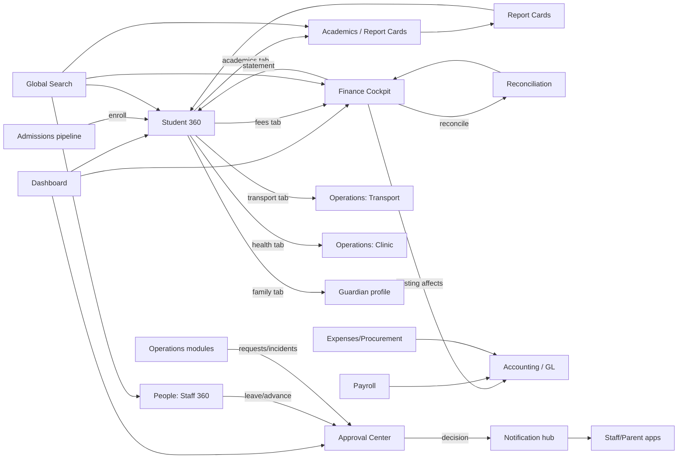

# 02 — Admin App Information Architecture (IA)

> **Purpose:** The bridge between [discovery](./01-admin-discovery.md) and UI design. Decides *what appears in the menu, what's on the dashboard, what's grouped, what's hidden, what's configurable* — so Stitch/Figma never have to be re-designed later.
> **Authored as:** Product Designer · ERP Consultant · UX Architect. **No code.**
> **Inputs:** [`01-admin-discovery.md`](./01-admin-discovery.md), [`../system-audit/`](../system-audit/), [`../prd/`](../prd/), [`../app-split/`](../app-split/), and the stakeholder-approved navigation proposal.

---

## Design principles (the rules every IA decision follows)

1. **Expose business workflows, not implementation details.** "Billing / Collections / Reconciliation" — not "Voteheads / Posting / Invoices".
2. **Group by mental model.** "People", "Operations", "Student 360" match how school staff think.
3. **One object, one home — many tabs.** A student/parent/staff member has a single profile with tabs; no scattered menu items.
4. **Capture lives elsewhere.** The Admin App **configures, approves, oversees, reports**. Marking attendance, entering marks, paying fees → Staff/Parent apps.
5. **Permission-first + branch-scoped.** Menus render only what the role can access; everything is scoped to the active branch/tenant.
6. **Shallow + searchable.** Max 2 levels of menu; global search and an approvals inbox keep deep features reachable.
7. **Progressive disclosure.** Advanced/rare config is "hidden" under module Settings, not in primary nav.

---

# 1. Navigation Tree

Adopted from the approved proposal, with three architect refinements (noted with ▸).

```text
Admin App
│
├── 🏠 Dashboard
│   ├── Overview
│   ├── Approvals            ▸ same data as global Approval Center (entry point)
│   └── Alerts
│
├── 🎓 Admissions
│   ├── Applications         (pipeline / funnel)
│   ├── Enrollment
│   └── Transfers
│
├── 👤 Students
│   ├── Student 360          (list → profile with tabs)
│   ├── Categories
│   ├── Promotion
│   └── Alumni
│
├── 📚 Academics
│   ├── Structure            (classes, streams, subjects, learning areas, teacher assignment)
│   ├── Timetable
│   ├── CBC                  (curriculum library, performance levels, rubrics, coverage)
│   ├── Assessments          (exams setup, schedules, grading, publishing, moderation)
│   └── Report Cards
│
├── 💰 Finance               → see §10 Finance Cockpit
│   ├── Dashboard
│   ├── Billing
│   ├── Collections
│   ├── Reconciliation
│   ├── Accounting           (GL, journals, statements, budgets)
│   └── Payroll
│
├── 🧑‍🤝‍🧑 People             (was "HR")
│   ├── Staff                (directory → Staff 360)
│   ├── Leave
│   ├── Attendance           (staff attendance oversight)
│   ├── Performance
│   └── Roles & Permissions
│
├── 🚌 Operations
│   ├── Transport
│   ├── Inventory
│   ├── Procurement
│   ├── Library
│   ├── Clinic
│   ├── Visitors
│   └── Security             ▸ added (incident log + audit/security center)
│
├── 💬 Communication
│   ├── Messages             (composer + chat + delivery)
│   ├── Announcements        (+ circulars)
│   └── Templates
│
├── 📊 Reports
│   ├── Academic
│   ├── Finance
│   ├── Operations
│   └── Executive            (board pack)
│
└── ⚙️ Settings
    ├── School               (identity, branding, branches, calendar)
    ├── Academic
    ├── Finance
    ├── Communication
    └── Integrations
```

**▸ Refinements & rationale**
- **Operations → Security added.** Visitors needs a sibling Security surface (incident log + audit/security center) so the Security Officer role has a home. Platform-level audit/backup still mirrors into Settings.
- **Dashboard → Approvals** is an *entry point* to the **global Approval Center** (§8), which is also reachable from a persistent top-bar badge. Same data, two doors.
- **Report Cards kept under Academics** (it's an academic output), while **Reports** (top-level) is for cross-module analytics/board pack.

**Persistent chrome (always visible, not in the tree):**
- Top bar: **Branch switcher** · **Global search** (§6) · **Notifications bell** (§7) · **Approvals badge** (§8) · profile/role menu.
- These are platform affordances, not menu items.

---

# 2. Menu Structure

## 2.1 Two-tier model
- **Primary nav (left rail / drawer):** the 11 top-level areas above.
- **Secondary nav (per area):** the sub-items (rendered as tabs or a section sub-menu).
- **Tertiary:** tabs *within* a screen (e.g. Student 360 tabs) — never in the menu.

## 2.2 What is hidden (deliberately not top-level)
| Hidden item | Where it lives now |
|-------------|--------------------|
| Family, Parent Info, Medical, Academic History, Discipline | **Tabs in Student 360** (§9) |
| Voteheads, Fee Structures, Posting | **Finance → Billing** (+ Settings → Finance for config) |
| Invoices, Payments, Receipts | **Finance → Collections** |
| Bank statements, M-Pesa, Transaction fixes | **Finance → Reconciliation** |
| Statements, Balances, Clearance | **Finance → Collections / Reports → Finance** |
| Concessions, Discounts, Plans | **Finance → Billing** (actions) |
| Journals, Chart of Accounts, Expenses, Vouchers, Vendors | **Finance → Accounting** |
| Lesson plans, Schemes, Homework, Diaries, Behaviours | **Academics → CBC/Assessments** (oversight) or Staff App (capture) |
| Reason codes, Notification rules | **Settings → Academic / Communication** |
| Payment methods, thresholds, doc settings, geofence | **Settings → Finance / School** |
| Activity/System logs, Backup | **Operations → Security** + **Settings → School** |

## 2.3 Permission-first menu rendering
The menu is **computed from the user's permissions** (not hard-coded per role). A menu item shows only if the user holds ≥1 permission within it.

| Area | Primarily for (example roles) |
|------|-------------------------------|
| Dashboard | All admin roles (role-shaped content) |
| Admissions | Admin, Secretary, Receptionist, Principal |
| Students | Admin, Secretary, Academic Director, Teacher (read-scoped) |
| Academics | Academic Director, Head Teacher, Senior Teacher, Admin |
| Finance | Finance Director, Bursar, Accountant, Admin |
| People | HR Officer, Principal, Admin, Secretary |
| Operations | Transport Manager, Store Keeper, Librarian, Nurse, Security Officer, Admin |
| Communication | Admin, Secretary, Principal |
| Reports | Leadership + module owners (scoped) |
| Settings | Admin, Super Admin (+ scoped module settings) |

> Super Admin sees all; everyone else sees least-privilege. Branch switcher only shows branches the user is entitled to.

## 2.4 Adaptive nav (role presets)
The same tree, with **role landing + collapsed irrelevant areas**:
- **Principal/Director:** lands on Dashboard Overview; Reports/Executive prominent.
- **Bursar/Accountant:** lands on Finance Dashboard; People/Academics collapsed.
- **Academic Director/Head Teacher:** lands on Academics; Finance read-only/collapsed.
- **Receptionist:** Admissions + Operations(Visitors) + Communication.
- **Librarian/Store Keeper/Nurse/Transport Manager/Security:** land directly in their Operations sub-area.

---

# 3. Dashboard Architecture

The Dashboard is a **composable widget canvas**, role-aware and branch-aware, with a **period selector** (term/year) in the header. Three tabs map to the nav: **Overview · Approvals · Alerts**.

## 3.1 Overview (role-shaped widgets)
Widgets are permission-gated; each tile = metric + sparkline + tap-through.

| Widget | Audience | Taps to |
|--------|----------|---------|
| Enrollment & attendance today | Exec/Academic | Students / Attendance |
| Fee collection vs target (donut + trend) | Exec/Finance | Finance Dashboard |
| Outstanding balances / defaulters | Finance | Collections |
| Unreconciled transactions | Finance | Reconciliation |
| Staff present (clock) | Exec/People | People → Attendance |
| Pending approvals (count by type) | All approvers | Approval Center |
| Admissions funnel | Admin/Principal | Admissions |
| Marks-submission / coverage progress | Academic | Academics |
| Report-card publish status | Academic | Report Cards |
| Incidents / visitors today | Security/Reception | Operations |
| Transport: trips active / on-route | Transport | Operations → Transport |
| Quick post announcement | Admin | Communication |

## 3.2 Approvals tab
Embedded **Approval Center** (§8) — the primary work surface for principals/HoDs/finance.

## 3.3 Alerts tab
**Early-warning & system signals**, prioritized:
- Academic: at-risk attendance, coverage behind schedule, unpublished results past deadline.
- Finance: defaulter spikes, failed payments, reconciliation backlog, budget overspend.
- Operations: low stock, overdue library, expiring vehicle/staff documents, open incidents.
- Platform: integration/webhook failures, backup status, sync errors.

## 3.4 Widget rules
- **Loading:** skeleton tiles. **Empty:** "No data for selected period." **Error:** inline retry; never blank the whole dashboard (cached fallback).
- **Personalization (P1):** users can reorder/hide widgets; tenants can set defaults per role.
- **Drill-through is mandatory:** every metric links to its source screen with filters pre-applied.

---

# 4. Screen Relationships

How screens link so navigation feels connected (not siloed). Arrows = "navigates to with context".



**Key relationship rules**
- **Student 360 is the hub** for everything about a learner; all learner-related screens link *into a tab* of it, not to standalone pages.
- **Guardian/Staff profiles** mirror the 360 pattern (one object, tabs).
- **Approvals are produced everywhere, decided in one place** (Approval Center), and decisions fan out via the Notification hub.
- **Finance posting/payroll/expenses all flow into the GL** (Accounting) — visible as a relationship, not a manual step.
- **Search is a cross-cutting entry** into any object.

---

# 5. User Journeys

Representative end-to-end flows (the IA must make each ≤ 3 taps from a logical start).

### J1 — Principal morning review
Dashboard ▸ Overview (attendance + collection tiles) → Approvals badge (5) → clear leave/lesson-plan approvals → Alerts (coverage behind) → post announcement. *Single screen + inbox; no module hopping.*

### J2 — Enroll a new student
Admissions ▸ Applications → open application → verify documents → **Enroll** → auto-creates **Student 360** (lands on profile) → assign class/stream + fee structure → first invoice posted. *Pipeline → profile, contextual.*

### J3 — Bursar reconciles M-Pesa
Finance ▸ Reconciliation → unmatched queue → open item → smart-match suggestions → share across siblings / confirm → balance updates → (maker-checker) second approver confirms. *One queue, not four payment screens.*

### J4 — Publish term results (CBC)
Academics ▸ Assessments → verify marks submitted → **moderation** → Report Cards → batch generate (CBC format) → **publish** → parents notified. *Linear, gated.*

### J5 — Approve leave with cover
Dashboard ▸ Approvals (or bell) → leave request → view balance + who's-out calendar → assign cover → approve → requester + cover notified. *Decision + context in one place.*

### J6 — Resolve a parent fee query
Global search "Achieng" → Student 360 ▸ Fees tab → statement → record/adjust or send reminder → chat parent. *Search → 360 → action.*

### J7 — Store keeper handles a requisition
Operations ▸ Procurement → approve requisition → raise PO → goods receipt → stock updates → (budget encumbrance). *Workflow, not CRUD.*

### J8 — Nurse logs a clinic visit
Operations ▸ Clinic → new visit (student via search) → symptoms/treatment/medication → parent auto-notified → flags recurring condition on Student 360 health tab.

---

# 6. Search Strategy

A **persistent global search** in the top bar is the fastest path to any object — essential when menus are intentionally shallow.

## 6.1 Scope & ranking
| Entity | Match on | Opens |
|--------|----------|-------|
| Students | name, admission no, class | Student 360 |
| Guardians/Parents | name, phone | Guardian profile |
| Staff | name, staff no, role | Staff 360 |
| Invoices/Payments | invoice no, receipt no, M-Pesa code | Finance detail |
| Classes/Subjects | name/code | Academics |
| Vehicles/Routes | reg, route name | Operations → Transport |
| Books/Items | title/SKU | Library/Inventory |
| Settings/actions | label | direct deep-link |

- **Tenant + branch + permission scoped** (never returns cross-tenant or unauthorized results).
- **Ranking:** exact ID > name prefix > fuzzy; recents boosted.
- **Type-ahead** with grouped results by entity; Enter → full results page with filters.

## 6.2 Scoped & contextual search
- Each list screen has its own filter/search (class, status, date, votehead, etc.).
- **Command palette (P1):** `⌘K`/`Ctrl-K` for power users — jump to screen, run action ("record payment for…"), or search.
- **Saved searches/segments (P2):** e.g. "Grade 6 defaulters > 30 days".

## 6.3 States
Loading skeleton; "No results"; "You don't have access to N hidden results" (transparency without leakage).

---

# 7. Notification Strategy

Three surfaces, one event backbone (the platform event bus). Every notification is **deep-linked** to its target screen.

## 7.1 Surfaces
| Surface | Use |
|---------|-----|
| **In-app bell** (top bar) | Persistent inbox; read/unread; filter by category |
| **Push** (Admin App) | Time-sensitive: approvals, payment failures, incidents, integration outages |
| **Email/SMS/WhatsApp** | Out-of-app escalation per preference (mostly for staff/parents via Staff/Parent apps) |

## 7.2 Categories (channels)
`approvals` · `finance` (failed payments, reconciliation, budget) · `academics` (publish deadlines, coverage) · `operations` (low stock, incidents, transport) · `hr` (leave, documents expiring) · `system` (webhook/backup/sync) · `announcements`.

## 7.3 Rules
- **Deep-link payload:** `{type, route, entityId, branchId}` → opens exact screen.
- **Targeting:** role + scope aware (a bursar gets finance, not clinic).
- **Preferences & quiet hours:** per-user, per-category; respects opt-outs.
- **Actionable notifications:** approve/reject directly from the bell for simple items.
- **Digest (P2):** daily/weekly summary option for leadership.
- **Severity:** info / warning / critical (critical may bypass quiet hours, e.g. payment outage).

---

# 8. Approval Center Design

The single most impactful IA decision: replace ~10 bespoke approve/reject screens with **one inbox + a configurable workflow engine**.

## 8.1 What it unifies
Leave · Salary advances · Expenses · Requisitions/POs · Lesson plans/schemes · Fee concessions/discounts · Online admissions · Staff profile changes · Driver-change & transport special assignments · (future) journal/disbursement maker-checker.

## 8.2 Layout
- **Left:** filters — type, urgency, requester, branch, age, amount.
- **Center:** queue list (requester, type, summary, amount, age, SLA flag).
- **Right (detail drawer):** full request + context (e.g. leave balance, budget impact, student fee history) + **Approve / Reject (reason) / Escalate / Request info**.
- **Header:** counts by type; **bulk approve** for low-risk batches.

## 8.3 Engine behavior
- **Configurable multi-step** per type/tenant (e.g. expense > threshold → 2-step).
- **Maker-checker** for financial actions (payments, vouchers, journals, disbursements).
- **SLA & escalation:** overdue items escalate to next approver; surfaced in Alerts.
- **Audit:** every decision logged (actor, before/after, reason, timestamp).
- **Notifications:** requester + next approver notified; decision deep-links back.

## 8.4 States
Empty: "No pending approvals 🎉". Loading: list skeleton. Error: per-item action error → rollback + toast.

## 8.5 Entry points
Dashboard ▸ Approvals tab · top-bar badge · category notifications · module screens ("Send for approval").

---

# 9. Student 360 Design

One profile per learner; **everything about the student is a tab**, eliminating ~6 scattered menu items (the biggest UX win in discovery).

## 9.1 Structure
```text
Student 360  (header: photo, name, adm no, class/stream, status, fee-balance chip, quick actions)
├── Overview        (snapshot: attendance %, latest results, fee balance, alerts, next event)
├── Academics       (subjects, exams, CBC competency progress, timetable)
├── CBC & Portfolio  (strand performance levels, portfolio evidence)
├── Report Cards    (term reports, publish status, download)
├── Attendance      (calendar, trends, at-risk)
├── Fees            (statement, invoices, payments, balance, plan, pay/record)
├── Family          (guardians, siblings, contacts, family-update link)
├── Health          (medical profile, clinic visits) ← Clinic module
├── Discipline      (behaviour/incidents, merit/demerit) ← Discipline
├── Transport       (route, drop-point, pickup history) ← Transport
├── Requirements    (collected items vs template)
└── Documents       (admission docs, certificates, generated docs)
```

## 9.2 Behavior
- **Header quick actions** (permission-gated): record payment, send message, generate document, transfer/promote, archive.
- **Tabs are permission-gated** (a nurse sees Health; a bursar sees Fees; a teacher sees Academics — scoped).
- **Cross-links:** Fees tab → Finance detail; Report Cards → Academics; Family → Guardian profile.
- **Lifecycle aware:** active vs alumni vs archived clearly indicated; archived shows read-only history + restore.
- **Audit:** changes tracked; sensitive tabs (Health/Discipline) access-logged.

## 9.3 Patterns reused
- **Guardian 360** and **Staff 360 (People)** follow the same one-object-many-tabs pattern (Staff 360: Profile, Employment, Payroll/Payslips, Leave, Attendance, Performance, Documents).

## 9.4 States
Header skeleton + per-tab skeleton; empty per tab ("No results published yet"); error per tab with retry; offline → cached read-only.

---

# 10. Finance Cockpit Design

Replaces ~25 implementation-detail finance menus with **6 workflow areas**. (Per stakeholder structure + discovery.)

```text
Finance
├── Dashboard        KPIs: collected vs target, outstanding, defaulters, unreconciled, M-Pesa feed, budget vs actual
├── Billing          Fee catalog (voteheads/structures) · posting (preview→commit→reverse) · concessions/discounts/plans
├── Collections      Invoices · payments (record/allocate/reverse) · statements · balances · clearance · defaulters
├── Reconciliation   Bank/M-Pesa C2B unmatched queue · smart-match · confirm/reject/share · transaction-fix audit
├── Accounting       Chart of accounts · journal entries (GL) · trial balance/P&L/BS/cash flow · budgets · expenses/vouchers/vendors · period close
└── Payroll          Salary structures · run (generate/process/lock) · payslips · advances · statutory → posts to GL
```

## 10.1 Area intents
| Area | Job-to-be-done | Primary role |
|------|----------------|--------------|
| Dashboard | "How are we doing financially?" | Finance Director, Principal |
| Billing | "Define and charge fees correctly." | Bursar, Accountant |
| Collections | "Bring money in and show balances." | Accountant, Cashier |
| Reconciliation | "Match money to students." | Accountant, Bursar |
| Accounting | "Keep the books and report." | Finance Director, Accountant |
| Payroll | "Pay staff and post to books." | Finance Director, HR Officer |

## 10.2 Cross-area rules
- **Posting (Billing) and Payroll and Expenses auto-post to the GL (Accounting)** — shown as a flow, not a manual re-entry.
- **Maker-checker** applies in Collections (payments/reversals), Reconciliation (share/confirm), and Accounting (journals/disbursements).
- **Branch-scoped** everywhere; consolidated views for group finance with permission.
- **Statements/balances** also surface inside **Student 360 ▸ Fees** and **Reports ▸ Finance**.

## 10.3 Settings split
Config (payment methods, bank accounts, thresholds, document/receipt settings, gateway credentials, COA setup, grading of fees) lives in **Settings ▸ Finance**, keeping the cockpit task-focused.

## 10.4 States
Dashboard: skeleton tiles + cached fallback. Reconciliation queue: "All transactions reconciled." Posting: dry-run preview before commit. Statements: async PDF for large batches.

---

## Approval gate → next step

This IA is the contract for UI design. **Once approved**, proceed exactly as planned:

1. **Stitch (Stage 1):** design the **design system + 5 core frames** — Dashboard, Student 360, Finance Cockpit, CBC, Settings — *not* all 55 screens.
2. **Figma (Stage 2):** only if Stitch output needs refinement.
3. **Build (Stage 3):** Admin App foundation (Auth, Navigation, Dashboard, Role Management) → then module-by-module.

> Companion next docs: `03-admin-ui-specs.md` (per-screen specs for the 5 core frames, mirroring [`../app-split/06-ui-specifications.md`](../app-split/06-ui-specifications.md)) and `04-design-system.md` (tokens/components) — generated **after** IA sign-off.

## Open decisions for sign-off
1. **Security** as an Operations sibling (proposed) vs folded into Settings/Reports — confirm placement.
2. **Reports** top-level vs surfacing analytics inside each module — confirm we keep a dedicated Reports area.
3. **Personalizable dashboard** in v1 or P1.
4. **Command palette (⌘K)** in v1 or P1.
5. Branch switcher granularity (per-screen scope vs global session scope).
