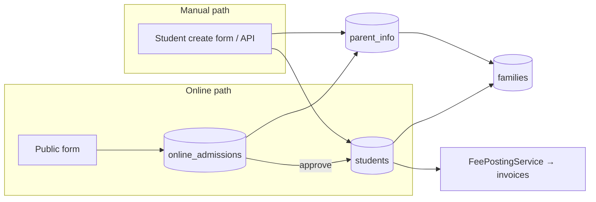
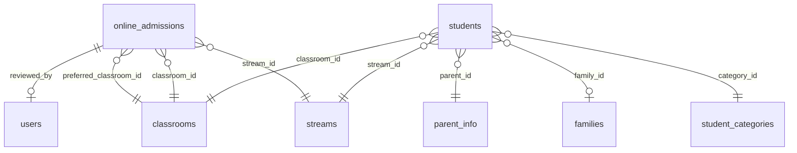
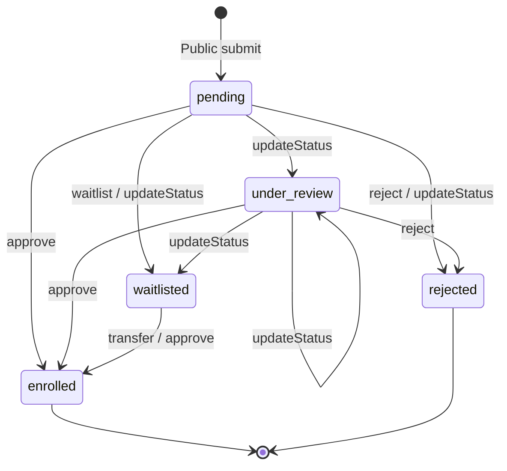
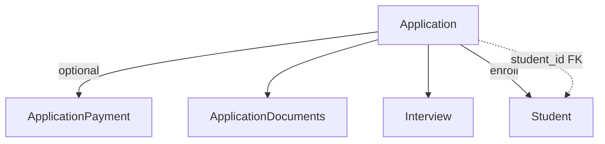

# 01 — Admissions Domain Audit (Laravel ERP)

**Status:** Complete (read-only discovery)  
**Scope:** Admissions lifecycle across web portal, database, APIs, roles, documents, payments, and gaps for Admin App implementation.  
**No application code** was written for this exercise.

**Primary sources:** `OnlineAdmissionController`, `StudentController`, `ApiStudentWriteController`, migrations on `online_admissions` / `students`, `routes/web.php`, `routes/api.php`, `FamilyLinkingService`, `FeePostingService`, `FileDownloadController`, existing audits in `docs/system-audit/` and `docs/admin-app/`.

---

## Executive summary

The ERP implements admissions as **two parallel paths** that both end in a **`students` row**, not as a formal multi-entity pipeline:

| Path | Entry | Record type | Enrollment |
|------|--------|-------------|------------|
| **Online admission** | Public form `/online-admissions/apply` | `online_admissions` (applicant) | Admin **approve** → creates `Student` + `ParentInfo` |
| **Manual admission** | `students/create` (web) or `POST /api/students` (mobile) | None (direct student) | Immediate `Student::create` |

There is **no** separate `applicants` table, **no** interviews module, **no** admission assessments, **no** application-fee billing, and **no** REST API for the online admissions queue. Spatie permissions `admissions.*` exist in seeders but are **not** wired to web routes (role middleware only).

---

# 1. Current Admission Architecture

## 1.1 Domain model (conceptual)

The product language uses Applicant → Admission → Enrollment → Student, but the **implementation** collapses several steps:



| Concept | Implementation |
|---------|----------------|
| **Applicant** | Row in `online_admissions` (no `Applicant` model name) |
| **Admission (application)** | Same row; `application_status` drives workflow |
| **Enrollment** | `approve()` / `transferFromWaitlist()` sets `enrolled=true`, `application_status=enrolled`, assigns class/stream |
| **Student** | New `students` record with generated `admission_number` |

**Missing link:** `online_admissions` has **no `student_id` FK**. After enrollment, the only tie is `enrolled=true` on the application row; finding the created student requires matching name/DOB or operational memory.

## 1.2 Online admission

| Aspect | Detail |
|--------|--------|
| **Controller** | `App\Http\Controllers\Students\OnlineAdmissionController` |
| **Public routes** | `GET/POST /online-admissions/apply` (no auth) |
| **Admin routes** | Prefix `online-admissions` under auth + `role:Super Admin\|Admin\|Secretary` |
| **Feature flag** | Setting `enable_online_admission` exists in Settings UI but is **not checked** in the controller (form always reachable if URL is known) |
| **Default status** | `application_status = pending`, `application_source = online` |
| **Class at apply** | `preferred_classroom_id` only; `classroom_id` / `stream_id` null until review/enroll |

**Captured at apply:** Student bio, preferred class, parents (father/mother/guardian + phones/emails/ID numbers), passport photo, birth certificate, father/mother ID documents, medical flags, residential area, transport preference, previous school + transfer reason (UI for Grade+), emergency contact.

**Not captured on public form:** `nemis_number`, `knec_assessment_number` (columns exist; admin can set at enroll via student copy only if present on application — typically empty).

## 1.3 Manual admission

| Aspect | Detail |
|--------|--------|
| **Web** | `StudentController::create` + `store` — full registry form with sibling mapping (`copy_family_from_student_id`) |
| **API** | `POST /api/students` (`ApiStudentWriteController::store`) — Super Admin / Admin / Secretary only |
| **Admission context** | None; no `online_admissions` row; no pipeline status |
| **Side effects** | Same as online enroll: `generateNextAdmissionNumber()`, `FamilyLinkingService`, optional transport fee, `FeePostingService::chargeFeesForNewStudent`, welcome comms (web only for `sendAdmissionCommunication`) |

Manual admission is **functionally “direct enrollment”** bundled under Students, not under an Admissions module.

## 1.4 Applicant records

- **Table:** `online_admissions` only.
- **Cardinality:** One row per application; “Submit & Add Another” creates multiple rows for siblings in one session.
- **Reviewer fields:** `reviewed_by`, `review_date`, `review_notes`.
- **Legacy columns (unused in code):** `form_status` (`Submitted` / `Not Submitted`), `payment_status` (`Paid` / `Unpaid`), `parent_id_card` (superseded by `father_id_document` / `mother_id_document`).

## 1.5 Enrollment process

Enrollment is **`OnlineAdmissionController::approve()`** (or `transferFromWaitlist()` → `approve()`):

1. Validate class, stream (if class has streams), category, residential area, optional transport, enrollment year/term, admission date.
2. Duplicate guard: active student with same first name, last name, DOB → block.
3. Transaction: create/reuse `ParentInfo` → generate admission number → create `Student` → `ensureFamilyForStudentFromParent` → optional `TransportFeeService::upsertFee` → mark application enrolled → welcome SMS/email/WhatsApp → `FeePostingService::chargeFeesForNewStudent`.

**Enrollment term:** Admin selects year/term; affects fee posting and when student appears in term-scoped features (documented in UI copy on review screen).

## 1.6 Student creation process

| Field source | Online enroll | Manual/API |
|--------------|---------------|------------|
| Bio | From `online_admissions` | Request body |
| `admission_number` | `Setting` counter `student_id_prefix` + `student_id_counter` (shared with `StudentController`) | Same |
| `parent_id` | New or matched parent | New, matched, or sibling copy |
| `family_id` | Via `FamilyLinkingService` after parent match | Sibling path sets explicitly; else linker |
| `photo_path` | Copy passport from `admissions/photos` → `students/photos` | Upload `photo` |
| `birth_certificate_path` | **Not copied** on enroll | Optional via family-update / separate flows |
| Documents on `Document` morph | **Not created** from application files | Family-update can attach later |
| `status` | `active` | Default active |
| `admission_date` | Admin-selected or today | Today or provided |
| `enrollment_year` / `enrollment_term` | From approve form | API/web optional |

## 1.7 Parent creation process

| Step | Service / logic |
|------|-----------------|
| Match existing | `FamilyLinkingService::findMatchingParent()` by phone/email |
| Create | `ParentInfo::create()` if no match |
| Sibling manual | Reuse `parent_id` / `family_id` from `copy_family_from_student_id` |
| Family record | `ensureFamilyForStudentFromParent()` or explicit `Family::create` on sibling map |
| ID documents | Online: stored on application; on enroll copied to parent only if fields mapped — **father/mother ID paths on parent not auto-copied from application in approve()** (only parent data text fields; ID file paths on admission are separate columns) |

**Note:** Approve copies parent **scalar** fields from admission to `ParentInfo`; `father_id_document` / `mother_id_document` on admission are **not** assigned to `parent_info` in the approve transaction (parent model supports `father_id_document` / `mother_id_document` on student create path).

## 1.8 Waiting lists

| Feature | Implementation |
|---------|----------------|
| Status | `application_status = waitlisted` |
| Ordering | `waitlist_position` integer; new entries get `max(position)+1` |
| Actions | `addToWaitlist`, `updateStatus` (can set waitlisted), `transferFromWaitlist` → enroll |
| UI filter | `?waitlist_only=1` on index |
| **Gaps** | No auto-promotion, no capacity per class, no expiry, no parent notification |

## 1.9 Interviews

**Not implemented.** No tables, routes, controllers, or statuses for interview scheduling, outcomes, or panels.

## 1.10 Assessments (admission)

**Not implemented** as an admission-stage assessment. Field `knec_assessment_number` on application/student is a **registry identifier** (KNEC), not an entrance exam workflow. Academic `exams` / `assessments` modules are post-enrollment only.

## 1.11 Admission payments

**Not implemented** for applications. `payment_status` on `online_admissions` is never read or updated in application code. Post-enrollment billing uses standard **fee structures** via `FeePostingService::chargeFeesForNewStudent` (tuition voteheads, not “application fee”).

## 1.12 Document uploads

See **§6 Document Audit**. Storage split: passport → `public` disk under `admissions/photos`; other docs → `private` under `admissions/documents`.

## 1.13 Admission numbers

- **Generator:** `Setting::get('student_id_prefix')` + atomic `student_id_counter` increment; collision check against `students.admission_number`.
- **Format:** Prefix + numeric suffix (e.g. `RKS77`) — no zero-padding enforced in code.
- **Uniqueness:** DB unique index on `students.admission_number`.
- **Series:** Single global series for online and manual paths.

---

# 2. Database Audit

## 2.1 Core tables

| Table | Role in admissions |
|-------|-------------------|
| `online_admissions` | Applicant / application lifecycle |
| `students` | Enrolled learner (terminal state) |
| `parent_info` | Guardian contact record |
| `families` | Sibling grouping (`family_id` on students) |
| `student_categories` | Required on enroll (boarding/day/etc.) |
| `classrooms`, `streams` | Placement |
| `drop_off_points`, `trips` | Transport at enroll |
| `settings` | `student_id_prefix`, `student_id_counter`, `enable_online_admission` |
| `invoices`, `invoice_items` | Post-enroll fee posting |
| `transport_fees` | Optional at enroll |
| `documents` | Polymorphic on `Student` (general module; not wired from admission approve) |
| `phone_number_normalization_logs` | Audit trail for admission phones |

**No tables:** `applicants`, `admission_interviews`, `admission_payments`, `admission_documents` (typed), `intakes`, `offers`.

## 2.2 `online_admissions` schema (effective)

| Column | Type / notes |
|--------|----------------|
| `id` | PK |
| **Student bio** | `first_name`, `middle_name`, `last_name`, `dob`, `gender` |
| **Parents** | `father_*`, `mother_*`, `guardian_*` (names, phones, emails, id numbers, country codes, whatsapp on model fillable but not all in create), `marital_status` |
| **Identifiers** | `nemis_number`, `knec_assessment_number` |
| **Documents** | `passport_photo`, `birth_certificate`, `parent_id_card` (legacy), `father_id_document`, `mother_id_document` |
| **Status** | `form_status`, `payment_status` (legacy), `enrolled` (bool), `application_status` enum |
| **Waitlist** | `waitlist_position` |
| **Review** | `reviewed_by` → `users.id`, `review_notes`, `review_date`, `application_date` |
| **Placement** | `preferred_classroom_id`, `classroom_id`, `stream_id` |
| **Source** | `application_source`, `application_notes` |
| **Transport** | `transport_needed`, `drop_off_point_id`, `drop_off_point_other`, `trip_id` (`route_id` removed 2026) |
| **Medical / address** | `has_allergies`, `allergies_notes`, `is_fully_immunized`, `emergency_contact_*`, `residential_area`, `preferred_hospital` |
| **Transfer** | `previous_school`, `transfer_reason` |
| `timestamps` | |

### `application_status` values

| Status | Meaning |
|--------|---------|
| `pending` | Submitted, not reviewed |
| `under_review` | Staff reviewing |
| `waitlisted` | Queued with position |
| `rejected` | Declined |
| `enrolled` | Student created (`enrolled=true`) |
| ~~`accepted`~~ | Migrated to `enrolled` (2026 migration); no longer in enum |

**Index:** `application_status`, `waitlist_position`.

## 2.3 Relationships



- **No FK** from `online_admissions` → `students`.
- **No FK** from `online_admissions` → `parent_info` (parent data duplicated on application row until enroll).

## 2.4 `students` admission-related fields

| Field | Purpose |
|-------|---------|
| `admission_number` | Unique public ID |
| `admission_date` | Required (NOT NULL after 2026 backfill) |
| `enrollment_year`, `enrollment_term` | Term when learner joins |
| `parent_id`, `family_id` | Linkage |
| `classroom_id`, `stream_id`, `category_id` | Placement |
| `photo_path`, `birth_certificate_path` | Documents |
| `nemis_number`, `knec_assessment_number` | External IDs |
| `status`, `archive`, `is_alumni` | Lifecycle (separate from admission) |

## 2.5 Document storage

| Asset | Table.column | Disk | Path pattern |
|-------|--------------|------|--------------|
| Passport (apply) | `online_admissions.passport_photo` | `public` | `admissions/photos/` |
| Birth cert (apply) | `online_admissions.birth_certificate` | `private` | `admissions/documents/` |
| Parent ID (apply) | `father_id_document`, `mother_id_document` | `private` | `admissions/documents/` |
| Student photo | `students.photo_path` | `public` | `students/photos/` |
| Student birth cert | `students.birth_certificate_path` | `private` | (family-update / manual) |
| Generic docs | `documents` morph | varies | `Document` module |

**S3 migration** command lists admission columns for optional cloud migration.

## 2.6 Parent / student linkage on enroll

1. Build `$parentData` from admission scalars.
2. `findMatchingParent` → reuse or `ParentInfo::create`.
3. `Student::create([..., 'parent_id' => $parent->id])`.
4. `ensureFamilyForStudentFromParent($student, $parent)` → set `family_id` if siblings exist.

---

# 3. API Audit

## 3.1 Summary

| Surface | Admissions-specific | Student create (manual admission) |
|---------|---------------------|----------------------------------|
| **Web** | 10 routes (2 public + 8 admin) | `students` resource + helpers |
| **REST API (`routes/api.php`)** | **None** | `POST /api/students`, `GET /student-categories` |

**Mobile suitability today:** Admin App cannot implement the **online admissions queue** without new APIs. It can only **create students directly** (same as manual admission), which bypasses application workflow.

## 3.2 Web routes — Online admissions

Middleware: **Public** — none. **Admin** — `auth` + `role:Super Admin|Admin|Secretary`.

| Method | Route | Name | Purpose | Roles | Payload / response |
|--------|-------|------|---------|-------|-------------------|
| GET | `/online-admissions/apply` | `online-admissions.public-form` | Render public application form | Public | HTML; lists classrooms, drop-off points |
| POST | `/online-admissions/apply` | `online-admissions.public-submit` | Submit application | Public | **Multipart:** student/parent fields, files (`passport_photo`, `birth_certificate`, `father_id_document`, `mother_id_document`); optional `save_add_another=1` → redirect |
| GET | `/online-admissions` | `online-admissions.index` | Paginated queue (20/page) | Super Admin, Admin, Secretary | **Query:** `status`, `waitlist_only`; HTML table |
| GET | `/online-admissions/{admission}` | `online-admissions.show` | Review detail + enroll form | Same | HTML |
| POST | `/online-admissions/{admission}/approve` | `online-admissions.approve` | Enroll → create student | Same | **Body:** `classroom_id`, `stream_id`, `category_id`, `trip_id`, `drop_off_point_id`, `drop_off_point_other`, `transport_fee_amount`, medical overrides, `residential_area`, `marital_status`, `enrollment_year`, `enrollment_term`, `admission_date` |
| POST | `/online-admissions/{admission}/reject` | `online-admissions.reject` | Set rejected | Same | No body required |
| POST | `/online-admissions/{admission}/waitlist` | `online-admissions.waitlist` | Add to waitlist | Same | Optional `review_notes` |
| POST | `/online-admissions/{admission}/transfer` | `online-admissions.transfer` | Waitlist → enroll | Same | Same as approve |
| PUT | `/online-admissions/{admission}/status` | `online-admissions.update-status` | Change status pre-enroll | Same | `application_status` in `pending,under_review,rejected,waitlisted`; optional `classroom_id`, `stream_id`, `review_notes` |
| DELETE | `/online-admissions/{admission}` | `online-admissions.destroy` | Delete application + files | Same | — |

## 3.3 Web routes — Related (not under `/online-admissions`)

| Method | Route | Purpose | Roles | Payload |
|--------|-------|---------|-------|---------|
| GET | `/admin/files/{model}/{id}/{field}` | Download private admission docs | Super Admin, Admin, Secretary | `model=online-admission`, `field` ∈ `passport_photo`, `birth_certificate`, `father_id_document`, `mother_id_document` |
| GET | `/api/students/{student}/family-link-preview` | Sibling parent preview for manual form | + Teacher | JSON parent fields |
| * | `students` resource | Manual admission CRUD | Super Admin, Admin, Secretary (+ Teacher read/edit scope) | Large multipart on `store` |

**File download caveat:** `FileDownloadController` reads all fields via `storage_private()`, but `passport_photo` is stored on the **public** disk — download may 404 unless file was migrated or duplicated.

## 3.4 REST API — Student write (manual admission only)

All require `auth:sanctum` and `hasAnyRole(['Super Admin','Admin','Secretary'])` in controller.

| Method | Route | Purpose | Roles | Payload |
|--------|-------|---------|-------|---------|
| GET | `/api/student-categories` | Categories for create form | Super Admin, Admin, Secretary | — |
| POST | `/api/students` | Create student (manual admission) | Same | JSON/multipart: mirrors web `store` (bio, class, stream, category, parent phones, optional `photo`, parent ID files, `admission_date`, etc.) |
| POST | `/api/students/{id}/update` | Update student | Same | Multipart update |
| GET | `/api/students/{id}/profile-update-link` | Family update URL | Same | — |

**Not exposed via API:** List/show/approve/reject/waitlist applications, document download for applications, admission funnel stats.

## 3.5 Permissions (Spatie) vs enforcement

| Permission | Seeded | Used on admissions routes |
|------------|--------|---------------------------|
| `admissions.view` | `RolesAndPermissionsSeeder` | **No** — not assigned to Admin/Secretary in that seeder |
| `admissions.create/edit/delete` | Same | **No** |
| `admissions.online_admission` | `PermissionSeeder` | **No** — web uses `role:` only |

Mobile `@erp/core` defines `admissions.view` for future Admin App drawer gating; backend must align when APIs ship.

---

# 4. Workflow Audit

## 4.1 State machine — Online application



**Invariant:** `enrolled=true` implies `application_status=enrolled`; approve refuses if already `enrolled`.

## 4.2 Flow A — Online application

1. Parent opens public form → fills student, parent, optional docs, transport → POST.
2. Server validates phones, requires ≥1 parent name+phone, stores files, sets `pending`.
3. Optional SMS/email: **none** on submit (only success flash).
4. Staff opens index → filters → show detail.
5. Staff may `updateStatus` to `under_review` or `waitlisted`.
6. Staff enrolls via approve (or transfer if waitlisted) → student + fees + comms.

## 4.3 Flow B — Manual admission

1. Staff: Students → Add (or mobile `POST /api/students`).
2. Optional sibling picker → `family-link-preview`.
3. Validate class/stream/category/parent phones.
4. Create parent (match or new) → student → family link → photo/ID uploads → fee posting → welcome comms (web).

**No application record** — cannot reject or waitlist; no conversion metrics.

## 4.4 Flow C — Application review

- **UI:** `online_admissions/show` — read-only sections + status form + document links.
- **Actions:** Update status, notes, pre-assign classroom/stream (stored on application).
- **Gaps:** No assignee, no SLA, no internal comments thread, no document verification flags.

## 4.5 Flow D — Approval

- **Semantic:** “Approval” = **enrollment** (single step); there is no distinct `offered` or `accepted` state (removed).
- **Reject:** Status only; no reason codes; no parent notification in controller.

## 4.6 Flow E — Enrollment

Same as approve (§1.5). Sets `enrollment_year` / `enrollment_term` on **student**, not on application row.

## 4.7 Flow F — Student creation

See §1.6. Triggered only from approve or manual/API paths.

## 4.8 Flow G — Parent linking

| Path | Behavior |
|------|----------|
| Online enroll | Match by phone/email → else create → `ensureFamilyForStudentFromParent` |
| Manual with sibling | Copy `parent_id` / `family_id` from reference student |
| Manual without sibling | Match or create; linker ensures `family_id` |

---

# 5. Role Audit

**Web enforcement:** `role:Super Admin|Admin|Secretary` for online admissions admin + file download. **No** dedicated “Admissions Officer” role in seeders.

| Role | Online queue | Approve / enroll | Reject / waitlist | Manual student create | View application files | Public apply |
|------|--------------|------------------|-------------------|----------------------|------------------------|--------------|
| **Director** | Yes (middleware bypass) | Yes | Yes | Yes (Gate bypass) | Yes | N/A |
| **Principal** | ❌ Not a seeded role | — | — | — | — | — |
| **Secretary** | Yes | Yes | Yes | Yes | Yes | N/A |
| **Admissions Officer** | ❌ Does not exist | — | — | — | — | — |
| **Admin** | Yes | Yes | Yes | Yes | Yes | N/A |
| **Super Admin** | Yes | Yes | Yes | Yes | Yes | N/A |
| **Teacher** | No | No | No | Read/edit students (resource) | No | N/A |
| **Parent / Public** | No | No | No | No | No | Yes |

**Product IA** (`docs/admin-app/02-admin-information-architecture.md`) assigns Admissions to Admin, Secretary, Receptionist, Principal — most of these are **design targets**, not current RBAC.

**Spatie `admissions.*`:** Not synced to Secretary/Admin in `RolesAndPermissionsSeeder` — future Admin App should use these permissions once APIs exist.

---

# 6. Document Audit

| Document type | Online apply | Admin review download | Copied to student on enroll | Custom / configurable |
|---------------|-------------|------------------------|----------------------------|------------------------|
| **Birth certificate** | Optional file | `file.download` | **No** | Fixed field only |
| **KCPE / KPSEA slip** | ❌ | ❌ | ❌ | `knec_assessment_number` text only (not on public form) |
| **Transfer letter** | ❌ (text `transfer_reason` only) | ❌ | ❌ | No file slot |
| **Medical forms** | Checkboxes + notes (allergies, immunization) | Display only | Copied as scalar fields | No PDF upload |
| **Passport photo** | Optional image | Download link | **Yes** → `students.photo_path` | Fixed |
| **Parent ID** | Father/mother ID files | Download | **Not** mapped to `parent_info` files in approve | Fixed |
| **Custom documents** | ❌ | ❌ | ❌ | No per-school checklist |

**Student `documents()` morph:** Available post-enrollment via general Document module / family-update — not part of admission approve pipeline.

**Verification:** No `verified_at`, `verified_by`, or required-doc rules engine.

---

# 7. Payment Audit

| Fee type | Supported | How |
|----------|-----------|-----|
| **Application fee** | ❌ | `payment_status` column unused |
| **Registration fee** | ⚠️ Implicit | May appear as votehead in fee structure after enroll — not admission-specific |
| **Admission deposit** | ❌ | No separate hold/deposit entity |

**Post-enrollment finance link:**

- `FeePostingService::chargeFeesForNewStudent($student, $year, $term)` creates/updates `invoices` + `invoice_items` from structures, optional fees, transport sync.
- Failure is logged only; enroll still succeeds.
- M-Pesa smart matching uses **student `admission_number`** after student exists — not for applicants.

**Gap:** No payment gate before review; no link from `online_admissions.id` to `payments` or `invoices`.

---

# 8. Gap Analysis

## 8.1 Missing functionality

| Gap | Impact |
|-----|--------|
| No admissions REST API | Blocks Admin App pipeline |
| No `student_id` on application | Weak audit trail after enroll |
| No interviews / entrance assessments | Cannot support selective admission |
| No application fee / deposit | No pay-before-review |
| No offer letter / acceptance step | Product expects pipeline stages per IA |
| No intake/cohort entity | Cannot report by admission season |
| No document checklist / verification | Compliance risk |
| `enable_online_admission` not enforced | Ops cannot disable apply |
| No parent notifications on submit/reject/waitlist | Communication gap |
| Birth cert / ID not migrated on enroll | Re-upload required on student |
| No admissions funnel analytics | Principal dashboard KPIs missing |
| Principal / Receptionist / Admissions Officer roles | IA vs RBAC mismatch |

## 8.2 Technical debt

- Legacy `form_status`, `payment_status`, `parent_id_card` on `online_admissions`.
- `accepted` → `enrolled` migration left historical data without student FK.
- Passport public vs `FileDownloadController` private disk mismatch.
- Gender enum mismatch: application table `Male/Female` vs student lowercase storage.
- Duplicate admission paths (online vs manual) with slightly different parent ID file handling.
- Permissions defined but unused; web relies on coarse roles + Gate bypasses.

## 8.3 Workflow issues

- Single-step “approve = enroll” — no offered/accepted separation.
- Waitlist is manual ordering only; no tie-break rules.
- Reject does not notify applicant.
- Teachers can access student CRUD but not admission queue — confused responsibilities.
- No idempotency key on public submit (duplicate applications possible).

## 8.4 Security concerns

| Risk | Detail |
|------|--------|
| Public form abuse | No CAPTCHA/rate limit on `/online-admissions/apply` |
| PII exposure | Applications hold full parent PII; delete destroys files but no retention policy in code |
| File download | Admin-only, but no per-application authorization beyond role |
| API gap | Student create API powerful; no scoped “admissions clerk” permission |
| CSRF | Public form uses CSRF token; API uses Sanctum |

---

# 9. Future-State Design — Admissions Workspace

Target structure aligned with `docs/admin-app/02-admin-information-architecture.md` and build plan Sprint 3:

```
Admissions
├── Dashboard          # Funnel KPIs, SLA, pending count, term intake
├── Applicants         # Alias: application list (online_admissions + future walk-in)
├── Application Review # Detail: docs, notes, status, assignee
├── Interviews         # NEW: schedule, outcome, panel (not in ERP today)
├── Enrollment         # Approve/enroll wizard → Student 360 handoff
├── Waiting List       # Ordered queue + promote action
├── Documents          # Checklist, verify/reject per doc type
├── Payments           # Application fee status (NEW billing link)
└── Settings           # Intake years, required docs, fees, enable online apply
```

### Recommended domain model (future)



- Unify **walk-in** as `application_source=walk-in` instead of only manual student create.
- Add `student_id` nullable on application when enrolled.
- Introduce `intake_id` (academic year + season) for reporting.

---

# 10. Admin App Recommendations

## 10.1 Screens (MVP → full)

| Priority | Screen | Data source (today) | Notes |
|----------|--------|---------------------|-------|
| P0 | **Applications list** | New `GET /api/admissions` | Filters: status, waitlist, date, class; pagination |
| P0 | **Application detail** | `GET /api/admissions/{id}` | Docs via signed URLs; status timeline |
| P0 | **Enroll sheet** | `POST .../enroll` | Port approve validation; return `student_id` |
| P1 | **Admissions dashboard** | New aggregate endpoint | KPIs below |
| P1 | **Waitlist board** | Filter `waitlisted` + position | Reorder API (new) |
| P2 | **Manual application** | `POST /api/admissions` | Walk-in without public form |
| P2 | **Interviews** | New module | Placeholder until backend |
| P3 | **Payments tab** | New | Application fee |

**Keep** `POST /api/students` for emergency direct enroll but hide behind `admissions.create` + “Skip pipeline” flag.

## 10.2 Navigation

- Drawer / More: **Admissions** (permission `admissions.view`).
- Bottom tabs: optional badge on More for pending count.
- Deep link: `admissions/:id` → detail; `admissions/:id/enroll` → modal/sheet.
- Post-enroll: `navigation.navigate('Student360', { id })` (per build plan J2).

## 10.3 Filters

- Status chips: `pending`, `under_review`, `waitlisted`, `rejected`, `enrolled`.
- Toggle: Waitlist only.
- Class / preferred class.
- Application date range.
- Source: `online`, `walk-in`, `referral` (future).
- Search: name, parent phone (server-side).

## 10.4 KPIs (dashboard)

| KPI | Definition |
|-----|------------|
| New applications (7d) | Count `pending` + `under_review` created in window |
| Pending review | `pending` + `under_review` |
| Waitlist size | `waitlisted` count |
| Enrolled (MTD) | `enrolled` with `review_date` in month |
| Conversion rate | Enrolled / (Enrolled + Rejected) per intake |
| Avg days to enroll | `review_date - application_date` |
| By class demand | Group by `preferred_classroom_id` |

## 10.5 Approval flows

1. **Review** — status → `under_review`; optional assignee (new field).
2. **Waitlist** — position assigned; notify parent (new).
3. **Reject** — reason code + optional message (new).
4. **Enroll** — single confirmation sheet: class, stream, category, term, transport, fees preview (read-only from `getProposedItems`) → commit → Student 360.

Use unified **approvals inbox** pattern long-term; short-term dedicated enroll CTA is enough for Batch 1.

## 10.6 Notifications

| Event | Channel | Today |
|-------|---------|-------|
| Application received | SMS/email to parent | ❌ |
| Under review | — | ❌ |
| Waitlisted | — | ❌ |
| Rejected | — | ❌ |
| Enrolled | SMS, email, WhatsApp | ✅ `sendAdmissionCommunication` |
| Missing documents | — | ❌ |

Recommend template codes: `admissions_received`, `admissions_waitlisted`, `admissions_rejected`, reuse `admissions_welcome_*` on enroll.

## 10.7 API backlog (for Laravel)

Minimum set before Admin App admissions feature:

1. `GET /api/admissions` — list + filters  
2. `GET /api/admissions/{id}` — detail + document metadata  
3. `PUT /api/admissions/{id}/status` — review states  
4. `POST /api/admissions/{id}/waitlist`  
5. `POST /api/admissions/{id}/reject`  
6. `POST /api/admissions/{id}/enroll` — body = current approve validation; response includes student summary  
7. `GET /api/admissions/stats` — dashboard KPIs  
8. Signed file URLs for application documents  
9. Assign `admissions.*` permissions to Secretary/Admin; enforce on API  

## 10.8 TanStack Query (mobile)

- `queryKeys.admissions.list(filters)` — staleTime ~60s  
- `queryKeys.admissions.detail(id)`  
- Mutations: `enroll`, `reject`, `waitlist`, `updateStatus` → invalidate list + detail  
- On enroll success: invalidate `students` list; prefetch Student 360  

---

## Appendix A — File reference map

| Area | Path |
|------|------|
| Controller | `app/Http/Controllers/Students/OnlineAdmissionController.php` |
| Model | `app/Models/OnlineAdmission.php` |
| Manual/API student | `app/Http/Controllers/Students/StudentController.php`, `app/Http/Controllers/Api/ApiStudentWriteController.php` |
| Family link | `app/Services/FamilyLinkingService.php` |
| Fees on enroll | `app/Services/FeePostingService.php` (`chargeFeesForNewStudent`) |
| Files | `app/Http/Controllers/FileDownloadController.php` |
| Routes | `routes/web.php` (~1220–1245, 1996–1998) |
| Views | `resources/views/online_admissions/*` |

## Appendix B — Related documentation

- `docs/system-audit/05-business-processes.md` — §1 Student Admission  
- `docs/system-audit/02-module-inventory.md` — A1 Admissions  
- `docs/admin-app/01-admin-discovery.md` — §2 Admissions  
- `docs/admin-app/02-admin-information-architecture.md` — J2 Enroll journey  
- `docs/execution/admin-app-build-plan.md` — Sprint 3 admissions pipeline  

---

*End of audit — ready for Admin App API design and Sprint planning.*
