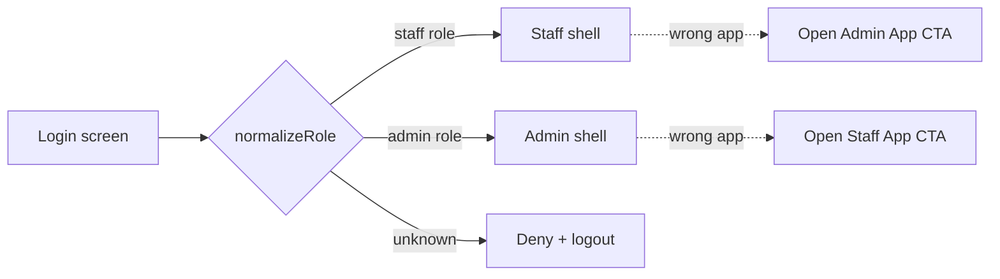

# STEP 4 — Target Architecture

> Goal: two apps (Staff, Admin) on one Laravel API, maximizing shared code while keeping each app focused. The architecture below is the recommended target; migration steps are in [`07-implementation-roadmap.md`](./07-implementation-roadmap.md).

---

## 4.1 App structure — monorepo with shared core (recommended)

**Do not fork the repo twice.** Convert `mobile-app/` into a monorepo so both apps share one API/auth/design layer and the Laravel contract never diverges.

```
school-erp-mobile/                 # monorepo root (pnpm/yarn workspaces + Turborepo)
├── apps/
│   ├── staff/                     # APP 1 — Staff App (Expo)
│   │   ├── app.config.ts          # bundleId: com.schoolerp.staff
│   │   ├── App.tsx                # composes core providers + StaffNavigator
│   │   └── src/
│   │       ├── navigation/        # StaffRootNavigator + role tab shells
│   │       ├── features/          # staff-only feature screens
│   │       └── widgets/           # staff dashboard widgets
│   └── admin/                     # APP 2 — Admin App (Expo) — NEW
│       ├── app.config.ts          # bundleId: com.schoolerp.admin
│       ├── App.tsx
│       └── src/
│           ├── navigation/        # AdminRootNavigator (drawer + tabs)
│           ├── features/          # admin-only feature screens
│           └── widgets/           # admin dashboard widgets
├── packages/
│   ├── core/                      # @erp/core — the shared brain
│   │   ├── api/                   # apiClient + all *.api.ts modules
│   │   ├── auth/                  # AuthContext, session, biometrics, smsRetriever
│   │   ├── query/                 # TanStack Query client, keys, hooks
│   │   ├── notifications/         # push register/route, prefs
│   │   ├── branding/              # branding api + ThemeContext + mergePortalColors
│   │   ├── storage/               # secure-store + async-storage wrappers
│   │   ├── analytics/             # analytics + crash-reporting facade
│   │   ├── config/                # env, feature flags, constants/roles
│   │   └── types/                 # shared TS types (api, domain)
│   ├── ui/                        # @erp/ui — design system / component library
│   │   ├── primitives/            # Button, Input, Card, Avatar, Badge, ...
│   │   ├── feedback/              # EmptyState, Skeleton, ErrorBanner, Toast
│   │   ├── layout/                # ScreenContainer, headers, OfflineBanner
│   │   ├── charts/                # line/bar/donut
│   │   └── theme/                 # tokens, palette, typography, spacing
│   └── features/                  # @erp/features — SHARED feature slices (type C)
│       ├── students-view/         # scoped student list/detail/report-card
│       ├── statements/            # fee statement viewer
│       ├── announcements/         # announcement reader
│       ├── notifications/         # notification inbox
│       ├── payments-mpesa/        # M-Pesa modal + status polling
│       └── settings/              # settings shell
├── package.json                   # workspaces
├── turbo.json
└── tsconfig.base.json             # path aliases @erp/*
```

**Why this structure**
- The current app's `api/`, `contexts/`, `utils/`, `components/common/`, `constants/` map almost 1:1 into `packages/core` + `packages/ui` — low-friction extraction.
- Each app is a **thin shell**: navigation + app-specific screens that compose shared feature slices.
- Single source of truth for the API contract; one place to bump endpoints.

**Alternative (if monorepo tooling is undesirable):** publish `@erp/core` + `@erp/ui` as private npm packages consumed by two standalone Expo repos. Same boundaries, more release overhead. **Recommendation: monorepo.**

---

## 4.2 Per-app feature module layout

Each feature is a self-contained vertical slice:

```
features/<feature>/
├── screens/        # screen components
├── components/     # feature-local components
├── hooks/          # useXxxQuery / useXxxMutation (wrap @erp/core/query)
├── api.ts          # re-exports the relevant @erp/core/api calls
├── types.ts
└── index.ts        # public surface (screens + route config)
```

Navigators import only a feature's `index.ts` (route config + screens), keeping coupling low and enabling lazy registration per role.

---

## 4.3 Shared component library (`@erp/ui`)

Promote today's `components/common/*` + `components/dashboard/*` into a versioned design system:

| Layer | Components |
|-------|-----------|
| Primitives | `Button`, `IconButton`, `Input`, `Select`, `Card`, `Avatar`, `Chip/Badge`, `StatusBadge`, `FeeStatusBadge`, `ListItem` |
| Feedback | `EmptyState`, `ListLoadingSkeleton`, `LoadErrorBanner`, `Toast`, `ConfirmDialog`, `BottomSheet` |
| Layout | `ScreenContainer`, `AppScreenHeader`, `GlobalAppHeader`, `OfflineBanner`, `SectionHeader`, `TabBar` |
| Data viz | `DashboardHero`, `LineChart`, `BarChart`, `DonutChart`, `StatTile`, `MenuGrid` |
| Forms | `FormField` (react-hook-form bound), `DatePickerField`, `FilePickerField` |

All components consume theme tokens from `@erp/ui/theme`, which are overridden at runtime by per-school branding (`ThemeContext`).

---

## 4.4 API layer

- Keep the singleton `ApiClient` (axios + interceptors: bearer token, multipart boundary fix, 401→logout, 422 flattening, `touchSession`).
- **Wrap every endpoint in TanStack Query** hooks in `@erp/core/query`:
  - Query keys namespaced: `['students', filters]`, `['student', id]`, `['dashboard', role, termId]`.
  - Mutations invalidate related keys; optimistic updates for attendance/marks.
  - Centralized `select`/error mapping.
- Single `ApiResponse<T>` envelope already in `types/api.types.ts` — standardize all hooks on it.
- Add **request cancellation** (AbortController) and **retry/backoff** policy in the query client.

```
@erp/core/query/
├── client.ts          # QueryClient + persistQueryClient (AsyncStorage)
├── keys.ts            # typed query-key factory
├── students.ts        # useStudents, useStudent, useCreateStudent ...
├── academics.ts
├── finance.ts
└── ...                # one file per domain (mirrors *.api.ts)
```

---

## 4.5 Authentication strategy

- Reuse `AuthContext` in `@erp/core/auth`, **shared by both apps**.
- Same flows: password / Google / OTP / biometric; same SecureStore token + session policy.
- **Harden:** change `normalizeRole` to **explicit-deny** (unknown role → no access / forced logout) instead of defaulting to `TEACHER`.
- **App-scoped login guard:** after login, each app checks the role belongs to it; if a staff role logs into the Admin App (or vice-versa), show "Use the other app" with a deep link to install/open it. This prevents privilege confusion and keeps each binary's surface clean.
- **Token audience:** ideally backend issues the same token usable by both apps (Sanctum), with role claims; client only routes.



---

## 4.6 Offline strategy

Replace the "banner-only" approach with **offline-first read + queued writes**:

| Tier | Mechanism |
|------|-----------|
| **Read cache** | `persistQueryClient` → AsyncStorage; stale-while-revalidate. Critical lists (students, classes, timetable, today's attendance) cached on login. |
| **Write queue** | Mutation queue persisted to storage; replays on reconnect (`useNetworkStatus`). Idempotency keys for attendance/marks. |
| **Conflict policy** | Last-write-wins for self-owned data; server-authoritative for shared (with conflict toast). |
| **Background sync** | `expo-task-manager` + `expo-background-fetch` for silent refresh + queue flush + (driver app) location upload. |
| **UX** | Per-screen "offline — showing cached" state; pending-sync badge; explicit "retry sync" in Settings. |

Staff App needs robust offline (teachers mark attendance/marks in poor-connectivity classrooms; drivers move through dead zones). Admin App can be lighter (mostly online back-office) but should still cache dashboards.

---

## 4.7 Push notification strategy

- Keep Expo push token registration (`device.api`) in `@erp/core/notifications`.
- **Add receive + response handlers** with **deep-link routing**: notification payload carries `{type, entityId, route}` → `Linking`/navigation ref opens the right screen in the right app.
- **Channels/categories** (Android channels): `attendance`, `fees`, `announcements`, `chat`, `transport`, `approvals`.
- **Silent data push** to trigger background sync / cache invalidation.
- **Per-app topics:** staff vs admin segmentation server-side so each app only gets relevant pushes.
- Respect `NotificationPreferences` (push/email/sms + per-category toggles); add quiet hours.
- **Backend:** centralize via Laravel notifications + a push service (Expo Push API / FCM).

---

## 4.8 Analytics strategy

- Introduce `@erp/core/analytics` facade with pluggable providers (so vendor swap is trivial).
- **Product analytics:** screen views, key funnels (login→dashboard, mark-attendance, pay-fees, approve-leave), feature adoption per role/tenant.
- **Crash + error reporting:** Sentry (RN) wired into `AppErrorBoundary` + global handlers + axios error interceptor.
- **Performance:** cold-start, screen TTI, API latency, OTA adoption.
- **Privacy:** no PII in events; tenant + role + anonymized user id; honor consent.
- **Dashboards:** separate Staff vs Admin properties (or a single property with `app` dimension).

---

## 4.9 Error handling strategy

| Layer | Strategy |
|-------|----------|
| Network/API | axios interceptor → typed `ApiError` (already flattens 422). Map to user-friendly copy; never surface raw stack. |
| Auth | 401 → silent token clear + global logout (existing). 419/expired → re-auth prompt. |
| Query/data | TanStack Query `error` + `isError` → standardized `LoadErrorBanner` with retry. Empty vs error vs loading clearly distinguished (see UI specs). |
| Render | `AppErrorBoundary` (existing) per app root + per high-risk feature subtree; "Something went wrong / Reload" with Sentry capture. |
| Mutations | Optimistic + rollback; toast on failure; queued when offline. |
| Forms | `react-hook-form` field errors + server 422 mapped back to fields. |
| Logging | Structured logger (no console in prod); breadcrumbs to Sentry. |

---

## 4.10 Architecture at a glance

```mermaid
flowchart TB
  subgraph Apps
    SA[Staff App\ncom.schoolerp.staff]
    AA[Admin App\ncom.schoolerp.admin]
  end
  subgraph Shared[Shared packages]
    UI[@erp/ui\ndesign system]
    FEAT[@erp/features\nshared slices]
    CORE[@erp/core\napi · auth · query · notifications · branding · analytics]
  end
  SA --> UI & FEAT & CORE
  AA --> UI & FEAT & CORE
  CORE -->|axios + Sanctum| API[(Laravel API)]
  CORE -->|push| EXPO[Expo Push / FCM]
  CORE -->|events/crashes| OBS[Analytics + Sentry]
  API --> DB[(MySQL)]
```
