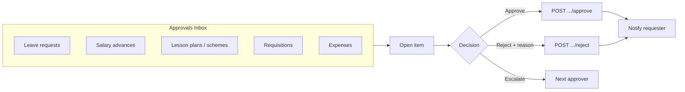

# STEP 5 — App Designs (Staff App & Admin App)

> Navigation, sitemaps, dashboards and user journeys for both apps. Route names reuse existing ones where the screen carries over (see [audit](./01-codebase-audit.md)).

---

# APP 1 — Staff App

**Audience:** Teacher, Senior Teacher, Class Teacher, Subject Teacher, Supervisor, Parent, Guardian, Student, Driver, Transport, and self-service for operational staff.
**Posture:** Capture & consume at the point of work. Fast, offline-tolerant, role-adaptive home.

## 5.1 Staff App — sitemap

```
Staff App
├── Auth
│   ├── Login (password / Google / OTP / biometric)
│   ├── Forgot password → OTP/SMS-link → Reset
│   └── App-mismatch guard (admin role → "Open Admin App")
├── (role-adaptive shell after login)
│
├── TEACHER / SENIOR / SUBJECT / CLASS TEACHER
│   ├── Home (TeacherDashboard)
│   ├── Classes → Students (scoped) → Student detail → Report card
│   ├── Attendance → Mark attendance → Records
│   ├── Academics hub
│   │   ├── Exams → Marks entry / Marks matrix
│   │   ├── Assignments → Create / Detail
│   │   ├── Lesson plans → Editor / Create-from-timetable / Detail
│   │   ├── Schemes of work (NEW)
│   │   ├── Gradebook (NEW)
│   │   ├── Diary
│   │   └── Timetable
│   ├── Transport (class roster → pickup verification)
│   ├── Requirements collection
│   ├── My work
│   │   ├── Clock in/out (GPS)
│   │   ├── My profile / Edit
│   │   ├── My salary / payslips
│   │   ├── Leave (apply + status) / Salary advance
│   │   └── Requisitions (raise)
│   ├── Senior-only: Review queue · Supervised classes · Supervised staff · Fee balances · Team clock
│   ├── Chat (NEW) · Announcements · Notifications
│   └── Settings
│
├── PARENT / GUARDIAN
│   ├── Home (per-child summary)
│   ├── My children → child detail → results / report card / attendance / statement
│   ├── Fees (financial portal: balances, invoices, Pay now, history, receipts)
│   ├── Transport (live bus track + pickup status) (NEW)
│   ├── Chat with teachers (NEW) · Announcements · Notifications
│   └── More: profile-update link, permission slips (NEW), settings
│
├── STUDENT
│   ├── Home
│   ├── Homework (view + submit (NEW))
│   ├── Results
│   ├── Timetable · Resources (NEW) · My borrowings (NEW)
│   ├── Announcements · Notifications
│   └── More / Settings
│
└── DRIVER / TRANSPORT
    ├── Home (today's trips + active trip)
    ├── Active trip (start/stop, live GPS broadcast (NEW), per-stop boarding (NEW))
    ├── Routes → Route detail
    ├── Incident report (NEW)
    └── Account / Settings
```

## 5.2 Staff App — navigation structure & bottom tabs

Role-adaptive bottom tabs (single binary, tabs chosen by role at runtime — extends today's `RoleBasedNavigator`):

| Role | Tab 1 | Tab 2 | Tab 3 | Tab 4 | Tab 5 |
|------|-------|-------|-------|-------|-------|
| **Teacher/Senior** | Home | Classes | Attendance | Academics | More |
| **Parent** | Home | Children | Fees | Chat | More |
| **Student** | Home | Homework | Results | Chat | More |
| **Driver** | Home | Routes | Trips | — | Account |

Notes: 4–5 tabs max; "Academics" and "More" open hubs (grid of feature tiles) rather than deep stacks. Chat is promoted to a tab for parent/student (engagement). Global header retains back + settings affordances (existing `AppScreenHeader`).

## 5.3 Staff App — drawer menu

Phones: **no drawer** — use bottom tabs + a "More" hub screen (keeps reach-friendly). Tablets: optional left rail mirroring tabs. The current app has `@react-navigation/drawer` installed but unused; keep it out of Staff App phone layout.

## 5.4 Staff App — dashboard widgets (by role)

**Teacher Home (`TeacherDashboard`):**
- Greeting + today's date + clock-in status chip
- Next class card (subject, class, room, time) — *needs timetable widget*
- Today: lessons to teach, attendance to mark (count), marks due
- Quick actions: Mark attendance · Enter marks · Create assignment · New lesson plan
- Pending: lesson plans to submit; (senior) reviews waiting
- Announcements strip · unread chat count

**Parent Home:**
- Child switcher (chips) for multi-child
- Per child: attendance % today, fee balance, latest result, next event
- Pay now CTA (if balance) · Bus status (live) · Unread messages · Recent announcements

**Student Home:**
- Today's timetable · homework due · latest results · attendance streak · announcements

**Driver Home:**
- Active trip card (start/resume) · today's trips list · assigned vehicle · students count · SOS/incident button

## 5.5 Staff App — key user journeys

1. **Class teacher marks attendance (offline-tolerant):** Home → Attendance tab → pick class/date → "All present" then toggle absentees → Save → if offline, queued + "will sync" badge → reconnect auto-sync → parents of absentees notified.
2. **Subject teacher enters marks:** Academics → Exams → select exam/class/subject → matrix entry → autosave per cell → submit → status "submitted".
3. **Teacher authors & submits lesson plan:** Academics → Lesson plans → Create from timetable → editor → save draft (offline) → submit → senior teacher review queue.
4. **Senior teacher reviews:** More/Home → Review queue → open plan → approve / reject (reason) → teacher notified.
5. **Parent pays fees:** Home → Fees → child → balance → Pay now (M-Pesa STK) → waiting webview → success → receipt → statement updates.
6. **Parent confirms pickup / tracks bus:** Home → Transport → live map + ETA → at stop, verify handover (QR/OTP) → "boarded/alighted" notifications.
7. **Driver runs a trip:** Home → Active trip → Start (GPS broadcast on) → per-stop board/alight scan → end trip.
8. **Staff self-service:** More → Apply leave / view payslip / clock in.

---

# APP 2 — Admin App (NEW)

**Audience:** Super Admin, Admin, Secretary, Principal, Deputy Principal, Head Teacher, Academic Admin, Accountant, Finance, Bursar, Receptionist, Librarian, Nurse, Store Keeper, Security.
**Posture:** Configure, approve, manage, analyze. Information-dense, drawer-driven, strong dashboards & workflows.

## 5.6 Admin App — sitemap

```
Admin App
├── Auth (same flows; app-mismatch guard for staff-only roles)
├── Dashboard (role-aware: exec / finance / academic / operations)
├── Approvals inbox (unified: leave · advances · lesson plans · requisitions · expenses) (NEW)
├── People
│   ├── Students (registry: list, create, edit, bulk upload, archive/restore, family mgmt, categories)
│   └── Staff (HR: directory, create/edit, attendance roster, clock oversight, leave, payroll, advances, appraisals (NEW))
├── Academics
│   ├── Exams (schedule, grading scales, moderation, result analysis)
│   ├── Marks oversight · Report cards (generate/bulk/publish)
│   ├── Lesson plans & schemes review (NEW schemes)
│   ├── Timetable builder (NEW)
│   ├── CBC/CBE assessment config (NEW)
│   └── Attendance analytics (school-wide)
├── Finance
│   ├── Dashboard / summary
│   ├── Invoices · Fee structures · Defaulters
│   ├── Payments · Record payment · Receipts
│   ├── Transactions reconciliation (bank/C2B confirm/reject/share)
│   ├── M-Pesa initiate · Expenses & budgets (NEW)
│   └── Statements
├── Operations
│   ├── Transport (routes, vehicles, drop-points, assignments, summary, live fleet map (NEW))
│   ├── Library (books, cards, borrowings, summary)
│   ├── Inventory/Store (items, adjustments, requisitions fulfill, summary)
│   ├── POS (products, orders, uniforms, summary)
│   ├── Hostel (hostels, rooms, allocations)
│   ├── Health/Clinic (visits, medical records) (NEW)
│   └── Visitor & Security (check-in/out, gate pass) (NEW)
├── Communication
│   ├── Announcements (create/publish/target)
│   ├── Broadcast SMS/Email · Templates · Delivery status
│   ├── Circulars (NEW) · Chat moderation (NEW)
│   └── Notifications
├── Documents (templates, certificates, export/import)
├── Reports & Analytics (cross-module dashboards) (NEW)
└── Settings (school config, branding, geofence, roles, feature flags)
```

## 5.7 Admin App — navigation structure

**Pattern:** Left **drawer** (primary modules) + **bottom tabs** for the 4–5 most-used per role + contextual stacks. Tablets: persistent drawer rail.

**Default bottom tabs (Admin/Super Admin):** Dashboard · Approvals · People · Finance · More(drawer).
**Accountant/Bursar tabs:** Dashboard · Finance · Payments · Reconcile · More.
**Academic Admin tabs:** Dashboard · Academics · Students · Approvals · More.
**Receptionist tabs:** Dashboard · Visitors · Communication · Students · More.
**Librarian tabs:** Dashboard · Catalog · Circulation · Members · More.
**Store Keeper tabs:** Dashboard · Inventory · Requisitions · POS · More.
**Nurse tabs:** Dashboard · Clinic · Students · Records · More.
**Security tabs:** Dashboard · Visitors · Gate pass · Incidents · More.

Drawer always exposes the full module list (gated by role/permission), so power-admins reach everything.

## 5.8 Admin App — dashboard layout

Modular **role-aware dashboard** built from reusable widgets (`@erp/ui` charts + stat tiles):

- **Executive (Principal/Admin/Super Admin):** enrollment & attendance today, fee collection vs target (donut + trend), staff present (clock), pending approvals count, incidents/visitors today, announcements quick-post, drill-down tiles.
- **Finance (Accountant/Bursar/Finance):** collected today/term, outstanding balances, defaulters count, unreconciled transactions, M-Pesa feed, expense vs budget.
- **Academic (Academic Admin/Head Teacher):** marks-submission progress, lesson-plan/scheme approval backlog, exams in progress, report-card publish status, syllabus coverage.
- **Operations (Store/Library/Transport/Hostel):** module-specific summaries (`*/summary` endpoints already exist).

Each widget: title, primary metric, sparkline/chart, period selector (term/year via `dashboard.api` params), tap → module screen. Loading = skeleton tiles; empty = "no data for period"; error = inline retry.

## 5.9 Admin App — management workflows

| Workflow | Steps |
|----------|-------|
| **Enroll student** | People → Students → Add → form (multipart photo/docs) → assign class/stream → fee structure → save → optional invoice. |
| **Run payroll** | Staff → Payroll → generate (month) → review records → process → download payslips → staff notified. |
| **Publish results** | Academics → Exams → select → verify marks submitted → moderate → generate report cards (bulk) → publish → parents/students notified. |
| **Reconcile payment** | Finance → Transactions → unmatched item → match/share across students / confirm / reject → statement updates. |
| **Manage transport** | Operations → Transport → route → drop points → assign students → vehicles → monitor live fleet. |
| **Issue circular / broadcast** | Communication → new → target (role/class) → schedule → send → track delivery/acknowledgment. |

## 5.10 Admin App — approval workflows (unified inbox)



- One queue, filters by type/urgency/requester; badge count on tab.
- Backed by existing approve/reject endpoints (`/leave-requests/{id}/approve`, `/salary-advances/{id}/approve`, `/lesson-plans/{id}/approve`, `/requisitions/{id}/approve`).
- Multi-step (configurable) for high-value items; full audit trail.

## 5.11 Admin App — analytics dashboards

- **Finance analytics:** collection trends, aging buckets, payment-method mix, defaulter cohorts.
- **Academic analytics:** performance by class/subject/teacher, mean-score trends, attendance correlation, marks-submission timeliness.
- **HR analytics:** attendance/punctuality, leave utilization, appraisal scores, headcount.
- **Operations analytics:** transport utilization, library circulation, inventory turnover, clinic visit trends.
- Cross-filter by term/year/class; export to PDF/Excel (`documents.api` export endpoints already exist).

## 5.12 Admin App — key user journeys

1. **Principal morning check:** open → Dashboard → attendance + collection tiles → Approvals badge (5) → clear leave/lesson-plan approvals → post announcement.
2. **Bursar reconciles M-Pesa:** Finance → Transactions → unmatched C2B → share across 2 students → confirm → statements update.
3. **Academic admin publishes term results:** Academics → Exams → verify → moderate → bulk generate → publish.
4. **Receptionist logs visitor:** Visitors → check-in → host notified → issue QR badge → check-out later.
5. **Store keeper fulfills requisition:** Approvals/Inventory → requisition → approve → fulfill → stock adjusts.
