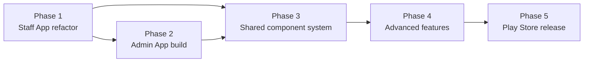

# STEP 7 — Implementation Roadmap

> Five phases from today's mixed app to two production apps on the Play Store. Each phase has goals, workstreams, exit criteria, and risks. Estimates assume a small team (2–3 RN engineers + 1 designer + backend support); adjust to your capacity.

---

## Guiding sequencing principle
**Extract the shared core first, then carve.** We make the existing app the Staff App by (a) lifting reusable code into shared packages, (b) deleting admin surfaces, (c) building the Admin App as a thin shell on the same core. This avoids two diverging API clients.

> Phase 3 (shared system) is partly **concurrent** with 1 & 2 — the extraction starts in Phase 1 and hardens in Phase 3.

---

## Phase 1 — Refactor current app into the Staff App
**Goal:** Existing app, stripped of admin functions, running cleanly for Teacher/Parent/Student/Driver + staff self-service.

**Workstreams**
1. **Repo → monorepo** (`apps/`, `packages/`) with workspaces + Turborepo; path aliases `@erp/*`. Keep current app building throughout.
2. **Extract `@erp/core`:** move `api/`, `contexts/`, `utils/` (storage, session, biometrics, smsRetriever, roleUtils, env, mpesaStatus), `constants/roles`, `types/`.
3. **Extract `@erp/ui`:** move `components/common/*`, `components/dashboard/*`, `constants/theme`, `styles/*`.
4. **Define Staff shell:** new `apps/staff` consuming core/ui; keep `TeacherNavigator`, `ParentTabNavigator`, `StudentTabNavigator`, `DriverTabNavigator`.
5. **Strip admin surfaces from Staff App:** remove admin/academic-admin branches from `RoleBasedNavigator`; delete admin-only screens (HR mgmt, finance back-office, registry create/edit/bulk, exam config, broadcast, library/inventory/POS/hostel mgmt) and `ModuleNavigators` admin stacks + placeholders.
6. **Fix audit defects (F2, F3):** build Staff-specific `More` menus (remove dead links for parent/student); change `normalizeRole` to **explicit-deny**; add **app-mismatch guard** (admin role → "Open Admin App").
7. **Introduce TanStack Query** in core; migrate Staff screens’ `useEffect` fetches to query hooks (incremental).

**Exit criteria:** Staff App builds from monorepo; all four staff role shells work; no admin code paths reachable; no dead nav links; role-deny verified; CI green; internal QA pass.

**Risks:** import-path churn during extraction → mitigate with codemods + alias map; keep PRs small per module.

---

## Phase 2 — Build the Admin App
**Goal:** New `apps/admin` on the same core/ui, covering management, approvals, and dashboards for admin roles.

**Workstreams**
1. **Admin shell:** `AdminRootNavigator` (drawer + role-aware bottom tabs from [`05-app-designs.md`](./05-app-designs.md)); wire `AdminBrandedProvider` (currently unwired, F8) + `useRootScreenBackground`.
2. **Reuse existing admin screens:** lift Admin/Academic-Admin/Finance/HR/Transport/Library screens into `apps/admin/features` (they already exist in the current repo — this is a move + retheme, not a rewrite).
3. **Role-aware dashboards:** executive/finance/academic/ops variants using `dashboard.api` + `*/summary` endpoints.
4. **Unified Approvals Inbox (P0 gap):** aggregate leave/advances/lesson-plans/requisitions; existing approve/reject endpoints.
5. **App-mismatch guard** for staff roles; app-scoped login.
6. **Per-app push topics** (staff vs admin segmentation).

**Exit criteria:** Admin App builds; each admin role lands on a correct dashboard + tabs; CRUD/management flows operate against live API; approvals inbox functional; branding applied; internal QA pass.

**Risks:** screen retheming scope; ensure no Staff-only assumptions leak. Backend may need role/permission claims surfaced for clean gating.

---

## Phase 3 — Shared Component System (hardening)
**Goal:** A stable, documented, versioned design system + shared feature slices used by both apps.

**Workstreams**
1. **`@erp/ui` v1:** finalize primitives, feedback, layout, charts, forms; tokens + light/dark + branding overrides; a11y (labels, contrast, font scaling).
2. **`@erp/features` shared slices (type C):** students-view, statements, announcements, notifications, payments-mpesa, settings — consumed by both apps.
3. **Component docs/catalog:** Storybook-style screen (or a `dev` app) showing every component + state; usage guidelines for Stitch/Figma parity.
4. **Standardize states:** enforce the loading/empty/error pattern from [`06-ui-specifications.md`](./06-ui-specifications.md) via shared wrappers (`QueryBoundary`).
5. **Theming polish:** persist user theme mode; per-tenant brand verification across both apps.
6. **Analytics + Sentry facade** (`@erp/core/analytics`) wired into both shells + error boundary.

**Exit criteria:** both apps consume `@erp/ui`/`@erp/features` with zero local forks; design tokens single-sourced; component catalog published; crash + analytics live.

---

## Phase 4 — Advanced Features
**Goal:** Close priority gaps from [`03-gap-analysis.md`](./03-gap-analysis.md) (sequenced by priority).

**P0 / early**
- **Offline-first** (read cache + write queue + background sync; `expo-task-manager`/`background-fetch`).
- **Push deep-link routing** (receive handlers → navigation).
- **Real-time chat** (Laravel Echo + Pusher — already web deps).
- **CBC/CBE assessment + schemes of work** (academic compliance).
- **Parent financial portal** enhancements.

**P1**
- **Live bus tracking** (driver background GPS + parent map) + **pickup verification (QR/OTP)**.
- **Gradebook**, homework submission, exam scheduling/analysis.
- **Incident & discipline tracking**, **leave balances/calendar**, **visitor management** (security), **clinic/health** (nurse), **inventory requisition** full UI.
- **Payslip/statement PDFs**, payment plans, additional gateways (Jenga).

**P2+**
- Timetable builder, learning resources, appraisals (TPAD), circulars, i18n (EN/SW), feature flags/remote config, global search, audit-trail visibility.

**Exit criteria:** each feature shipped behind a flag, QA'd, with analytics; offline + push verified on physical devices; chat load-tested.

**Risks:** background location/battery + store policy (foreground-service disclosures); chat moderation/abuse; CBC data model needs backend alignment.

---

## Phase 5 — Play Store Production Release
**Goal:** Two production apps (`com.schoolerp.staff`, `com.schoolerp.admin`) released and maintainable via OTA.

**Workstreams**
1. **Store assets:** two listings — icons, splash, screenshots (from Stitch/Figma specs), descriptions, privacy policy, data-safety forms (location, biometrics, push, payments disclosures).
2. **EAS build profiles** per app (preview/production); separate `app.config.ts`, bundle IDs, EAS project IDs; signing.
3. **OTA channels:** `preview`/`production` per app (existing `eas:update:*` scripts as template); confirm APK-download fallback (F: `android_apk_download_url`) per app branding.
4. **Release management:** staged rollout (internal → closed → open testing → production), version policy (semver + OTA for JS-only, store build for native changes).
5. **Compliance & hardening:** permissions justification, security review (cert pinning, root detection), accessibility pass, performance budget (cold start, bundle size).
6. **Observability in prod:** crash-free rate target, alerting, dashboards; support/feedback loop.
7. **Migration/comms:** notify existing users; ensure current single-app users land in Staff App; deep links cross-promoting Admin App for admin roles.

**Exit criteria:** both apps live on Play Store; staged rollout healthy (crash-free ≥ 99.5%); OTA pipeline verified; rollback tested; data-safety approved.

---

## Cross-phase: backend coordination (Laravel)
- Surface **role + permission claims** in `/user` for clean client gating.
- Add **per-app push segmentation** + notification payload `{type, route, entityId}` for deep links.
- New endpoints for gap features (CBC, schemes, chat, live transport, incidents, discipline, visitors, clinic, appraisals, analytics aggregates).
- Idempotency keys for offline-queued writes (attendance, marks, payments).
- Keep one API contract; both apps version against it.

## Suggested phase ordering vs effort (relative)
| Phase | Relative effort | Can parallelize with |
|-------|-----------------|----------------------|
| 1 Staff refactor | M | start of 3 (extraction) |
| 2 Admin build | L | 3 |
| 3 Shared system | M | 1, 2 |
| 4 Advanced | XL (incremental) | 5 prep |
| 5 Release | M | — |

## Definition of done (program)
- Two apps, one shared core, one API contract.
- No dead nav links; explicit-deny role security; app-mismatch guards.
- Offline-first + push routing + analytics + crash reporting live.
- Design system single-sourced; Stitch/Figma specs realized.
- Both apps in Play Store production with healthy rollout + OTA.
