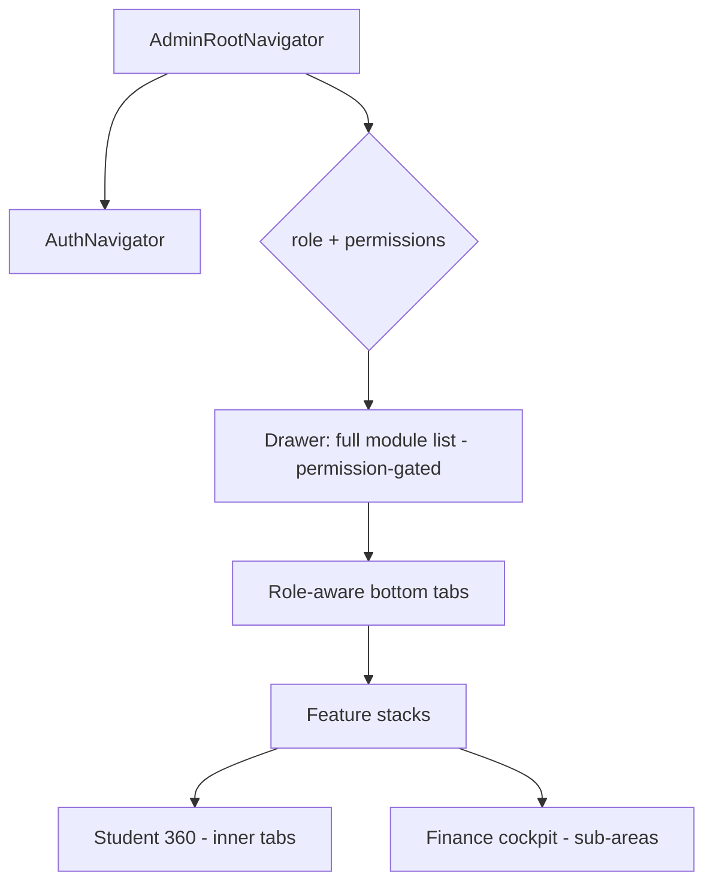
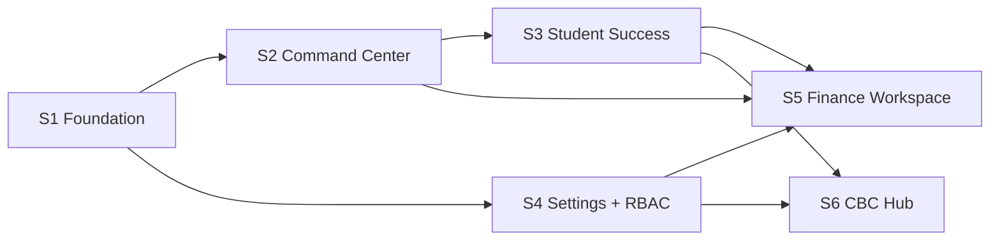

# Admin App — Implementation-Ready Build Plan

> **Purpose:** Convert the approved Admin App **IA**, **UI specifications**, **Product Backlog**, and **ERP Audit** into an engineering-ready architecture and a six-sprint delivery plan. This is the contract between design and build.
> **Authored as:** Mobile Architect · Staff/Platform Engineer · Delivery Lead. **No code** — architecture + plan only.
> **Inputs:**
> - Admin IA — [`../admin-app/02-admin-information-architecture.md`](../admin-app/02-admin-information-architecture.md)
> - Admin Discovery — [`../admin-app/01-admin-discovery.md`](../admin-app/01-admin-discovery.md)
> - UI Specifications — [`../app-split/06-ui-specifications.md`](../app-split/06-ui-specifications.md) (Part B)
> - Target Architecture — [`../app-split/04-architecture.md`](../app-split/04-architecture.md)
> - App Designs — [`../app-split/05-app-designs.md`](../app-split/05-app-designs.md)
> - Implementation Roadmap — [`../app-split/07-implementation-roadmap.md`](../app-split/07-implementation-roadmap.md)
> - Product Backlog — [`../prd/02-MASTER-PRODUCT-BACKLOG.md`](../prd/02-MASTER-PRODUCT-BACKLOG.md) (EPIC 7 = R3)
> - ERP Audit — [`../system-audit/MASTER-ERP-AUDIT.md`](../system-audit/MASTER-ERP-AUDIT.md)

---

## 0. Scope, principles & traceability

The Admin App is the **management surface** of the School OS: it **configures, approves, oversees, and reports**. Capture/self-service (mark attendance, enter marks, clock-in, pay fees) stays in the Staff/Parent apps. It is one of two Expo binaries (`com.schoolerp.admin`, `com.schoolerp.staff`) on **one shared core** against **one Laravel API**.

**Non-negotiable principles (inherited from IA + Audit):**

1. **Permission-first, branch-scoped** — menus and screens render from the user's permission set, scoped to the active branch/tenant. Super Admin sees all; everyone else least-privilege.
2. **Shared-core monorepo** — `@erp/core`, `@erp/ui`, `@erp/features` consumed by both apps; one API contract; no forked clients.
3. **One object, one home, many tabs** — Student 360 / Staff 360 / Guardian 360 patterns; no scattered menu items.
4. **Approvals → one inbox** — replace ~10 bespoke approve/reject screens with a unified inbox + workflow engine.
5. **Server is the authorization boundary** — the client gates *visibility*; the API enforces *access* (fixes audit W3 RBAC bypasses).
6. **Mobile-first, glanceable** — dense web tables become cards + filters + search; heavy exports run async.

**Release traceability:** this plan delivers **Backlog EPIC 7 (Admin App, Release R3)** and prepares the surfaces that EPIC 14/15 (Finance, R5), EPIC 10–13 (CBC, R4), and EPIC 27 (Analytics, R8) plug into. It assumes **R1 foundations** (E1 tenancy, E3 identity, E4 RBAC, E5 auth, E29 integrations) are in progress on the backend; the Permission System (§7) is designed to degrade gracefully if backend RBAC claims arrive incrementally.

---

# 1. Technical Architecture

## 1.1 System context

```mermaid
flowchart TB
  subgraph Apps[Expo binaries]
    AA[Admin App\ncom.schoolerp.admin]
    SA[Staff App\ncom.schoolerp.staff]
  end
  subgraph Shared[Shared packages - monorepo]
    UI[@erp/ui\ndesign system]
    FEAT[@erp/features\nshared slices]
    CORE[@erp/core\napi · auth · query · rbac · notifications · branding · analytics]
  end
  AA --> UI & FEAT & CORE
  SA --> UI & FEAT & CORE
  CORE -->|axios + Sanctum bearer| API[(Laravel API\nmulti-tenant)]
  CORE -->|push register/route| PUSH[Expo Push / FCM]
  CORE -->|events + crashes| OBS[Analytics + Sentry]
  API --> DB[(MySQL\nrow-level tenant_id)]
```

The Admin App is a **thin shell**: navigation + admin-only feature screens that compose shared slices from `@erp/features` and primitives from `@erp/ui`, all talking to the backend exclusively through `@erp/core`.

## 1.2 Layered architecture (inside the app)

| Layer | Responsibility | Lives in |
|-------|----------------|----------|
| **Shell** | Providers, root navigators, role→shell routing, app-mismatch guard, deep-link handling | `apps/admin/src/navigation`, `App.tsx` |
| **Feature slices** | Screens + feature-local components + query/mutation hooks per domain | `apps/admin/src/features/*` |
| **Shared feature slices** | Cross-app slices (student-view, statements, announcements, notifications, settings, payments-mpesa) | `@erp/features/*` |
| **Design system** | Primitives, feedback, layout, charts, forms — themed by branding | `@erp/ui/*` |
| **Core / platform** | API client, TanStack Query layer, auth/session, RBAC engine, branding/theme, notifications, analytics, storage, config | `@erp/core/*` |
| **Backend contract** | Laravel API (Sanctum, Spatie permissions, tenant scope) | external |

**Dependency rule:** Shell → Features → (`@erp/features`, `@erp/ui`) → `@erp/core`. Nothing in `@erp/core`/`@erp/ui` imports from apps. Features never call `axios` directly — only via `@erp/core/query` hooks.

## 1.3 Cross-cutting platform concerns

- **Tenancy & branch scope** — a `ScopeContext` (active `tenantId` + `branchId`) is injected into every query key and request header; the branch switcher in the top bar mutates it and invalidates scoped queries. Backend enforces isolation (audit W4).
- **Offline posture** — Admin is mostly online back-office. Strategy = **read cache (stale-while-revalidate) + cached dashboards**; write queue is *light* (only low-risk mutations queue). Heavy/financial writes require connectivity (no offline maker-checker). This is intentionally lighter than the Staff App's offline-first capture.
- **Error & resilience** — `AppErrorBoundary` per root + per high-risk subtree; standardized `QueryBoundary` for loading/empty/error; axios interceptor → typed `ApiError` (422 flattening, 401→logout). Dashboards never blank fully (cached fallback).
- **Observability** — `@erp/core/analytics` facade (product events + Sentry crash/error) wired into the shell and error boundary; per-tenant/role/anonymized-user dimensions, no PII.
- **Notifications** — Expo push register + deep-link routing `{type, route, entityId, branchId}`; per-app topic segmentation (admin vs staff); categories: `approvals, finance, academics, operations, hr, system, announcements`.

## 1.4 Build & release topology

- **Monorepo** with pnpm/yarn workspaces + Turborepo; path aliases `@erp/*` via `tsconfig.base.json`.
- **EAS** build profiles per app (`preview`/`production`), separate `app.config.ts`, bundle IDs, signing.
- **OTA channels** per app; JS-only changes ship via `expo-updates`, native changes via store build.

---

# 2. Folder Structure

Monorepo root (Admin App is `apps/admin`; shared packages are reused as-is from the app-split target architecture).

```text
school-erp-mobile/
├── apps/
│   ├── admin/                          # ← THIS APP
│   │   ├── app.config.ts               # bundleId com.schoolerp.admin, EAS, branding splash
│   │   ├── App.tsx                     # provider tree + AdminRootNavigator
│   │   ├── eas.json
│   │   └── src/
│   │       ├── navigation/
│   │       │   ├── AdminRootNavigator.tsx      # drawer + role-aware bottom tabs
│   │       │   ├── roleShells.ts               # role → tab preset map (§5)
│   │       │   ├── linking.ts                   # deep-link config (notifications/search)
│   │       │   └── guards/                      # AppMismatchGuard, PermissionGate route wrapper
│   │       ├── features/
│   │       │   ├── dashboard/                   # role-aware widgets (Sprint 2)
│   │       │   ├── approvals/                   # unified inbox + workflow engine (Sprint 2)
│   │       │   ├── students/                    # registry + Student 360 (Sprint 3)
│   │       │   ├── admissions/                  # pipeline (Sprint 3)
│   │       │   ├── academics/                   # structure, exams, report-cards oversight (Sprint 3)
│   │       │   ├── finance/                     # cockpit: billing/collections/recon/accounting/payroll (Sprint 5)
│   │       │   ├── people/                      # Staff 360, leave, attendance oversight (Sprint 3/4)
│   │       │   ├── operations/                  # transport/library/inventory/clinic/visitors (post-MVP, R6)
│   │       │   ├── communication/               # composer, announcements, templates
│   │       │   ├── reports/                     # cross-module + board pack (R8 surface)
│   │       │   ├── cbc/                         # CBC config & oversight hub (Sprint 6)
│   │       │   └── settings/                    # Settings hub + RBAC admin (Sprint 4)
│   │       ├── widgets/                         # admin dashboard widget registry
│   │       └── theme/                           # admin-specific theme overrides (if any)
│   └── staff/                          # APP 1 (existing, out of scope here)
├── packages/
│   ├── core/                           # @erp/core — shared brain
│   │   ├── api/                        # apiClient (axios) + *.api.ts endpoint modules
│   │   ├── query/                      # TanStack Query client, keys factory, domain hooks
│   │   ├── auth/                       # AuthContext, session, biometrics, token policy
│   │   ├── rbac/                       # permission engine: can(), useCan, menu computation (§7)
│   │   ├── scope/                      # ScopeContext (tenant/branch), branch switcher state
│   │   ├── notifications/              # push register/route, deep-link payloads, prefs
│   │   ├── branding/                   # branding api + ThemeContext + mergePortalColors
│   │   ├── storage/                    # secure-store + async-storage wrappers
│   │   ├── analytics/                  # analytics + crash-reporting facade
│   │   ├── config/                     # env, feature flags, constants/roles
│   │   └── types/                      # shared TS types (api envelope, domain, rbac)
│   ├── ui/                             # @erp/ui — design system
│   │   ├── primitives/                 # Button, Input, Select, Card, Avatar, Badge, ListItem, StatusBadge
│   │   ├── feedback/                   # EmptyState, ListLoadingSkeleton, LoadErrorBanner, Toast, ConfirmDialog, BottomSheet, QueryBoundary
│   │   ├── layout/                     # ScreenContainer, AppScreenHeader, GlobalAppHeader, OfflineBanner, SectionHeader, TabBar, DrawerContent
│   │   ├── charts/                     # LineChart, BarChart, DonutChart, Sparkline
│   │   ├── data/                       # StatTile, DashboardHero, MenuGrid, DataTable (mobile cards)
│   │   ├── forms/                      # FormField (RHF-bound), DatePickerField, FilePickerField
│   │   └── theme/                      # tokens, palette, typography, spacing, shadows
│   └── features/                       # @erp/features — shared vertical slices
│       ├── students-view/              # scoped student list/detail/report-card (Admin reuses + extends → 360)
│       ├── statements/                 # fee statement viewer
│       ├── announcements/
│       ├── notifications/
│       ├── payments-mpesa/
│       └── settings/
├── package.json                        # workspaces
├── turbo.json
└── tsconfig.base.json                  # @erp/* path aliases
```

**Per-feature internal layout** (every `features/<x>` and `@erp/features/<x>`):

```text
features/<feature>/
├── screens/        # screen components (one per UI-spec screen)
├── components/     # feature-local components
├── hooks/          # useXxxQuery / useXxxMutation (wrap @erp/core/query)
├── api.ts          # re-exports relevant @erp/core/api calls
├── permissions.ts  # permission keys this feature requires (drives menu + gates)
├── routes.tsx      # route config (screens + params) consumed by navigators
├── types.ts
└── index.ts        # public surface
```

Navigators import only a feature's `index.ts` (route config), keeping coupling low and enabling **lazy, permission-driven registration** per role.

---

# 3. React Native Stack

Pinned to the existing repo baseline (per codebase audit) plus the additions the architecture mandates. Use the versions already in the monorepo; do not invent versions — add new deps via the package manager at install time.

| Concern | Choice | Notes |
|---------|--------|-------|
| Runtime | **Expo SDK ~54**, React Native 0.81.x, React 19, TypeScript 5.3 | Shared with Staff App |
| Build/Deploy | **EAS Build + EAS Update (OTA)** | Per-app profiles & channels |
| Monorepo | **pnpm/yarn workspaces + Turborepo** | Path aliases `@erp/*` |
| Navigation | **React Navigation v6** — drawer + bottom-tabs + native-stack | Drawer (installed, unused today) becomes the Admin primary nav |
| HTTP | **axios** singleton `ApiClient` | Interceptors: bearer, multipart fix, 401→logout, 422 flatten, `touchSession`, tenant/branch headers |
| **Server state** | **TanStack Query (React Query)** + `persistQueryClient` (AsyncStorage) | NEW vs current Context-only; the backbone for caching/offline-read |
| **Client/UI state** | **React Context + (optional) Zustand** for ephemeral UI (drawer, filters, scope) | Keep global state minimal |
| Forms | **react-hook-form** + zod (validation) | `FormField` binds RHF; server 422 maps back to fields |
| Charts | **react-native-chart-kit + react-native-svg** | Dashboard line/bar/donut/sparkline |
| Storage | **expo-secure-store** (token), **async-storage** (user, prefs, query cache) | |
| Auth extras | expo-local-authentication (biometric), Google OAuth (expo-auth-session), OTP autofill | Reuse `@erp/core/auth` |
| Notifications | **expo-notifications** + expo-device | Add **receive + response handlers** with deep-link routing |
| Updates | **expo-updates** (OTA) + APK fallback | |
| Media/Docs | expo-image-picker, expo-document-picker, react-native-pdf, react-native-webview | Docs, receipts, M-Pesa waiting webview |
| Realtime (later) | **Laravel Echo + Pusher** | Chat moderation / live tiles (post-MVP) |
| Observability | **Sentry (RN)** + analytics facade | Wired in shell + error boundary |
| Testing | **Jest + React Native Testing Library**; **Detox** (E2E, key flows); MSW for API mocking | RBAC menu computation + approvals get unit priority |
| Quality | ESLint + Prettier + TypeScript strict; Turborepo cache in CI | |

> **State management is the single biggest stack change** from the current app (Context-only): TanStack Query becomes the standard for all server data. See §4.

---

# 4. State Management Strategy

The app distinguishes **three kinds of state**; each has exactly one home.

### 4.1 Server state → TanStack Query (authoritative)

All API-derived data (students, dashboards, approvals, finance, etc.) is owned by **TanStack Query** in `@erp/core/query`. Never store server data in Context/Zustand.

- **Query-key factory** (typed) in `@erp/core/query/keys.ts`, **namespaced and scope-aware**:
  - `['dashboard', role, { tenantId, branchId, termId }]`
  - `['students', { tenantId, branchId, filters }]` · `['student', id]`
  - `['approvals', { type, branchId, status }]`
  - `['finance','summary', { branchId, termId }]`
  - Including `tenantId`/`branchId` in every key means the **branch switcher just changes the key** → automatic refetch/cache separation, no manual clearing.
- **Hooks per domain** (`students.ts`, `finance.ts`, `approvals.ts`, …) mirror the `*.api.ts` modules. Standardized on the `ApiResponse<T>` envelope with centralized `select`/error mapping.
- **Mutations** invalidate related keys; **optimistic + rollback** for low-risk UI (e.g. approve/reject toggles); **no optimism** for financial maker-checker writes (server-authoritative).
- **Caching policy:** `staleTime` tuned per domain (dashboards short, catalogs long); `persistQueryClient` to AsyncStorage for offline-read + warm start; background refetch on focus/reconnect.
- **Cancellation/retry:** AbortController on unmount; bounded retry/backoff in the query client (no retry on 4xx).

### 4.2 Global client state → Context (thin) + optional Zustand

| State | Mechanism | Why |
|-------|-----------|-----|
| Auth/session/user + roles | `AuthContext` (`@erp/core/auth`) | Shared by both apps; drives routing |
| Permissions (resolved set) | `RbacContext` (`@erp/core/rbac`) | Derived from `/user` claims; powers `can()` + menu (§7) |
| Active scope (tenant/branch) | `ScopeContext` (`@erp/core/scope`) | Injected into query keys + headers |
| Theme/branding | `ThemeContext` (`@erp/core/branding`) | Per-tenant override of `@erp/ui` tokens |
| Notification prefs | `NotificationPreferencesProvider` | Per-category + quiet hours |
| Ephemeral UI (drawer open, list filters, multi-select, command palette) | **Zustand** (or local `useState`) | Not server data; keep out of Query/Context |

**Provider tree (`apps/admin/App.tsx`):**
`ThemeProvider → SafeAreaProvider → AppErrorBoundary → QueryClientProvider(persist) → AuthProvider → RbacProvider → ScopeProvider → NotificationPreferencesProvider → AdminRootNavigator`.

### 4.3 Form state → react-hook-form (local)

Form state is local to the screen via RHF + zod; on submit, server 422 errors map back to fields. Never lift transient form state to global stores.

### 4.4 Rules of thumb

- If it comes from the API → **Query**. If it's session/identity/scope/theme → **Context**. If it's transient UI → **local/Zustand**. If it's a form → **RHF**.
- One source of truth per datum; derive, don't duplicate.

---

# 5. Navigation Strategy

**Pattern (from App Designs §5.7):** Left **drawer** (full permission-gated module list) + **role-aware bottom tabs** (4–5 most-used per role) + contextual native stacks. Tablets: persistent drawer rail.



## 5.1 Root routing & guards

1. **Auth gate** — unauthenticated → `AuthNavigator` (Login/OTP/Forgot/Reset, shared from `@erp/features`/core).
2. **`normalizeRole` = explicit-deny** — unknown role → forced logout (fixes audit risk of defaulting to TEACHER).
3. **App-mismatch guard** — a staff-only role logging into the Admin App sees "Open Staff App" (deep link), and vice-versa.
4. **Role→shell + permission-driven registration** — after login, tabs and drawer items are **computed from the permission set** (§7), not hard-coded per role.

## 5.2 Role-based bottom-tab presets (defaults; user lands on role home)

| Role | Tab 1 | Tab 2 | Tab 3 | Tab 4 | Tab 5 |
|------|-------|-------|-------|-------|-------|
| Admin / Super Admin | Dashboard | Approvals | People | Finance | More (drawer) |
| Accountant / Bursar | Dashboard | Finance | Payments | Reconcile | More |
| Academic Admin / Head Teacher | Dashboard | Academics | Students | Approvals | More |
| Receptionist | Dashboard | Visitors | Communication | Students | More |
| Librarian | Dashboard | Catalog | Circulation | Members | More |
| Store Keeper | Dashboard | Inventory | Requisitions | POS | More |
| Nurse | Dashboard | Clinic | Students | Records | More |
| Security | Dashboard | Visitors | Gate pass | Incidents | More |

The **drawer always exposes the full module list** (gated), so power-admins reach everything; "More" opens the drawer.

## 5.3 Hierarchy depth (matches IA "shallow + searchable")

- **Primary** = drawer modules (11 areas). **Secondary** = per-area stack screens / segmented tabs. **Tertiary** = inner tabs within a screen (Student 360, Finance sub-areas, Staff 360) — never in the menu.
- Max two menu levels; **global search** + **approvals badge** in the persistent top bar keep deep features ≤3 taps.

## 5.4 Persistent chrome (not menu items)

`GlobalAppHeader`: **branch switcher · global search · notifications bell (unread badge) · approvals badge · profile/role menu**. Rendered above all shells.

## 5.5 Deep linking

`linking.ts` maps notification/search payloads `{type, route, entityId, branchId}` → exact screen, setting scope first. Approvals, payment failures, incidents, and search results all resolve through this single config.

## 5.6 Inner-tab navigators (the "one object, many tabs" hubs)

- **Student 360:** Overview · Academics · CBC & Portfolio · Report Cards · Attendance · Fees · Family · Health · Discipline · Transport · Requirements · Documents (tabs **permission-gated**).
- **Staff 360:** Profile · Employment · Payroll/Payslips · Leave · Attendance · Performance · Documents.
- **Finance cockpit:** Dashboard · Billing · Collections · Reconciliation · Accounting · Payroll (segmented sub-areas).

---

# 6. API Layer Design

One contract, one client, every endpoint wrapped in a typed hook. The API layer lives entirely in `@erp/core` and is shared by both apps.

## 6.1 Layers

```text
@erp/core/api/
├── client.ts          # axios singleton + interceptors
├── endpoints.ts       # base URL, versioning, path constants
├── students.api.ts    # raw endpoint functions (typed in/out)
├── finance.api.ts
├── approvals.api.ts
├── dashboard.api.ts
└── ...                # one module per domain

@erp/core/query/
├── client.ts          # QueryClient + persistQueryClient
├── keys.ts            # typed, scope-aware key factory
├── students.ts        # useStudents/useStudent/useCreateStudent ... (wrap *.api.ts)
├── finance.ts
├── approvals.ts
└── ...
```

Features import **only** the `@erp/core/query` hooks (re-exported through their local `api.ts`); they never touch axios.

## 6.2 ApiClient (axios) interceptor responsibilities

| Concern | Behavior |
|---------|----------|
| **Auth** | Inject `Authorization: Bearer <token>` from SecureStore; `touchSession` on each call |
| **Tenant/branch scope** | Inject `X-Tenant-Id` / `X-Branch-Id` from `ScopeContext` (defense-in-depth; server still enforces) |
| **Multipart** | Boundary fix for student/staff photo + document uploads |
| **401** | Silent token clear → global logout |
| **419 / expired** | Re-auth prompt |
| **422** | Flatten validation → typed `ApiError` with `fieldErrors` (RHF maps back) |
| **Idempotency** | `Idempotency-Key` header for queued/at-risk writes (payments, posting) — aligns with backend roadmap |
| **Cancellation** | AbortController signal per request |
| **Errors** | Normalize to typed `ApiError`; never surface raw stack; breadcrumb to Sentry |

## 6.3 Response envelope & typing

- Standardize on the existing `ApiResponse<T>` envelope (`types/api.types.ts`); all hooks `select` the payload and surface a uniform `{ data, error, isLoading, isError }`.
- Domain types live in `@erp/core/types`; generated/maintained to match the Laravel contract (single source of truth — fixes the "diverging clients" risk).

## 6.4 Endpoint surface used by the Admin App (from UI specs Part B)

| Area | Representative endpoints (read + actions) |
|------|-------------------------------------------|
| Dashboard | `GET /dashboard/stats?academic_year_id&term_id`; module `*/summary` (`/finance/summary`, `/hr/summary`, `/transport/summary`, `/library/summary`, `/inventory/summary`, `/pos/summary`, `/hostels/summary`) |
| Approvals | `GET /leave-requests`, `/salary-advances`, `/lesson-plans/review-queue`, `/requisitions`, `/expenses`; `POST .../{id}/approve` `/reject` per type |
| Students | `GET /students`, `/students/{id}`, `/student-categories`, `/classes`; `POST/PUT /students` (multipart); `GET /students/bulk-upload-template`, `POST /students/bulk-upload`; `POST /students/{id}/archive|restore`; statement/stats/attendance-calendar |
| Admissions | online-admissions review/enroll/reject/waitlist; funnel (new) |
| Academics | `GET /exams`, `/exams/{id}`; report cards `POST /report-cards/generate|generate-bulk`, `/{id}/publish`, `/download`; `GET /attendance/analytics`; timetable; CBC config (new) |
| Finance | `GET /invoices`, `/fee-structures`, `/payments`, `/finance/transactions` (+`/{id}` share/confirm/reject), `POST /payments`, `/finance/transactions/mark-swimming`; `POST /students/{id}/mpesa/prompt`, `GET .../payment-link`, `GET /students/{id}/statement` |
| People/HR | `GET /staff`, `/staff/{id}`, `POST/PUT /staff`, photo; payroll `GET /payroll-records`, `POST /payrolls/generate|{id}/process`, `/payrolls/{id}/payslip`; leave; `/staff-attendance` (+geofence/clock-roster); `/salary-advances` |
| Communication | `POST/PUT /announcements`, `/{id}/publish`; `POST /messages/send`, `/message-templates`, `GET /messages/{id}/delivery-status` |
| Settings/Admin | `app-branding` (admin write — new), `staff-attendance/geofence`, notification prefs, roles/permissions, feature flags |

> Endpoints marked *new* are backend deliverables coordinated per the roadmap (CBC config, approvals workflow engine, audit center, live fleet, clinic/visitor). The query layer is structured so adding a domain = adding one `*.api.ts` + one `query/*.ts`.

## 6.5 Conventions

- **Pagination/filtering** standardized (`page`, `per_page`, `search`, domain filters) with infinite-query support for long lists.
- **Mutations → invalidation map** documented per domain (e.g. record payment → invalidate `['student',id]`, `['finance','summary']`, `['payments']`).
- **Async heavy jobs** (bulk import, batch report cards, large statements) return job handles → poll status → toast on completion (no UI block).

---

# 7. Permission System Design

Replaces the audit's fragmented, partially-bypassed RBAC (W3) with a **permission-first, branch-scoped** client engine that mirrors the canonical backend taxonomy (Backlog E4). **The client gates visibility; the API is the enforcement boundary.**

## 7.1 Model

```text
User ──has──> Roles ──grant──> Permissions   (resolved server-side, returned in /user)
User ──scoped to──> Branch(es) within Tenant
Permission = "<resource>.<action>"  e.g. students.view, payments.record, journals.post
```

- **Source of truth:** the backend resolves the user's effective permission set per active branch and returns it in `/user` (claims). The client **never re-derives** permissions from role strings.
- **Resolved set** is held in `RbacContext` and persisted for warm start; refreshed on login, branch switch, and token refresh.

## 7.2 Client API (`@erp/core/rbac`)

| Primitive | Use |
|-----------|-----|
| `can(permission, opts?)` | imperative check (e.g. inside handlers); `opts.branchId` for cross-branch checks |
| `useCan(permission)` | hook for conditional render |
| `<PermissionGate permission=… fallback=…>` | wrap actions/tabs/buttons |
| `withPermission(routeConfig)` | route-level guard used by navigators |
| `computeMenu(navTree, permissionSet)` | returns the visible drawer/tab tree (a node shows if user holds ≥1 permission within it) |

## 7.3 Permission-first menu rendering

The navigation tree (IA §1) is **data**, annotated with required permissions per node. `computeMenu` filters it against the resolved set → the drawer and tabs render only what the user can access. **No hard-coded per-role menus** (IA §2.3). Role presets (IA §2.4) only choose the **landing screen + collapsed areas**, not visibility.

## 7.4 Scoping

- Every screen and query is **branch-scoped** via `ScopeContext`; the branch switcher only lists branches the user is entitled to.
- **Tab-level gating** inside 360 hubs: a nurse sees *Health*, a bursar sees *Fees*, a teacher sees *Academics* (scoped) — driven by `useCan` per tab.
- **Consolidated/group views** (cross-branch finance, board pack) require an explicit `*.viewGroup` permission.

## 7.5 Segregation of duties & maker-checker (finance/security)

- Financial actions (payments/reversals, journal posting, disbursements, recon share/confirm) are gated by **distinct maker vs checker permissions**; the UI hides the "confirm/approve" affordance from the maker and surfaces it to a different checker.
- The **Approval Center** workflow engine enforces multi-step routes per type/tenant; client renders steps + audit trail from the engine's response.
- Sensitive tabs (Health, Discipline) are **access-logged** server-side; the client flags them as audited.

## 7.6 Graceful degradation (R1 dependency reality)

If backend RBAC claims are incomplete during R3, the engine falls back to a **mapped role→permission table** shipped in `@erp/core/config` (least-privilege defaults), behind a feature flag, so the Admin App ships without waiting for full E4 — then flips to server claims when ready. This keeps EPIC 7 independent of E4's exact completion date while never *expanding* access beyond the server.

## 7.7 Canonical roles supported (Backlog E4.2)

Super Admin, Admin, Secretary, Principal, Deputy Principal, Head Teacher, Academic Director, Finance Director, Bursar, Accountant, HR Officer, Receptionist, Transport Manager, Librarian, Store Keeper, Nurse, Security Officer (+ custom per-tenant roles). The client treats roles as **bundles of permissions**, not switches.

---

# 8. Sprint Breakdown

**Cadence assumption:** 2-week sprints, small team (2–3 RN engineers + 1 designer + backend support), aligned to Roadmap Phases 2–3. Sprints are sequenced by dependency: Foundation → Command Center → Student Success → Settings/RBAC → Finance → CBC. Operations modules (transport/library/inventory/clinic/visitors, R6) and Reports/Analytics (R8) follow this plan as later sprints and inherit its patterns.

> **Global Definition of Done (applies to every sprint, in addition to per-sprint DoD):** TypeScript strict passes; ESLint/Prettier clean; unit tests for hooks + RBAC/menu logic; loading/empty/error states via `QueryBoundary`; permission-gated visibility verified; branch scope respected; a11y (44×44 targets, labels, contrast AA); analytics events + Sentry wired; PR reviewed; CI green; QA sign-off on physical device; no dead nav links.

---

## Sprint 1 — Foundation

**Theme:** Stand up the Admin App shell on the shared core. Nothing user-facing ships value yet, but every later sprint depends on this.

### Objectives
- Establish `apps/admin` as a thin shell consuming `@erp/core` + `@erp/ui` from the monorepo.
- Implement auth, role→shell routing, app-mismatch guard, scope (tenant/branch), theming/branding, and the platform plumbing (Query client, RBAC engine skeleton, analytics, push, error boundaries).
- Prove the architecture end-to-end with a trivial authenticated, branch-scoped, permission-gated screen.

### Deliverables
- Monorepo wiring for `apps/admin` (workspaces, Turborepo, aliases, `app.config.ts`, EAS profiles, bundle id `com.schoolerp.admin`).
- Provider tree + `AdminRootNavigator` (drawer + role-aware bottom-tab scaffold) with empty/placeholder feature stacks.
- `@erp/core` integration: `ApiClient` interceptors (bearer, tenant/branch headers, 401/419/422, idempotency, cancellation); `QueryClientProvider` + `persistQueryClient`; typed key factory.
- `@erp/core/auth` reuse: login/OTP/Google/biometric; **explicit-deny `normalizeRole`**; **app-mismatch guard**.
- `@erp/core/rbac` engine skeleton: `can`, `useCan`, `PermissionGate`, `computeMenu` + role→permission fallback table behind a flag (§7.6).
- `@erp/core/scope`: `ScopeContext` + branch switcher in `GlobalAppHeader`.
- `@erp/core/branding`: ThemeContext applying per-tenant tokens to `@erp/ui`.
- Notifications register + deep-link routing scaffold; Sentry + analytics facade wired into shell + `AppErrorBoundary`.
- `@erp/ui` shared-state wrappers used app-wide: `ScreenContainer`, `GlobalAppHeader`, `QueryBoundary`, `EmptyState`, `LoadErrorBanner`, `OfflineBanner`.
- CI pipeline (lint, types, unit, Turbo cache) + EAS preview build that installs and logs in.

### Dependencies
- Monorepo + `@erp/core`/`@erp/ui` extraction from Roadmap Phase 1 (Staff App refactor) at least started.
- Backend R1 slices: Sanctum tokens with **role + permission claims in `/user`**; tenant/branch scoping; `app-branding` read endpoint. (RBAC degradation §7.6 covers partial availability.)

### Risks
- **Import-path/extraction churn** while `@erp/core`/`@erp/ui` are still being carved → mitigate with codemods, alias map, small PRs, keep both apps building.
- **Backend RBAC claims not ready** → mitigated by the role→permission fallback table (flagged).
- **Branch-scope leakage** if scope isn't threaded into keys/headers from day one → enforce via key factory lint rule + review checklist.
- **Two-app config drift** (signing, bundle ids, EAS) → document per-app config; verify both build in CI.

### Definition of Done
- Admin App builds from the monorepo via EAS (preview); installs on a device.
- A user can log in; an admin role lands on the Admin shell, a staff role is blocked with "Open Staff App"; an unknown role is denied.
- Branch switcher changes active scope and a sample scoped query refetches correctly.
- `computeMenu` renders drawer/tabs from the (fallback or live) permission set; a gated placeholder is shown/hidden correctly.
- Crash + analytics events visible in dashboards; CI green.

---

## Sprint 2 — School Command Center

**Theme:** The daily cockpit — role-aware Dashboard + the unified Approvals Center. This is the Admin App's reason to open it every morning (Backlog E7.1, E7.2; IA §3, §8).

### Objectives
- Ship the **role-aware, branch-aware Dashboard** with composable, permission-gated widgets, a period selector, and mandatory drill-through.
- Ship the **unified Approvals Inbox** with a configurable workflow engine surface, decision actions, audit trail, and deep-linked notifications.
- Make role landing + collapsed-area presets (IA §2.4) real.

### Deliverables
- **Dashboard shell** (`features/dashboard`): `DashboardHero`, period selector (term/year), `StatTile` grid, line/bar/donut charts, widget registry.
- **Role variants:** Executive, Finance, Academic, Operations widget sets (IA §3.1; App Designs §5.8), each tile = metric + sparkline + tap-through with filters pre-applied.
- Dashboard tabs: **Overview · Approvals · Alerts** (Alerts = early-warning feed: academic/finance/ops/platform signals).
- Widget data via `GET /dashboard/stats` + module `*/summary`; skeleton tiles, "no data for period" empty, per-widget retry + cached fallback (never blank).
- **Approvals Center** (`features/approvals`): left filters (type/urgency/requester/branch/age/amount), center queue, right detail drawer with context (leave balance, budget impact, fee history), actions **Approve / Reject (reason) / Escalate / Request info**, header counts + **bulk approve** for low-risk batches.
- Approvals aggregation across types (leave, advances, lesson plans, requisitions, expenses) via existing approve/reject endpoints; **workflow-engine adapter** (multi-step, maker-checker hooks) + audit-trail rendering.
- Decision → requester/next-approver notification (deep-linked) + optimistic update with rollback on failure.
- Top-bar **approvals badge** + notification category routing into the inbox.

### Deliverables traceability
Covers IA §3 (Dashboard), §7 (Notifications surfaces), §8 (Approval Center); UI specs B1, B2; Backlog E7.1.1/7.1.2, E7.2.1/7.2.2/7.2.3.

### Dependencies
- Sprint 1 shell, RBAC engine, scope, notifications.
- Backend: `dashboard/stats` + `*/summary` returning branch-scoped data; approval endpoints per type; **workflow-engine endpoints** (config + steps + audit) — if the engine lags, ship single-step approvals first and slot the engine behind a flag.

### Risks
- **Widget sprawl / performance** (many summary calls) → batch/parallelize queries, lazy-load below-the-fold widgets, short `staleTime`, cache fallback.
- **Heterogeneous approval payloads** across types → normalize to one `ApprovalItem` view-model in the adapter layer.
- **Workflow engine maturity** (new backend) → degrade to single-step; design UI for multi-step from the start.
- **Bulk approve correctness/SoD** → restrict bulk to explicitly low-risk types; enforce maker-checker gating; confirm dialogs + audit.

### Definition of Done
- Each admin role lands on its correct dashboard variant; widgets are permission-gated and every tile drills through with scope/filters applied.
- Period + branch changes refresh all widgets consistently; dashboard degrades gracefully (cached) when a summary endpoint fails.
- Approvals Inbox aggregates ≥4 request types into one queue; approve/reject/escalate work, notify requester, and write an audit entry.
- Bulk approve works for permitted low-risk types only; maker-checker affordances are correctly hidden/shown.
- Notification tap deep-links into the exact approval item with scope pre-set.

---

## Sprint 3 — Student Success Platform

**Theme:** Student 360 + registry + admissions + academic oversight — the operational heart for academic/registrar roles (IA §9, §4; Backlog E7.3.1, E7.3.2).

### Objectives
- Ship **Student 360** as the single learner hub (one object, permission-gated tabs) reusing/extending the shared `students-view` slice.
- Ship the **student registry** (list, add/edit, bulk upload, archive/restore, family management, categories) and the **Admissions pipeline**.
- Ship **academic oversight**: exams setup/scheduling view, grading + publishing (with moderation step), report-card generate/bulk/publish, attendance analytics, lesson-plan/scheme review (feeds Approvals).

### Deliverables
- **Student 360** (`features/students`): header (photo, adm no, class/stream, status, fee-balance chip, permission-gated quick actions) + inner tabs Overview · Academics · CBC & Portfolio · Report Cards · Attendance · Fees · Family · Health · Discipline · Transport · Requirements · Documents (each tab gated; lifecycle-aware active/alumni/archived; cross-links to Finance/Report Cards/Guardian).
- **Registry:** Students list (search/filters/FAB), Add/Edit (multipart bio/class/guardians/fees/photo/docs with 422 mapping), **async Bulk Upload** (template → preview → result summary), Family management (guardian linking), archive/restore (confirm dialogs), categories.
- **Admissions pipeline** (`features/admissions`): board view (applied → reviewing → offered → accepted → enrolled), document checklist, application review/enroll/reject/waitlist; enroll → creates Student 360 (lands on profile) → assign class/stream + fee structure → first invoice posted (J2).
- **Academic oversight** (`features/academics`): Exams list/schedule + grading scales (read/config), **publishing with moderation gate**, Report Cards generate/bulk/publish/download (progress + confirm), Attendance analytics (school-wide), Lesson plan & scheme review queue (decisions route through Approvals).
- Cross-screen relationships wired (IA §4): Student 360 ↔ Finance statement, ↔ Report Cards, ↔ Guardian profile; global search → Student 360.

### Dependencies
- Sprint 1 (shell/RBAC/scope), Sprint 2 (Approvals — review decisions surface there).
- Backend: `students` CRUD + bulk + archive + statement/stats/attendance-calendar; admissions endpoints (+ funnel new); exams read; `report-cards` generate/bulk/publish/download; `attendance/analytics`; lesson-plan review queue.
- Shared `@erp/features/students-view` + `statements` slices available.

### Risks
- **Identity-model debt** (parent triad, archive vs alumni — audit W6) surfacing in Family tab/lifecycle → consume the consolidated identity model where ready; isolate legacy quirks behind the data hooks.
- **Tab permission matrix complexity** (12 gated tabs × roles) → drive from a single declarative tab-permission map + table tests.
- **Heavy multipart/bulk uploads on mobile/poor networks** → async jobs with progress + resumable upload; clear error-row reporting.
- **Report-card publish is high-stakes** (parent-visible) → moderation gate + confirm + audit; publish disabled until marks verified.

### Definition of Done
- Student 360 opens from list, search, and admissions enroll; tabs render per permission; archived profiles are read-only with restore.
- Add/Edit/Bulk/Archive/Family/Categories all operate against live API with correct validation and async behavior.
- Admissions enroll produces a Student 360 + class/fee assignment + initial invoice in ≤3 taps from the pipeline.
- Exam publishing requires the moderation step; report cards batch-generate and publish with progress + parent notification.
- Lesson-plan/scheme review decisions appear in and resolve through the Approvals Center.

---

## Sprint 4 — Settings Hub

**Theme:** The unified, tenant/branch-aware Settings hub **and the permission-first RBAC admin** — the control plane that everything else (especially Finance) trusts (IA §21 redesign; Backlog E1.2, E4; UI spec B11).

> Settings/RBAC is sequenced **before Finance** deliberately: maker-checker, branch scope, and integration config must exist before the Finance Workspace can enforce segregation of duties.

### Objectives
- Ship the **Settings hub** with clear sections (School/identity/branding/branches/calendar, Academic, Finance, Communication, Integrations) + search, replacing scattered config.
- Ship **Role & Permission management** (permission-first) so admins assign canonical/custom roles and the live permission claims drive `computeMenu` (flip off the §7.6 fallback).
- Ship **feature flags / module toggles**, branding upload, and geofence config.

### Deliverables
- **Settings hub** (`features/settings`): sectioned navigation + search; School (identity, branding upload, branches, academic calendar), Academic config, Finance config (payment methods, bank accounts, thresholds, doc/receipt settings — moved out of Finance screens), Communication config, Integrations config (gateways/providers/credentials — write surface).
- **RBAC admin:** role list + create/edit (canonical + custom per-tenant), permission matrix editor, user→role assignment, branch entitlement; changes reflect in resolved claims.
- **Branding:** `app-branding` admin write (new endpoint) → live theme across both apps.
- **Feature flags / module toggles** (per-tenant tiers/rollouts) surfaced + enforced in `computeMenu`.
- **Geofence config** (`staff-attendance/geofence` GET/PUT, map radius) and notification-preference defaults per role.
- Switch RBAC engine from fallback table → **live server claims** (remove/disable §7.6 flag) and verify menu/gates unchanged or correctly tightened.

### Dependencies
- Sprint 1 RBAC engine + scope; backend E4 (canonical permission-first RBAC, bypass removal) and E1.2 (tenant config/branding/flags) sufficiently complete; `app-branding` admin write; integrations config endpoints.

### Risks
- **RBAC cutover** (fallback → live claims) could change visible menus unexpectedly → run a diff harness comparing fallback vs live menus per role before flipping; staged rollout.
- **Settings is cross-cutting** — config moved from Finance/Academics/HR can break those screens → coordinate ownership; keep config reads pointing at the hub's single source.
- **Secrets handling** (gateway credentials) → never store secrets client-side; write-only fields, masked display, backend vault/KMS (audit W5/E29.3.2).
- **Branch-specific overrides** (calendar/fee/timetable per branch) add matrix complexity → model scope explicitly in settings schema.

### Definition of Done
- Settings hub renders all sections with search; each config write persists, is branch/tenant-scoped, and reflects immediately.
- An admin can create a custom role, assign permissions + branch entitlement, assign it to a user; that user's menu/gates change accordingly.
- RBAC engine runs on **live server claims** (fallback disabled) with no unintended access broadening (diff-verified).
- Branding upload changes theme in both apps; module toggles hide/show modules in `computeMenu`.
- No gateway secrets are readable on the client; geofence config saves and is honored by the Staff App clock.

---

## Sprint 5 — Finance Workspace

**Theme:** The Finance Cockpit — 6 workflow areas replacing ~25 implementation-detail menus, with maker-checker and branch scope (IA §10; Backlog E7.3.3 + EPIC 14; ERP audit W1/W7).

> Depends on Sprint 4 (maker-checker permissions, finance config in Settings, branch scope). GL/Accounting depth (E15) is a Finance-transformation effort (R5); this sprint ships the **Admin App cockpit surfaces** and the workflows the API already supports, with Accounting/GL screens as read-first surfaces that fill in as backend GL lands.

### Objectives
- Ship the **Finance Cockpit** segmented into Dashboard · Billing · Collections · Reconciliation · Accounting · Payroll.
- Deliver the high-value workflows: fee catalog + posting (preview→commit), payments record/allocate, **reconciliation queue with smart-match + share/confirm/reject**, statements/balances/clearance/defaulters, M-Pesa initiate, payroll run, expenses/vouchers.
- Enforce **maker-checker** on payments/reversals, recon confirm, and journal/disbursement actions.

### Deliverables
- **Finance Dashboard:** collected vs target (donut+trend), outstanding, defaulters, unreconciled, M-Pesa feed, budget vs actual (`/finance/summary` + `/dashboard/stats`).
- **Billing:** fee catalog (voteheads/structures) read/manage, **posting with dry-run preview → commit → reverse** (diffs), concessions/discounts/plans (with approval gates → Approvals).
- **Collections:** invoices list/detail, payments record/allocate/reverse (maker-checker), statements, balances, clearance, defaulters; Student 360 ▸ Fees deep-link parity.
- **Reconciliation:** bank/M-Pesa C2B unmatched queue, smart-match suggestions, **share-split across siblings / confirm / reject**, mark-swimming, transaction-fix audit; empty "All transactions reconciled."
- **Accounting (read-first, fills with GL):** chart of accounts + journal entries view, trial balance/P&L/BS/cash flow surfaces, budgets, expenses/vouchers/vendors; posting/maker-checker where backend supports.
- **Payroll:** period generate → review records → process → lock; payslip download (admin); advances (→ Approvals); GL-posting surfaced as it lands.
- **M-Pesa initiate** (STK prompt + waiting webview) + receipt; statement viewer (async PDF for large batches).
- Maker-checker UI throughout: maker cannot self-confirm; checker affordances gated by distinct permissions; full audit trail.

### Dependencies
- Sprint 4 (maker-checker permissions, finance config in Settings, branch scope), Sprint 2 (Approvals for concessions/advances/disbursements), Sprint 3 (Student 360 Fees cross-link).
- Backend EPIC 14 (unified transactions/allocations, reconciliation, refunds) and EPIC 15 (GL) per their R5 cadence; **idempotent** payment/posting endpoints (audit W5/W7).

### Risks
- **Financial integrity** — denormalized balances + manual recon (audit W7) → rely on server-derived balances; never compute money client-side; idempotency keys on all writes.
- **Maker-checker correctness** is security-critical → dedicated test suite for SoD gating; deny-by-default; audit every decision.
- **GL backend lag (E15)** → ship Accounting as read-first surfaces; gate posting actions behind capability flags; avoid hard dependency on GL completion for the cockpit MVP.
- **Reconciliation complexity** (multi-rail, sibling share) → reuse the proven backend matching engine; keep client to queue + confirm UX; extensive empty/error/rollback handling.
- **Webhook/payment reliability** (unauthenticated webhooks W5) is a backend risk that affects displayed state → surface clear "pending/failed" states; poll `mpesaStatus`.

### Definition of Done
- Finance Cockpit presents all 6 areas; role lands on Finance Dashboard; non-finance roles cannot see it.
- Posting runs a dry-run preview with diffs before commit; reverse is audited.
- Payments record/allocate and reconciliation share/confirm/reject work; a maker cannot confirm their own item; checker can; both are audited.
- Statements/balances/clearance/defaulters reconcile with Student 360 ▸ Fees; large statements generate async.
- M-Pesa STK initiate completes with receipt + statement update; failure states are clear and idempotent (no double charge).

---

## Sprint 6 — CBC Hub

**Theme:** The CBC configuration & oversight hub — curriculum library, performance-level/rubric config, coverage tracking, portfolio completeness, and CBC-format report cards (IA §6/Academics ▸ CBC; Backlog EPIC 10–13; ERP audit W2). Capture stays in the Staff App.

> This is the product's defining academic differentiator (audit "biggest academic gap"). The Admin App owns **config + oversight + report templates**; teacher competency **capture** lives in the Staff App (E6.3.3/E10.2).

### Objectives
- Ship the **CBC config hub**: curriculum library management (LLM-assisted + human-verified ingestion), outcome-level **performance levels (E.E./M.E./A.E./B.E.)** and rubric config (replacing %-based descriptors).
- Ship **coverage tracking** (delivery-vs-plan %, "behind schedule" flags) and **portfolio completeness** oversight.
- Ship **CBC-format report cards** (areas → strands → competencies → narrative + summative appendix + portfolio summary) wired into the academic publish flow.
- Surface **KNEC** capture/export entry points where backend is ready.

### Deliverables
- **CBC config hub** (`features/cbc`): curriculum tree manager (learning areas/strands/sub-strands/competencies per grade), **verified ingestion review UI** (LLM-extracted → human approve/correct), versioning.
- **Performance levels & rubrics:** outcome-level band config (E.E./M.E./A.E./B.E.) + rubric editor (no manual JSON); applied across assessment + report cards.
- **Coverage tracking:** scheme delivery vs plan %, behind-schedule flags, drill-down by class/subject/teacher (oversight; surfaces in Academic dashboard + Alerts).
- **Portfolio completeness:** per-learner/per-class evidence completeness oversight (capture remains Staff App); links into Student 360 ▸ CBC & Portfolio.
- **CBC report card templates + generation:** official-format report (areas→strands→competencies→narrative, summative appendix, portfolio summary), batch generate + publish + controlled access (reuses Sprint 3 report-card flow with CBC layout).
- **KNEC entry points:** national/summative capture + KNEC-format export pack surfaces (gated by backend readiness).

### Dependencies
- Sprint 3 (academics/report-card flow + Student 360 CBC tab), Sprint 2 (coverage flags → dashboard Alerts).
- Backend EPIC 11 (curriculum library + verified ingestion), EPIC 10 (outcome-level competency model + CBC report), EPIC 12 (portfolio), EPIC 13 (KNEC) per R4 cadence. These are **new backend builds** — coordinate closely.

### Risks
- **Backend CBC engine is a from-scratch build (R4)** and may trail the Admin App → ship config + oversight surfaces against contract stubs behind flags; prioritize what the verified-ingestion + report endpoints expose first.
- **Curriculum fidelity** (regex→LLM ingestion, audit W2) → the hub's value is the **human-verify** step; make correction UX first-class; version + audit changes.
- **Performance-level semantics** must match MoE descriptors exactly → lock the E.E./M.E./A.E./B.E. model with academic stakeholders before building rubric UI.
- **Report-card format compliance** (official CBC layout) → validate templates with a real school + KNEC reference before publish.
- **Capture/oversight boundary** confusion → enforce that the Admin App never captures competencies (Staff App only); oversight is read/aggregate.

### Definition of Done
- Curriculum library can be ingested (LLM-assisted), **human-verified**, versioned, and browsed per grade.
- Performance levels use outcome-level E.E./M.E./A.E./B.E. descriptors and rubrics (no %, no manual JSON), applied to report cards.
- Coverage % + behind-schedule flags compute per class/subject and surface in the Academic dashboard/Alerts.
- Portfolio completeness is visible per class/learner and links from Student 360; capture confirmed Staff-App-only.
- CBC-format report cards batch-generate and publish through the academic flow with controlled parent access; KNEC export surfaces appear where backend supports them.

---

## 9. Cross-sprint sequencing & roadmap fit



- **S1 → everything.** **S2 (Approvals)** is consumed by S3 (lesson-plan review), S5 (concessions/advances/disbursements). **S4 (RBAC/maker-checker/finance config)** must precede **S5 (Finance)**. **S3 (Student 360 + report-card flow)** precedes **S6 (CBC report cards + portfolio links)**.
- **Roadmap alignment:** S1–S4 = Backlog **EPIC 7 / Release R3** (Admin App core). S5 = R3 finance surface meeting **EPIC 14/R5**. S6 = R3 academic surface meeting **EPIC 10–13/R4**. Operations modules (transport/library/inventory/clinic/visitors, **R6**), Reports & Analytics/board pack (**R8**), and real-time chat moderation (**R7/E26**) extend this plan as subsequent sprints, reusing the same shell, RBAC, and API patterns.

## 10. Definition of Ready (gate into each sprint)
- UI spec screen(s) approved (UI specs Part B / 360 + Cockpit + CBC frames).
- Backend contract for the sprint's endpoints confirmed (or stub + flag agreed).
- Required permissions defined in the canonical taxonomy.
- Branch-scope behavior specified for each screen.
- Empty/loading/error copy provided per screen.

> This plan is implementation-ready: it fixes the stack, structure, state/navigation/API/permission strategies, and a dependency-ordered six-sprint path. Code begins at Sprint 1 against the contracts above.
