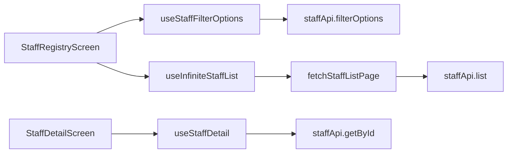

# Sprint 4 — Batch 2 Report: People Workspace Foundation

**Status:** Complete  
**Scope:** Read-only People workspace — staff directory, search, filters, detail routing. No create/edit, Staff 360 tabs, or payroll editing.  
**Verification:** `tsc --noEmit` passes for `packages/core`, `packages/ui`, and `apps/admin`.

---

## 1. API audit (pre-implementation)

Source: [`docs/people/01-people-audit.md`](../people/01-people-audit.md).

| Existing endpoint | Batch 2 use |
| --- | --- |
| `GET /api/staff` | Paginated directory + search |
| `GET /api/staff/{id}` | Staff detail screen |
| `PUT /api/staff/{id}` | **Not used** (no edit) |
| `POST /api/staff/{id}/photo` | **Not used** |

**Gaps before Batch 2:** List only supported `search` + `department_id`; no filter metadata endpoint; list payload omitted `employment_status`, `gender`, `system_role`; `role` field incorrectly mirrored job title.

---

## 2. APIs reused

| Method | Route | Purpose |
| --- | --- | --- |
| GET | `/api/staff` | Directory (extended query params in Batch 2) |
| GET | `/api/staff/{id}` | Detail overview |

**Query params on `GET /staff` (server-side):**

| Param | Filter |
| --- | --- |
| `search` / `q` | Name, email, phone, staff ID |
| `department_id` | Department |
| `staff_category_id` | Category |
| `employment_status` | Employment status |
| `gender` | Gender (case-insensitive) |
| `role` | Spatie role name on linked user |
| `page`, `per_page` | Pagination |

---

## 3. APIs created

| Method | Route | Purpose |
| --- | --- | --- |
| GET | `/api/staff/filter-options` | Departments, categories, roles, employment status + gender enums |

**`ApiStaffController` enhancements:**

- Eager-load `user.roles` on list/detail.
- List/detail payload adds: `system_role`, `department_id`, `staff_category_id`, `staff_category`, `employment_status`, `gender`.
- `role` in JSON now reflects **system role** (job title remains in `job_title` / `designation`).

**Files:**

- `app/Http/Controllers/Api/ApiStaffController.php`
- `routes/api.php` (route order: `filter-options` before `{id}`)

---

## 4. Mobile architecture

### 4.1 Models (`@erp/core`)

| Type | Location | Role |
| --- | --- | --- |
| `StaffRecord` | `types/staff.ts` | Raw API DTO |
| `StaffSummary` | `types/staff.ts` | Directory row |
| `StaffDetail` | `types/staff.ts` | Detail + routing seed |
| `StaffListFilters` | `types/staff.ts` | Query key + hook input |
| `StaffFilterOptions` | `types/staff.ts` | Filter chips data |

Re-exported from `apps/admin/src/features/people/models` for feature parity with Students.

### 4.2 Staff API module

`packages/core/src/api/staff.api.ts` — `list`, `getById`, `filterOptions`.

### 4.3 Normalization

`packages/core/src/staff/normalize.ts` — `toStaffSummary`, `toStaffDetail`, `buildStaffQueryParams`.

### 4.4 Query hooks (TanStack Query)

| Hook | Key | Behavior |
| --- | --- | --- |
| `useStaffFilterOptions` | `queryKeys.staff.filterOptions()` | Filter chip options |
| `useInfiniteStaffList` | `queryKeys.staff.list(filters)` | Infinite scroll directory |
| `useStaffDetail` | `queryKeys.staff.detail(id)` | Detail fetch |

### 4.5 UI (`@erp/ui`)

| Component | Purpose |
| --- | --- |
| `StaffSearchBar` | Debounced search field |
| `StaffFilters` | Department, category, role, employment, gender chips |
| `StaffListItem` | Directory row + employment badge |
| `StaffEmploymentBadge` | Status pill |

### 4.6 Admin app

| Piece | Path |
| --- | --- |
| People stack | `navigation/PeopleStackNavigator.tsx` |
| Registry | `features/people/screens/StaffRegistryScreen.tsx` |
| Detail routing | `features/people/screens/StaffDetailScreen.tsx` (overview only) |
| Tab shell | `BottomTabsNavigator` → `PeopleStackNavigator` (replaces placeholder) |
| Deep links | `linking.ts` — `people/:staffId` |

**RBAC:** `useCan(['people.view', 'staff.view'])` on registry and detail.

---

## 5. Query architecture

- **Filter state:** `useStaffRegistryState` — 400ms debounced search; stable `StaffListFilters` object for query keys.
- **Navigation:** Pass optional `StaffSummary` into `StaffDetail` for instant header paint while `useStaffDetail` loads.

---

## 6. Caching strategy

| Query | `staleTime` | Invalidation |
| --- | --- | --- |
| `filterOptions` | 10 min | Rarely changes; manual pull-to-refresh on list refetches list only |
| `staff.list(filters)` | 45 s | Key includes full filter object — auto-invalidates on filter change |
| `staff.detail(id)` | 60 s | Per-id cache; revisit same profile uses cache |

**Pull-to-refresh:** `listQuery.refetch()` on registry FlatList.

**Not implemented:** Optimistic updates, prefetch on list press (optional follow-up).

---

## 7. Out of scope (confirmed)

- Staff creation (`POST /staff`)
- Staff editing (`PUT /staff`)
- Staff 360 tabs (leave, payroll, attendance, performance)
- Payroll period processing / payslip PDF
- Profile change approvals inbox

---

## 8. Risks

| Risk | Mitigation |
| --- | --- |
| `people.view` not on Laravel Secretary role | Fallback `staff.view` in `useCan`; assign `people.view` server-side in a later RBAC pass |
| Staff without `user_id` invisible to **role** filter | Expected; show “—” for system role in UI |
| List API returns **active** `status` only | Matches audit; archived staff need future `status` param |
| `employment_status` null on legacy rows | Filter may exclude; badge hidden when null |
| Breaking change: API `role` now system role not job title | Mobile uses `system_role` + `job_title` explicitly |
| Filter options load all Spatie roles | May include non-staff roles; trim in future if noisy |

---

## 9. Follow-ups (Batch 3+)

1. Staff 360 tabs — leave inbox, payslip list, clock history per staff.
2. `POST /api/staff` + create flow (if product requires mobile hire).
3. Profile change + leave approval from People dashboard KPIs.
4. Server: `people.view` permission wired to `ApiStaffController` (not only Spatie roles).
5. Optional `status=archived` on list API.

---

*End of Sprint 4 Batch 2.*
