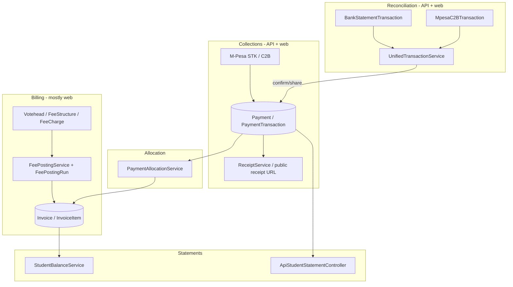

# 01 — Finance Workspace Audit (Laravel ERP → Admin App)

**Status:** Complete (read-only discovery)  
**Sprint:** 6 Batch 1 — Finance Workspace Discovery  
**Scope:** Student billing & collections subledger (receivables), statements, reconciliation — **not** General Ledger, accounting, budgeting, procurement, or fixed assets.  
**No application code** was written for this exercise.

**Primary sources:** [`docs/system-audit/07-finance-audit.md`](../system-audit/07-finance-audit.md), [`docs/system-audit/05-business-processes.md`](../system-audit/05-business-processes.md) (§7–9), [`docs/admin-app/02-admin-information-architecture.md`](../admin-app/02-admin-information-architecture.md) (§10 Finance Cockpit), `routes/api.php`, `routes/web.php` (finance prefix), API controllers under `app/Http/Controllers/Api/`, web finance controllers, legacy `mobile-app/src/api/finance.api.ts`, `apps/admin` Finance placeholder.

---

## Executive summary

The ERP is a **production-grade receivables subledger** (voteheads → posting → invoices → payments → allocation → reconciliation). It is **not** a double-entry accounting system. For the Admin App Finance Workspace MVP, the backend already exposes **substantial read/write REST coverage** for collections and reconciliation; **billing operations** (posting, invoice generation, fee catalog edits) remain **web-only**.

| Workspace area | Backend readiness | Admin App today |
|----------------|-------------------|-----------------|
| **Dashboard** | Partial — `GET /dashboard/stats` (role-shaped); no dedicated `/finance/summary` | Placeholder tab (`FinanceScreen`) |
| **Billing** | Read-only API (`/fee-structures`, `/invoices`); posting/generation web-only | Not started |
| **Collections** | Strong — invoices, payments list/detail, `POST /payments`, M-Pesa STK/link | Legacy monolith screens exist; `@erp/admin` empty |
| **Statements** | Strong — `GET /students/{id}/statement`; web family/PDF/export only | Student 360 Fees tab can reuse statement API |
| **Reconciliation** | Strong — unified transactions + confirm/reject/share | Legacy monolith; API wired |

**Recommendation:** Ship Finance Workspace MVP by **porting and hardening** existing Sanctum APIs into `@erp/core` + `@erp/admin`, mirroring the Admissions/Students workspace pattern. Defer posting/commit, GL, expenses, and payroll to later sprints (explicitly out of MVP scope).

---

# 1. Domain architecture (as-is)

Per [`07-finance-audit.md`](../system-audit/07-finance-audit.md), finance is organized as:



**In scope for this workspace:** billing *visibility*, collections, statements, reconciliation.  
**Out of scope (per sprint brief):** Chart of accounts, journals, trial balance, P&L, balance sheet, cash flow, budgets, expenses/vouchers as a module, procurement, assets, payroll runs.

---

# 2. API inventory

All routes below are under `auth:sanctum` unless noted. Response envelope: `{ success, data, message? }` with paginated lists using `data.data`, `current_page`, `last_page`, `total`.

## 2.1 Mobile-ready REST APIs (Sanctum)

| Endpoint | Controller | Methods | Mobile-ready | Notes |
|----------|------------|---------|--------------|-------|
| `/invoices` | `ApiInvoiceController` | GET list | ✅ Yes | Filters: `year`/`year_id`, `term`/`term_id`, `student_id`, `class_id`, `stream_id`, `status`, `search`, `include_reversed`, `per_page`. **Gap:** `index()` has **no finance role guard** (only `show()` checks access). |
| `/invoices/{id}` | `ApiInvoiceController` | GET detail | ✅ Yes | Line items + votehead names. Roles: Super Admin, Admin, Secretary, Finance Officer, Accountant; teachers scoped to their students. |
| `/fee-structures` | `ApiFeeStructureController` | GET list | ✅ Yes | Read-only summary per structure (class, term, year, total charges). Finance roles only. |
| `/payments` | `ApiPaymentController` | GET list | ✅ Yes | Filters: `student_id`, `class_id`, `search`, `date_from`/`date_to`, `active_only`, `per_page`. All-payments list requires finance staff role. |
| `/payments/{id}` | `ApiPaymentController` | GET detail | ✅ Yes | Allocations, receipt public URL, `portal_note` pointing advanced actions to web. |
| `/payments` | `ApiPaymentController` | POST create | ✅ Yes | Cash/manual record: auto-allocate + receipt generation. Roles: Super Admin, Admin, Secretary, Finance Officer, Accountant. |
| `/students/{id}/statement` | `ApiStudentStatementController` | GET | ✅ Yes | Year-scoped debit/credit ledger; `closing_balance` from `StudentBalanceService`. Parents/teachers/finance scoped. |
| `/students/{id}/fee-clearance` | `ApiFeeClearanceController` | GET | ⚠️ Partial | Term clearance snapshot (transport gating). Adjacent to collections; amounts policy varies by role. |
| `/students/{id}/mpesa/prompt` | `ApiMpesaPaymentController` | POST | ✅ Yes | STK push (admin-initiated). Sibling share payload supported. |
| `/students/{id}/mpesa/payment-link` | `ApiMpesaPaymentController` | GET | ✅ Yes | Family payment link for parent self-pay. |
| `/finance/transactions` | `ApiFinanceTransactionsController` | GET list | ✅ Yes | Unified bank + C2B. `view` filter: `all`, `unassigned`, `auto-assigned`, `duplicate`, `swimming`, `manual-assigned`, `draft`, `collected`, `archived`. |
| `/finance/transactions/{id}?type=bank\|c2b` | `ApiFinanceTransactionsController` | GET detail | ✅ Yes | `type` query required. |
| `/finance/transactions/{id}/confirm` | `BankStatementController` | POST | ✅ Yes | Creates/confirms payment from matched transaction. Body: `type`. |
| `/finance/transactions/{id}/reject` | `BankStatementController` | POST | ✅ Yes | Rejects + reverses related payments. Body: `type`. |
| `/finance/transactions/{id}/share` | `BankStatementController` | POST | ✅ Yes | Sibling split before confirm. Body: `type`, `allocations[]`. |
| `/finance/transactions/mark-swimming` | `BankStatementController` | POST | ✅ Yes | Bulk swimming reclass. |
| `/dashboard/stats` | `ApiDashboardController` | GET | ⚠️ Partial | **Finance Officer / role `Finance`:** dedicated `financeDashboard` (collections today/week/month, pending/overdue invoices, charts). **Admin/Super Admin/Secretary:** `adminDashboard` includes `fees_collected`, `total_invoiced`, `outstanding_balance` + term/year filters. No unreconciled-transaction count today. |
| `/students`, `/students/{id}` | `ApiStudentController` | GET | ✅ Supporting | Student picker for collections/reconciliation. |
| `/classes`, `/classes/{id}/streams` | `ApiClassroomController` | GET | ✅ Supporting | Invoice/payment filters. |
| `/student-categories` | `ApiStudentWriteController` | GET | ✅ Supporting | Peripheral to billing context. |

### Receipts

There is **no** `GET /receipts` or `GET /payments/{id}/receipt/pdf` API. Receipts are surfaced as:

- `receipt_number` on payment list/detail
- `receipt_public_url` → `url('/receipt/{public_token}')` (unauthenticated web view)
- Web: `finance.payments.receipt`, `.receipt.pdf`, bulk print

**Mobile implication:** open receipt in `WebBrowser` / `Linking` via `receipt_public_url`; optional future authenticated PDF endpoint.

## 2.2 Referenced but missing APIs

| Expected (client code) | Status |
|------------------------|--------|
| `GET /finance/summary` | ❌ **Not registered** — `mobile-app/src/api/finance.api.ts` catches 404 and returns zeros. MVP should add this or derive KPIs from `/dashboard/stats` + aggregates. |
| `GET /finance/stats` (workspace-specific) | ❌ Not present — recommend Sprint 6 Batch 2. |
| Posting preview/commit | ❌ Web only (`PostingController`) |
| Invoice generate/reverse | ❌ Web only |
| Payment reverse/allocate/transfer | ❌ Web only (detail API documents web portal) |
| Fee balances / defaulters list | ❌ Web only (`FeeBalanceController`); senior-teacher has `GET /senior-teacher/fee-balances` (supervisory read) |
| Bank statement import | ❌ Web only |
| Credit/debit notes | ❌ Web only |
| Fee concessions / payment plans | ❌ Web only |

## 2.3 Web-only finance routes (reference)

Under `routes/web.php` → `finance.*` middleware `role:Super Admin|Admin|Secretary` (Finance Officer/Accountant on some sub-routes):

| Module | Controller(s) | Primary actions |
|--------|---------------|-----------------|
| Voteheads & fee structures | `VoteheadController`, `FeeStructureController` | CRUD, import, replicate |
| **Posting** | `PostingController` | Dry-run preview, commit, reverse, `FeePostingRun` audit |
| Invoices | `InvoiceController` | Generate, edit, reverse, bulk print/import, carry-forward |
| Optional/transport/uniform fees | `OptionalFeeController`, `TransportFeeController`, … | Class/student billing lines |
| Payments | `PaymentController` | Record, allocate, reverse, transfer, share siblings, bulk comms |
| Bank statements | `BankStatementController` | Import PDF/CSV, auto-assign, bulk confirm, swimming, link payments |
| Student statements | `StudentStatementController` | Per-student/family statement, print, export, legacy line edits |
| Fee balances / clearance | `FeeBalanceController`, `FeeClearanceReportController` | Arrears reports, PDF |
| M-Pesa admin | `MpesaPaymentController` | Dashboard, waiting pages, prompt (mirrored in API) |
| Concessions/discounts/plans | `FeeConcessionController`, `DiscountController`, `FeePaymentPlanController` | Approval workflows |
| Expenses/vouchers | `ExpenseController`, `PaymentVoucherController` | **Out of MVP scope** |
| Payroll | `PayrollPeriodController`, … | **Out of MVP scope** (separate People/Finance IA item) |
| Legacy import / BBF | `LegacyFinanceImportController`, `BalanceBroughtForwardController` | Migration tooling |

## 2.4 Auxiliary web JSON (non–`routes/api.php`)

| Route | Purpose |
|-------|---------|
| `GET /api/finance/students/{student}` | M-Pesa UI student balance payload |
| `GET /api/finance/students/{student}/invoices` | M-Pesa UI invoice picker |

These are **session/web** helpers inside the finance route group, not Sanctum mobile contracts.

---

# 3. Data models

Core tables/models for the Finance Workspace MVP:

| Model | Table | Role in workspace |
|-------|-------|-------------------|
| `Votehead` | `voteheads` | Fee line catalog (billing context) |
| `VoteheadCategory` | `votehead_categories` | Mandatory/optional/activity grouping |
| `FeeStructure` | `fee_structures` | Class/year/term fee definition |
| `FeeCharge` | `fee_charges` | Votehead amounts per structure |
| `FeePostingRun` | `fee_posting_runs` | Auditable posting batch |
| `PostingDiff` | `posting_diffs` | Dry-run diff rows (web posting) |
| `Invoice` | `invoices` | One per student/year/term; denormalized `total`, `paid_amount`, `balance` |
| `InvoiceItem` | `invoice_items` | Votehead lines; discounts |
| `Payment` | `payments` | Receipted collection; `transaction_code`, `receipt_number`, allocation fields |
| `PaymentAllocation` | `payment_allocations` | Links payment → invoice item amounts |
| `PaymentMethod` | `payment_methods` | Cash, M-Pesa, bank transfer, etc. |
| `PaymentTransaction` | `payment_transactions` | Gateway STK/C2B attempt tracking |
| `BankStatementTransaction` | `bank_statement_transactions` | Imported bank lines |
| `MpesaC2BTransaction` | `mpesa_c2b_transactions` | M-Pesa paybill inbox |
| `Receipt` | `receipts` | Receipt metadata (paired with `Payment`) |
| `StudentTermFeeClearance` | `student_term_fee_clearances` | Clearance snapshots |
| `CreditNote` / `DebitNote` | `credit_notes`, `debit_notes` | Adjustments (web) |
| `FeeConcession` | `fee_concessions` | Discount approvals (web) |

**Balance truth:** `Invoice::recalculate()`, `StudentBalanceService::getTotalOutstandingBalance()`, legacy balance-brought-forward tables coexist — mobile should treat API-computed balances as authoritative and avoid client-side recomputation from partial lists.

**Identifiers for search:** `invoice_number`, `receipt_number`, `transaction_code`, M-Pesa `trans_id` / `mpesa_receipt_number`.

---

# 4. Permissions & access control

## 4.1 Server-side roles (API)

Recurring allow-list on finance APIs:

`Super Admin`, `Admin`, `Secretary`, `Finance Officer`, `Accountant`

Additional patterns:

- **Teachers:** read invoices/payments/statement only for students in their scope (`applyTeacherStudentFilter`).
- **Parents:** `GET /students/{id}/statement` when `canAccessStudent`.
- **Senior Teacher:** `finance.fee_balances.view` → `GET /senior-teacher/fee-balances` (read-only supervisory).

## 4.2 Spatie permissions (seeded)

From `RolesAndPermissionsSeeder` / `Comprehensive2025Seeder`:

| Permission | Typical grant |
|------------|---------------|
| `finance.view` | Admin presets |
| `finance.create` / `finance.edit` / `finance.delete` | Admin, Accountant |
| `finance.manage` | Dashboard-oriented admin preset |
| `finance.fee_balances.view` | Senior Teacher |

**Gap:** API controllers predominantly use **`hasAnyRole([...])`**, not `$user->can('finance.view')`. Mobile RBAC (`@erp/core` `finance.view`) may **not align** with server enforcement. Unknown mobile role `finance` maps to `BURSAR` preset client-side, but server expects `Finance Officer` or `Accountant` ([`04-role-audit.md`](../system-audit/04-role-audit.md)).

## 4.3 Web route middleware

Finance web group: `Super Admin|Admin|Secretary` — **Secretary can access full web finance** while API payment create also allows Secretary. Finance Officer/Accountant have narrower web access on some routes (e.g. sibling balance transfer).

## 4.4 Recommended RBAC for Admin Finance Workspace

| Client permission | MVP screens | Server check (target) |
|-------------------|-------------|------------------------|
| `finance.view` | Dashboard, Billing read, Collections list, Statements read, Reconciliation queue read | Finance roles + Admin |
| `finance.create` | Record payment, STK prompt, confirm transaction | Finance staff |
| `finance.edit` | Share transaction, mark swimming | Finance staff |
| `finance.delete` | Reject transaction (destructive) | Finance staff + audit |

**Maker-checker (future):** confirm/reject should optionally require a second approver — not enforced in API today.

---

# 5. Workflows currently supported

Mapped from [`05-business-processes.md`](../system-audit/05-business-processes.md) §7–9 and code review.

## 5.1 Fee billing (posting)

| Step | Where | Mobile today |
|------|-------|--------------|
| Maintain voteheads/structures | Web | ❌ |
| Preview posting diff | Web `PostingController` | ❌ |
| Commit posting → invoices | `FeePostingService` | ❌ |
| Reverse posting | Web | ❌ |
| View resulting invoices | API `GET /invoices` | ✅ Read |

**Trigger points:** manual posting, new student enroll (`chargeFeesForNewStudent`), optional/transport/activity fee services.

## 5.2 Fee collection

| Channel | Flow | Mobile API |
|---------|------|------------|
| Cash/cheque/bank (manual) | `PaymentController` / `ApiPaymentController::store` | ✅ POST `/payments` |
| M-Pesa STK (admin) | `MpesaGateway` → webhook → allocation | ✅ POST `/students/{id}/mpesa/prompt` |
| M-Pesa STK (parent link) | `PaymentLink` public pages | ✅ GET payment-link; parent-facing |
| M-Pesa C2B | Paybill inbox → reconciliation | ✅ Via `/finance/transactions` |
| Bank import | PDF/CSV → `BankStatementTransaction` | ❌ Import web-only; reconcile via API |

Post-collection: `ReceiptService`, SMS/WhatsApp (web/bulk jobs), auto-allocation FIFO / oldest-invoice-first.

## 5.3 Payment allocation

| Capability | Web | API |
|------------|-----|-----|
| Auto-allocate on create | ✅ | ✅ on `POST /payments` |
| Manual allocate to voteheads | ✅ | ❌ |
| Sibling share | ✅ | ✅ on reconciliation `share` + STK payload |
| Transfer payment | ✅ | ❌ |
| Reverse payment | ✅ | ❌ (reject transaction reverses linked payments) |

## 5.4 Reconciliation

| Step | Implementation | Mobile API |
|------|----------------|------------|
| Ingest bank/C2B | Import + webhooks | List/filter via `UnifiedTransactionService` |
| Smart match | `MpesaSmartMatchingService` | `match_status`, `match_confidence` on list row |
| Manual match / edit | Web show screen | ❌ Full editor web-only |
| Share among siblings | `BankStatementController::share` | ✅ |
| Confirm → create payment | `confirm` | ✅ |
| Reject | `reject` | ✅ |
| Swimming reclass | bulk/single web + API mark | ✅ mark-swimming |
| Audit fixes | `TransactionFixAudit` | ❌ |

## 5.5 Statements & balances

| Output | Web | API |
|--------|-----|-----|
| Student statement (single year) | Print/export PDF | ✅ `GET /students/{id}/statement` |
| Family statement | Web | ❌ |
| Fee balance report (school-wide) | Web | ❌ |
| Student 360 fee context | Web student show | Partial via statement + student detail |

## 5.6 Out-of-scope workflows (documented, not in MVP)

- Expense submit → approve → voucher → pay  
- Payroll generate → lock → payslip  
- Credit/debit note import  
- Fee concession approval (`approval_status`)  
- Legacy finance import / BBF  
- Jenga bank disbursement (`/jenga/*` APIs exist but are treasury/disbursement, not school fee collection)

---

# 6. Finance Workspace MVP design

Aligns with Admin IA §10 but **trimmed** to the five areas in the sprint brief (no Accounting/Payroll modules in this workspace).

```text
Finance (bottom tab — apps/admin)
├── Dashboard        KPIs + charts + alerts entry
├── Billing          Invoices + fee structures (read); posting status (read/link-out)
├── Collections      Payments + record payment + M-Pesa + receipts
├── Statements       Student/family statement lookup
└── Reconciliation   Unified transactions queue + confirm/reject/share
```

## 6.1 Dashboard

**Job:** “How are we doing financially this term?”

| UI element | Data source (MVP) | Fallback |
|------------|-------------------|----------|
| Collections today / week / month | `GET /dashboard/stats` when role = finance; else admin dashboard fields | Sum from `GET /payments?date_from&date_to` |
| Outstanding balance | `outstanding_balance` (admin) or computed from invoices | — |
| Pending / overdue invoice counts | Finance dashboard fields | Filter `GET /invoices?status=…` |
| Unreconciled transactions | **New KPI recommended** — count `GET /finance/transactions?view=unassigned` | Manual badge |
| Collection trend (7d) | `charts.line` on finance dashboard | Client aggregate |
| Payment method mix (30d) | `charts.bar` on finance dashboard | — |
| Quick actions | Navigate to Collections, Reconciliation queue | — |

**Non-goals:** budget vs actual, GL balances, payroll totals.

## 6.2 Billing

**Job:** “What was charged, and what structures exist?” — **not** full posting UI in MVP.

| Screen | MVP capability | API |
|--------|----------------|-----|
| Invoice registry | Search/filter list, status chips (issued/partial/paid/overdue) | `GET /invoices` |
| Invoice 360 | Header (student, term, totals) + line items (voteheads) | `GET /invoices/{id}` |
| Fee structures | Read-only list per class/year | `GET /fee-structures` |
| Posting | **Read-only banner:** “Last posting run” if API added later; else link to ERP web | Web for commit |
| Defaulters | Filter invoices with `balance > 0` + overdue `due_date` | Client filter on invoice list |

**Non-goals:** votehead CRUD, posting dry-run/commit, invoice generation, credit/debit notes.

## 6.3 Collections

**Job:** “Record money in and prove receipt.”

| Screen | MVP capability | API |
|--------|----------------|-----|
| Payments registry | Infinite list, search by receipt/M-Pesa code/student | `GET /payments` |
| Payment 360 | Amount, method, allocations, receipt link | `GET /payments/{id}` |
| Record payment | Student picker, amount, method, date, reference, notes | `POST /payments` |
| M-Pesa STK | Phone + amount (+ optional invoice) | `POST /students/{id}/mpesa/prompt` |
| Payment link | Copy/share family link | `GET /students/{id}/mpesa/payment-link` |
| Receipt | Open `receipt_public_url` in browser | From payment detail |

**Non-goals:** reverse payment, manual allocation editor, bulk receipt SMS (web).

## 6.4 Statements

**Job:** “Answer parent balance queries on the spot.”

| Screen | MVP capability | API |
|--------|----------------|-----|
| Statement lookup | Search student → year selector | `GET /students` + statement |
| Statement view | Opening/closing, invoiced/paid totals, transaction ledger | `GET /students/{id}/statement?year=` |
| Entry from Student 360 | Fees tab reuses same hook (already in student workspace plan) | Same API |

**Non-goals:** family consolidated statement, PDF export, legacy line edits.

## 6.5 Reconciliation

**Job:** “Clear the unmatched queue.”

| Screen | MVP capability | API |
|--------|----------------|-----|
| Queue | Tabs/filters mirroring web views: unassigned, auto-assigned, duplicates, swimming | `GET /finance/transactions?view=` |
| Transaction 360 | Bank vs C2B detail | `GET /finance/transactions/{id}?type=` |
| Confirm | One-tap confirm matched student | `POST .../confirm` |
| Reject | Reject with confirm dialog | `POST .../reject` |
| Share | Sibling split form | `POST .../share` |
| Mark swimming | Bulk select + action | `POST .../mark-swimming` |

**Non-goals:** bank file import, auto-assign batch, link-to-existing-payments UI, transaction-fix audit viewer.

## 6.6 Navigation & integration

- Replace `FinanceScreen` placeholder with `FinanceStackNavigator` (mirror Admissions): workspace home with section cards or sub-tabs.
- Deep links from **global search** (invoice #, receipt #, M-Pesa code) → Invoice 360 / Payment 360 / Reconciliation detail.
- **Student 360 → Fees tab** shares `@erp/core` statement + payment hooks (single source of truth).
- **Dashboard (main)** may show finance tiles for Admin; Finance tab shows finance-role-specialized dashboard.

---

# 7. KPI recommendations

| KPI | Definition | Source (MVP) | Priority |
|-----|------------|--------------|----------|
| Collections today | Sum payments `payment_date = today`, not reversed | Dashboard stats | P0 |
| Collections MTD | Month-to-date collections | Dashboard stats | P0 |
| Outstanding AR | Sum invoice `balance` active invoices | Dashboard `outstanding_balance` | P0 |
| Pending invoices | Count invoices with `balance > 0` | Finance dashboard `pending_invoices` | P0 |
| Overdue invoices | Balance > 0 and `due_date < today` | Finance dashboard `overdue_invoices` | P0 |
| Unreconciled count | Unified transactions `view=unassigned` total | **New API or client count** | P0 |
| Unreconciled amount | Sum `trans_amount` unassigned | Aggregate on `/finance/transactions` | P1 |
| Collection rate | Payments / invoiced (term-scoped) | Admin dashboard term filter | P1 |
| Auto-match rate | % transactions `auto-assigned` | Reconciliation list metrics | P2 |
| Defaulter count | Students with overdue balance | Invoice list aggregate | P1 |
| Avg days overdue | Mean days past `due_date` for open invoices | Requires API extension | P2 |

**Suggested new endpoint (Batch 2):** `GET /finance/stats` returning the above in one round-trip for the Finance Dashboard screen.

---

# 8. Mobile implementation strategy

## 8.1 Reuse pattern (match Sprint 5 Admissions)

| Layer | Deliverable |
|-------|-------------|
| `@erp/core/types` | `finance.ts` — `InvoiceRecord`, `PaymentRecord`, `FinanceTransactionRecord`, `StudentStatementRecord`, filters |
| `@erp/core/api` | `finance.api.ts` — port from `mobile-app/src/api/finance.api.ts` (remove `/finance/summary` fallback once API exists) |
| `@erp/core/query` | `queryKeys.finance.*`, hooks: `useFinanceStats`, `useInfiniteInvoices`, `useInfinitePayments`, `useFinanceTransactions`, `useStudentStatement`, mutations for payment create + recon actions |
| `@erp/ui` | Finance list items, status badges, KPI row, transaction match chips |
| `apps/admin` | `FinanceStackNavigator`, screens per MVP area, RBAC via `finance.view` / `finance.create` |

## 8.2 Phased delivery

| Batch | Focus | Depends on |
|-------|-------|------------|
| **Batch 1 (this doc)** | Discovery only | — |
| **Batch 2** | Core package + Dashboard + Collections (payments list/record/detail) | Existing APIs |
| **Batch 3** | Billing (invoices + fee structures) + Statements | Existing APIs |
| **Batch 4** | Reconciliation queue + actions + `GET /finance/stats` backend | API hardening |
| **Batch 5** | Polish: receipt PDF, deep links, diagnostics, smoke script | Optional new endpoints |

## 8.3 API hardening (Batch 2+ backend)

1. Add `GET /finance/stats` (or extend `/dashboard/stats` with `?module=finance`).
2. Guard `ApiInvoiceController::index` with finance role check (parity with payments).
3. Align permission checks to `finance.view` / `finance.create` where roles are insufficient.
4. Optional: `GET /payments/{id}/receipt.pdf` authenticated download for offline share.
5. Optional: `GET /finance/defaulters` paginated (or document client-side filter from invoices).

## 8.4 Legacy monolith assets

`mobile-app/src/screens/Finance/*` and `finance.api.ts` are a **proven reference implementation** (list screens, M-Pesa modal, transaction confirm). Port UI/logic into `@erp/admin` with shared core — do not duplicate API shapes.

## 8.5 Testing & ops

- Extend `scripts/smoke-admin-api.ps1` with `/invoices`, `/payments`, `/finance/transactions`, `/fee-structures`.
- Add `tests/Feature/Api/FinanceApiTest.php` for role gates and pagination envelopes.
- Production deploy requires `route:cache` after new finance routes.

## 8.6 Explicit exclusions (do not implement in Finance Workspace MVP)

- General Ledger, chart of accounts, journal entries  
- Budgeting & budget vs actual  
- Expenses, payment vouchers, vendors (Accounting area in IA)  
- Payroll runs & payslips (People/Finance IA — separate epic)  
- Procurement, inventory, assets  
- Bank statement **import** UI  
- Fee posting commit UI  

---

# 9. Risks & pain points

| Risk | Impact on mobile | Mitigation |
|------|------------------|------------|
| Denormalized invoice balances drift | Wrong AR KPIs | Prefer server aggregates; call `recalculate` server-side (already on statement) |
| Multiple payment rails (STK, C2B, bank, manual) | Reconciliation complexity | Unified transactions API already abstracts; MVP focuses on queue UX |
| No `/finance/summary` | Dashboard fallback zeros | Add stats endpoint or compose from dashboard + counts |
| Role name mismatch (`finance` vs `Finance Officer`) | 403 for legitimate users | Normalize roles server-side; document in RBAC |
| Broad Admin bypass | Segregation of duties weak | UI hints; future maker-checker on confirm |
| Invoice index lacks auth guard | Data leak if token compromised | Fix in API hardening |
| Advanced actions only on web | User expectation gap | `portal_note` pattern on payment detail + clear CTAs |

---

# 10. Open decisions for sign-off

1. **Finance sub-nav:** bottom-tab sections as stack tabs vs single workspace with section cards (Admissions-style)?
2. **Billing MVP depth:** read-only invoices only, or include “open in web to post” deep link?
3. **Reconciliation MVP:** confirm/reject only, or include share + swimming in v1?
4. **Dedicated `/finance/stats`:** new controller vs extend `ApiDashboardController`?
5. **Secretary access:** match web (full finance) or restrict mobile collections to Finance Officer/Accountant?

---

## Appendix A — Quick API cheat sheet

```
GET    /invoices
GET    /invoices/{id}
GET    /fee-structures
GET    /payments
GET    /payments/{id}
POST   /payments
GET    /students/{id}/statement?year=
POST   /students/{id}/mpesa/prompt
GET    /students/{id}/mpesa/payment-link
GET    /finance/transactions?view=unassigned
GET    /finance/transactions/{id}?type=bank|c2b
POST   /finance/transactions/{id}/confirm
POST   /finance/transactions/{id}/reject
POST   /finance/transactions/{id}/share
POST   /finance/transactions/mark-swimming
GET    /dashboard/stats
```

---

*Next step after sign-off: Sprint 6 Batch 2 — `@erp/core` finance module + Finance Dashboard & Collections screens.*
