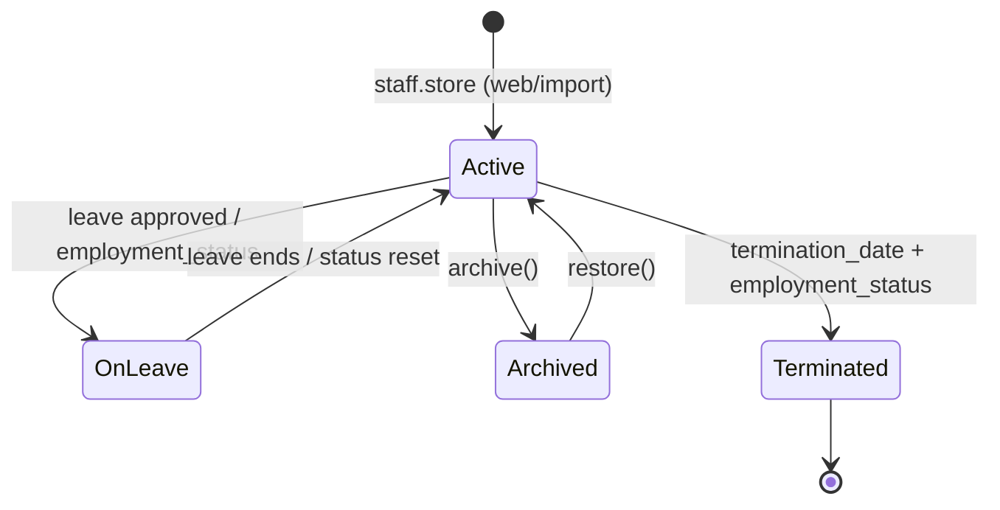
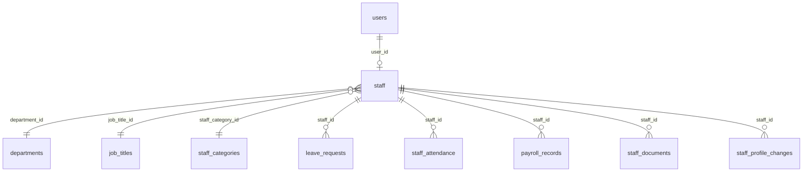
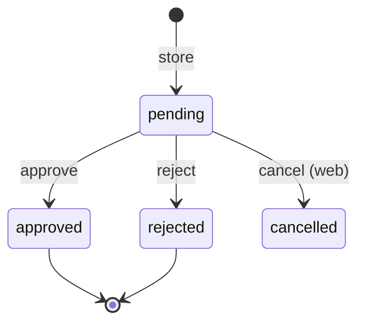
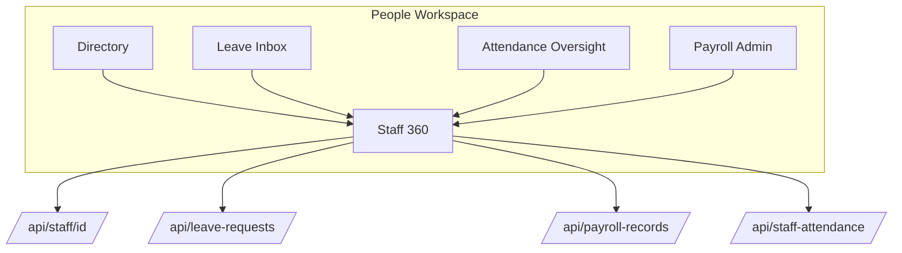

# 01 — People Domain Audit (Laravel ERP)

**Status:** Complete (read-only discovery)  
**Scope:** Staff management, role-specific cohorts (teachers, drivers, etc.), HR, leave, attendance, payroll, performance — for Admin App **People** workspace planning.  
**No application code** was written for this exercise.

**Primary sources:** `app/Http/Controllers/Hr/*`, `app/Http/Controllers/Api/ApiStaff*`, `ApiLeaveRequestController`, `ApiPayrollRecordsController`, `routes/web.php`, `routes/api.php`, `docs/system-audit/02-module-inventory.md`, `docs/admin-app/01-admin-discovery.md` §16, `docs/admin-app/02-admin-information-architecture.md`.

---

## Executive summary

People/HR in this ERP is **staff-centric**: one `staff` table linked to `users` for login, with **web-heavy** CRUD and **partial mobile APIs** (directory read/update, leave, clock, payslip list). There is **no recruitment/applicant module** — hiring is “create staff” (or bulk import). **Performance management** and **training** tables exist as **schema stubs** with almost no UI or API. **Security** (guards/visitors) is **not implemented**. **Drivers** are a **Spatie role** + transport APIs, not a separate HR entity.

| Area | Maturity | Mobile API |
|------|----------|------------|
| Staff directory | Strong (web) | Read/update/photo |
| Teachers | Via staff + assignments | Clock, leave, timetable |
| Non-teaching staff | Via `staff_categories` / roles | Same as staff |
| Drivers | Transport module | `/driver/trips` |
| Security | Missing | — |
| Leave | Strong | Full workflow API |
| Staff attendance (clock) | Strong | Geofence clock API |
| Payroll | Strong (web) | Payslip list only |
| Performance (HR) | Stub | — |

---

# 1. Domain map (requested areas)

## 1.1 Staff Management

**Purpose:** Canonical workforce registry — identity, employment, payroll inputs, system access.

| Layer | Implementation |
|-------|----------------|
| **Model** | `App\Models\Staff` ↔ `users` (`user_id`) |
| **Controller** | `Hr\StaffController` (CRUD, bulk upload, archive, credentials) |
| **API** | `Api\ApiStaffController` (index, show, update, photo) — **no POST create** |
| **Supporting** | `StaffMeta`, `StaffDocumentController`, `StaffProfileController` (self-service → `StaffProfileChange`) |

**Create flow (web):** Validate → `User::create` (password = id_number, must change) → Spatie role from picker or category default (category `1` → Teacher, `2` → Administrator, else Staff) → `staff_id` from settings counter → `Staff::create` → supervisors pivot → welcome SMS/email.

## 1.2 Teachers

**Not a separate table.** Identified by:

- Spatie role `Teacher` (and variants: `Senior Teacher`, teacher-like bypasses)
- `staff_categories` (convention: id `1` = teaching in auto-role logic)
- `max_lessons_per_week` on `staff`
- Academic assignments: `classroom_subjects`, `class_teacher_assignments`, `stream_teacher`, timetable slots

**Teacher-specific mobile:** geofence **clock-in/out** (`ApiStaffClockController` — `hasTeacherLikeRole()`), class **student attendance** (`/attendance/*`), lesson plans, exams/marks, senior-teacher supervision APIs.

## 1.3 Non-Teaching Staff

Same `staff` row; distinguished by `staff_category_id`, `department_id`, `job_title_id`, and Spatie role (`Administrator`, `Staff`, `Secretary`, `Accountant`, etc.). No “non-teaching” enum — operational classification is **lookup-driven**.

## 1.4 Drivers

| Layer | Detail |
|-------|--------|
| **HR** | Driver is a **staff** member with Spatie role `Driver` |
| **Operations** | `Driver\DriverController` (web), `Api\ApiDriverTransportController` |
| **API** | `GET /api/driver/trips`, `GET /api/driver/trips/{trip}` |
| **Attendance** | `trip_attendances` (student transport), not `staff_attendance` |

Fleet/route management lives under **Transport**, not People — but drivers appear in staff directory.

## 1.5 Security

**No visitor management, gate pass, or security-officer module** in routes/controllers. Legacy `RoleSeeder` mentions `security` / `receptionist` roles (often broken/unused). Product backlog (E25) targets future Visitor Management — **out of scope today**.

Admin App **Operations** may later own visitors; **People** should not duplicate until backend exists.

## 1.6 HR (cockpit)

Umbrella for:

- Staff lifecycle (create → active → leave → exit)
- Lookups: `departments`, `job_titles`, `staff_categories`, `custom_fields` (`LookupController`)
- Roles: `RolePermissionController` under `/hr`
- Reports: `StaffReportController` (directory export, department/category, hires, terminations, turnover)
- Analytics: `HRAnalyticsController`
- Profile change approvals: `ProfileChangeController` (`/hr/profile-requests`)
- Senior teacher config: `Admin\SeniorTeacherAssignmentController`

## 1.7 Leave Management

| Component | Path |
|-----------|------|
| Types | `LeaveTypeController` — `/staff/leave-types` |
| Requests | `LeaveRequestController` — `/staff/leave-requests` |
| Balances | `StaffLeaveBalanceController` — `/staff/leave-balances` |
| Self-service (teacher) | `Teacher\LeaveController`, `senior_teacher.php` leave routes |
| API | `ApiLeaveRequestController` |

**State:** `pending` → `approved` | `rejected` (cancellable while pending). Working-days calculation excludes weekends.

## 1.8 Attendance (staff)

**Two mechanisms:**

| Mechanism | Purpose | Web | API |
|-----------|---------|-----|-----|
| **Geofence clock** | Teacher/staff GPS check-in/out | — | `/staff-attendance/*` |
| **HR mark/report** | Manual/bulk status by date | `StaffAttendanceController` — `/staff/attendance` | Roster/history via clock API for oversight |

**Table:** `staff_attendance` (date, status, check_in/out times, lat/lng, distance, `marked_by`).

**Note:** **Student** attendance (`attendance` table, `/api/attendance/*`) is Academics — not People.

## 1.9 Payroll

| Component | Web (`/hr/payroll`) | API |
|-----------|---------------------|-----|
| Salary structures | `SalaryStructureController` | — |
| Periods | `PayrollPeriodController` (generate, process, lock) | — |
| Records / payslips | `PayrollRecordController`, `PayslipController` | `GET /payroll-records` (list) |
| Advances | `StaffAdvanceController` | — |
| Deductions | `DeductionTypeController`, `CustomDeductionController` | — |

**Calculation:** `PayrollCalculationService` (PAYE, NSSF, NHIF) on process. **No GL posting** of payroll journals.

## 1.10 Performance Management (HR)

| Artifact | State |
|----------|--------|
| `performance_reviews`, `performance_goals`, `performance_feedback` | Tables + empty/minimal models |
| Controllers / routes | **None** |
| API | **None** |

**Exam “teacher-performance”** (`/reports/exams/teacher-performance`) is **academic analytics**, not HR performance reviews.

**Training:** `training_courses`, `training_records`, `training_requests`, `staff_skills`, `staff_qualifications`, `staff_certifications` — limited or no admin UI.

---

# 2. Current staff lifecycle

## 2.1 Ideal vs actual

| Stage | Product language | Actual implementation |
|-------|------------------|------------------------|
| **Applicant** | External candidate | ❌ **Not modeled** |
| **Employee** | Hired, pre-active | ❌ **Skipped** — create = active staff + user |
| **Active staff** | Working | `staff.status = active`, `employment_status = active` (default) |
| **Leave** | Temporarily away | `leave_requests.status = approved` + optional `employment_status = on_leave` (manual on edit) |
| **Exit** | Terminated/archived | `status = archived` and/or `employment_status = terminated`, `termination_date` |



**No onboarding checklist, probation period entity, or applicant → offer → hire pipeline.**

## 2.2 User account coupling

Every new staff member (web create) gets a `users` row (`work_email` login). Deactivation is **staff archive**, not automatic user disable (verify operationally when implementing exit workflows).

## 2.3 Supervision graph

- `staff.supervisor_id` (primary)
- `staff_supervisor` pivot (multiple supervisors)
- `is_supervisor()` helper uses **subordinate staff**, not Spatie `Supervisor` role — affects leave approval scope in API

---

# 3. Database audit

## 3.1 Core tables

| Table | Role |
|-------|------|
| `staff` | Master record |
| `users` | Authentication |
| `staff_categories` | Teaching/admin/support grouping |
| `departments`, `job_titles` | Org structure |
| `staff_supervisor` | Multi-supervisor |
| `staff_meta` / `staff_metas` | Extension (duplication risk) |
| `staff_documents` | HR file cabinet |
| `staff_profile_changes` | Self-service change approval queue |
| `staff_statutory_exemptions` | PAYE/NSSF/NHIF flags |
| `staff_attendance` | Clock + manual marks |
| `leave_types`, `leave_requests`, `staff_leave_balances` | Leave |
| `salary_structures`, `salary_history` | Pay configuration |
| `payroll_periods`, `payroll_records` | Pay runs |
| `staff_advances`, `deduction_types`, `custom_deductions` | Payroll adjustments |
| `performance_reviews`, `performance_goals`, `performance_feedback` | **Unused** |
| `training_*`, `staff_skills`, `staff_qualifications`, `staff_certifications` | **Thin/no UI** |
| `staff_weeklies` | Weekly report submissions (ops/academic reporting) |

## 3.2 Key `staff` fields

| Group | Fields |
|-------|--------|
| Identity | `staff_id`, names, `work_email`, `personal_email`, `phone_number`, `id_number`, `photo` |
| Employment | `hire_date`, `termination_date`, `employment_status`, `employment_type`, contract dates |
| Record status | `status` (`active` / `archived`) |
| Payroll | `basic_salary`, bank fields, `kra_pin`, `nssf`, `nhif` |
| Teaching | `max_lessons_per_week` |
| Org | `department_id`, `job_title_id`, `staff_category_id`, `supervisor_id` |

## 3.3 Relationships



Spatie: `model_has_roles` links `User` → `roles` (not `Staff` directly).

---

# 4. Controllers & web routes (inventory)

**Middleware:** Most HR under `role:Super Admin|Admin|Secretary`. HR payroll/reports also `Senior Teacher` on some routes. Profile changes: `Super Admin|Admin` only.

## 4.1 Staff (`/staff`)

| Method | Route | Action |
|--------|-------|--------|
| GET | `/staff` | index |
| GET/POST | `/staff/create`, `/staff` | create, store |
| GET | `/staff/upload`, POST parse/commit | bulk import |
| GET | `/staff/template` | Excel template |
| GET | `/staff/{id}` | show |
| GET/PUT | `/staff/{id}/edit`, `/staff/{id}` | edit, update |
| PATCH | `/staff/{id}/archive`, `/restore` | exit/return |
| POST | `/staff/bulk-assign-supervisor` | supervision |
| POST | `/staff/{id}/resend-credentials`, `/reset-password` | access |

Nested under `/staff`: `leave-types`, `leave-requests`, `leave-balances`, `attendance`, `documents`.

## 4.2 HR (`/hr`)

Payroll resource tree, salary structures, advances, deductions, roles/permissions, reports, analytics, access-lookups.

## 4.3 Profile changes (`/hr/profile-requests`)

index, show, approve, reject, approve-all — status on `staff_profile_changes`.

## 4.4 Self-service (`/my/profile`)

`StaffProfileController` — staff edits create **pending** `StaffProfileChange` rows for admin approval (sensitive fields).

---

# 5. API audit (mobile suitability)

All below: `auth:sanctum` unless noted.

## 5.1 Staff Directory APIs

| Method | Route | Purpose | Roles (effective) | Payload / response |
|--------|-------|---------|-------------------|-------------------|
| GET | `/api/staff` | Paginated directory (active only) | Super Admin, Admin, Secretary | **Query:** `search`/`q`, `department_id`, `per_page`. **Response:** `{ success, data: { data[], pagination } }` — list shape (`formatStaff`) |
| GET | `/api/staff/{id}` | Profile detail | Admin/Secretary OR self OR senior teacher supervising | Full detail: employment, bank, statutory, supervisor |
| PUT | `/api/staff/{id}` | Update profile | Admin/Secretary OR self (limited fields) | JSON body — subset of HR fields |
| POST | `/api/staff/{id}/photo` | Avatar upload | Admin/Secretary OR self | Multipart `photo` |

**Gaps for Admin App:** No `POST /staff` (create), no archive, no list inactive/archived, no documents API, no supervisor bulk, no credentials reset.

**Mobile suitability:** **Good** for directory + profile view/edit; **insufficient** for full HR admin.

## 5.2 Staff Detail APIs

Same as `GET/PUT /api/staff/{id}` plus related reads:

| Method | Route | Purpose |
|--------|-------|---------|
| GET | `/api/user` | Current user + permissions + staff id linkage |
| GET | `/api/payroll-records?staff_id=` | Payslips for staff (privileged or self) |
| GET | `/api/leave-requests?staff_id=` | Leave history |
| GET | `/api/staff-attendance/staff/history` | Clock history (oversight) |
| GET | `/api/timetables/teacher/{staffId}` | Teaching timetable |

## 5.3 Leave APIs

| Method | Route | Purpose | Roles | Payload |
|--------|-------|---------|-------|---------|
| GET | `/api/leave-types` | Active types | Authenticated | — |
| GET | `/api/leave-requests` | List | Admin/Secretary (all), supervisor (subordinates), else own | `status`, `staff_id`, `per_page` |
| POST | `/api/leave-requests` | Apply | Own staff; Admin can set `staff_id` | `leave_type_id`, `start_date`, `end_date`, `reason`, optional `staff_id` |
| POST | `/api/leave-requests/{id}/approve` | Approve | Admin/Secretary/supervisor rules | optional notes |
| POST | `/api/leave-requests/{id}/reject` | Reject | Same | `rejection_reason` |

**Mobile suitability:** **Strong** — suitable for Staff App self-service and Admin App approvals.

**Gaps:** No cancel endpoint in API (web has cancel); no leave balance endpoint; no calendar/ICS.

## 5.4 Attendance APIs (staff clock)

| Method | Route | Purpose | Roles | Notes |
|--------|-------|---------|-------|-------|
| GET | `/api/staff-attendance/geofence` | School lat/lng/radius | Authenticated | |
| PUT | `/api/staff-attendance/geofence` | Update geofence | Admin | |
| GET | `/api/staff-attendance/me/today` | Today's punch state | Teacher-like + staff profile | |
| GET | `/api/staff-attendance/me/history` | Self history | Teacher-like | |
| POST | `/api/staff-attendance/clock-in` | GPS check-in | Teacher-like | lat/lng/accuracy |
| POST | `/api/staff-attendance/clock-out` | GPS check-out | Teacher-like | |
| GET | `/api/staff-attendance/clock-roster` | Who is in/out today | Admin / team roles | Oversight |
| GET | `/api/staff-attendance/staff/history` | Per-staff history | Privileged | Query staff + dates |

**Mobile suitability:** **Strong** for Staff App capture; **partial** for Admin oversight (roster/history exist; no bulk mark API).

**HR web bulk mark** (`POST /staff/attendance/bulk-mark`) — **not exposed on API**.

## 5.5 Payroll APIs

| Method | Route | Purpose | Roles | Payload |
|--------|-------|---------|-------|---------|
| GET | `/api/payroll-records` | Payslip list | Teachers (own), Finance, Admin, Secretary, Senior Teacher | `staff_id`, `status`, `per_page` |

**Mobile suitability:** **Read-only payslip index** — OK for Staff App “my payslips”; **not** for running payroll.

**Gaps:** No period list, process, lock, payslip PDF download URL, advances, or salary structure APIs.

## 5.6 Performance APIs

| Type | Route | Notes |
|------|-------|-------|
| HR performance | — | **None** |
| Academic | `GET /api/reports/exams/teacher-performance` | Class/exam analytics only |

---

# 6. Permissions audit

## 6.1 Spatie (seeded)

| Permission | Seeder | Assigned to Admin/Secretary? |
|------------|--------|------------------------------|
| `staff.view`, `staff.create`, `staff.edit`, `staff.delete` | RolesAndPermissionsSeeder | Admin: yes; Secretary: **no** (only partial staff in some seeders) |
| `staff.manage_staff`, `staff.upload_staff` | PermissionSeeder | Legacy vocabulary |

## 6.2 Web enforcement

**`role:Super Admin|Admin|Secretary`** on `/staff/*` — not `permission:staff.view`.

## 6.3 API enforcement

Hardcoded `hasAnyRole(['Super Admin','Admin','Secretary'])` in `ApiStaffController`; leave uses role + `is_supervisor()`; clock uses `hasTeacherLikeRole()`.

## 6.4 Admin App (planned)

`people.view` in `@erp/core` — **not** wired to Laravel yet. Map to `staff.view` + leave approve + payroll read per persona (HR Officer, Principal).

## 6.5 Role × capability matrix (effective today)

| Role | Directory | Create staff | Leave approve | Payroll run | Clock roster | Profile changes |
|------|-----------|--------------|---------------|-------------|--------------|-----------------|
| Super Admin | Yes | Yes | Yes | Yes | Yes | Yes |
| Admin | Yes | Yes | Yes | Yes | Yes | Yes |
| Secretary | Yes | Yes | Yes | Partial | Partial | No |
| Senior Teacher | Supervised staff read | No | Subordinates | Own payslips | Team clock | No |
| Teacher | Self | No | No | Own payslips | Self clock | Self via profile change |
| Driver | Self (if staff row) | No | No | If applicable | No | No |
| HR Officer | — | — | — | — | — | **Role missing** |

---

# 7. Workflow audit

## 7.1 Hire (web)

Create staff → user + role + staff_id → optional welcome comms → active in directory. **No** applicant record, offer letter, or contract signing workflow.

## 7.2 Leave



Balance check against `staff_leave_balances` for active academic year on create.

## 7.3 Payroll month

Create/open `payroll_period` → generate records (`PayrollCalculationService`) → review `payroll_records` → **process** → **lock** → payslip PDF per staff.

## 7.4 Profile change (self-service)

Staff submits `/my/profile` → `StaffProfileChange` pending → Admin `/hr/profile-requests` approve/reject → fields applied to `staff`/`user`.

## 7.5 Exit

`archive()` sets `status=archived`; update can set `termination_date` + `employment_status=terminated`. No automated access revocation documented in controller.

---

# 8. Gap analysis

| Gap | Impact |
|-----|--------|
| No recruitment/applicant | People workspace cannot start at “Applicant” |
| No `POST /api/staff` | Admin App cannot hire from mobile |
| Performance/training schema without UI/API | Staff 360 “Performance” tab empty |
| No Security/visitor module | “Security” subsection is placeholder |
| Payroll API read-only | Cannot run payroll from Admin App |
| HR attendance bulk mark not in API | Admin must use web for manual marks |
| `people.view` not in Laravel RBAC | Permission drift vs mobile shell |
| Supervisor vs Spatie Supervisor confusion | Leave approval edge cases |
| No GL payroll posting | Finance/People boundary unclear |
| Secretary payroll access inconsistent | Role matrix vs route middleware |
| Exam teacher-performance ≠ HR performance | Naming collision in planning |

---

# 9. Future Staff 360 architecture

Align with IA: **one staff object, many tabs** (mirror Student 360).

```
Staff 360 (People)
├── Overview          # identity, role, status, supervisor, quick actions
├── Employment        # hire/contract, department, category, job title
├── Payroll           # salary, payslips, advances, deductions (read-heavy on mobile)
├── Leave             # balance, requests, calendar
├── Attendance        # clock history, exceptions, HR marks
├── Performance       # reviews, goals (NEW backend)
├── Documents         # contracts, IDs, certifications
├── Training          # courses, CPD (NEW backend)
├── Teaching          # assignments, timetable (link-out to Academics) — teachers only
└── Activity          # audit log, profile changes, system access
```

**Data sources (phased):**

| Tab | Phase 1 (existing API) | Phase 2 (new API) |
|-----|--------------------------|-------------------|
| Overview | `GET /staff/{id}` | documents list |
| Employment | detail fields | contracts |
| Payroll | `GET /payroll-records` | payslip PDF, advances |
| Leave | leave-types + leave-requests | balances endpoint |
| Attendance | clock history + roster | bulk mark read |
| Performance | — | CRUD reviews |
| Documents | — | `staff_documents` API |



---

# 10. People Workspace — navigation & Admin App strategy

## 10.1 Recommended navigation (drawer / More)

```
People
├── Dashboard           # KPIs: headcount, on leave today, clocked in, pending approvals
├── Directory           # searchable staff list (active default)
├── Leave               # approval inbox + calendar (future)
├── Attendance          # roster + exceptions (clock)
├── Payroll             # periods summary → deep link web for run (v1)
└── Settings            # link to Settings ▸ People lookups / roles
```

**Sub-areas (filters/tags, not top-level tabs initially):**

- **Teachers** — filter `staff_category` / role Teacher / `max_lessons_per_week` set  
- **Non-teaching** — exclude Teacher role  
- **Drivers** — role Driver + link to Operations ▸ Transport  
- **Security** — hide until visitor module ships  

## 10.2 Screens (priority)

| P | Screen | APIs |
|---|--------|------|
| P0 | Staff directory | `GET /staff` |
| P0 | Staff 360 shell + Overview | `GET /staff/{id}` |
| P0 | Leave approval list | `GET /leave-requests?status=pending` |
| P1 | Leave detail + approve/reject | POST approve/reject |
| P1 | Attendance today roster | `GET /staff-attendance/clock-roster` |
| P1 | Staff 360 Leave tab | leave-requests + **new** balances |
| P2 | Staff 360 Payroll tab | payroll-records |
| P2 | Staff 360 Attendance tab | staff history |
| P3 | Profile change approvals | new `/api/profile-requests` |
| P3 | Payroll period dashboard | new payroll APIs |
| P4 | Performance / Training | new modules |

## 10.3 KPIs (People dashboard)

| KPI | Source |
|-----|--------|
| Active headcount | `staff.status=active` count |
| Clocked in now | roster endpoint / today rows |
| On leave today | approved leave overlapping date |
| Pending leave approvals | `leave_requests.status=pending` |
| Pending profile changes | `staff_profile_changes.status=pending` |
| New hires MTD | `hire_date` in month |
| Terminations YTD | `termination_date` or archived |
| Open payroll period | latest `payroll_periods` not locked |

## 10.4 Filters (directory)

- Search: name, `staff_id`, email, phone  
- Department, job title, staff category  
- Spatie role (requires API extension or client-side from detail)  
- Status: active / archived  
- Employment status: active, on_leave, terminated, suspended  
- Supervisor  

## 10.5 Implementation strategy

1. **Sprint A — Read foundation:** Directory + Staff 360 Overview using existing `GET /staff` + TanStack Query; gate with `people.view`.  
2. **Sprint B — Leave:** Approval inbox wired to existing leave APIs; deep link to Staff 360.  
3. **Sprint C — Attendance oversight:** Clock roster + per-staff history on Staff 360; keep clock capture in Staff App.  
4. **Sprint D — API gaps:** `POST /staff`, archive, leave balances, profile-requests, payslip PDF URLs.  
5. **Sprint E — Payroll admin:** New period/record APIs or embedded WebView for process/lock (interim).  
6. **Sprint F — Performance/training:** Schema + UI only after product defines TPAD workflow.

**Do not duplicate:** Student attendance, transport trip attendance, or exam teacher-performance under People — cross-link from Staff 360 “Teaching” tab.

**Permissions:** Sync Laravel `staff.*` and new `people.*` permissions; assign Secretary/HR Officer explicitly.

---

## Appendix — Key files

| Area | Path |
|------|------|
| Staff web | `app/Http/Controllers/Hr/StaffController.php` |
| Staff API | `app/Http/Controllers/Api/ApiStaffController.php` |
| Clock API | `app/Http/Controllers/Api/ApiStaffClockController.php` |
| Leave API | `app/Http/Controllers/Api/ApiLeaveRequestController.php` |
| Payroll API | `app/Http/Controllers/Api/ApiPayrollRecordsController.php` |
| Model | `app/Models/Staff.php` |
| Routes | `routes/web.php` (staff, hr), `routes/api.php` |
| Mobile shell | `mobile-app/apps/admin/src/features/people/` (placeholder) |
| IA | `docs/admin-app/02-admin-information-architecture.md` |

---

*End of audit — ready for People workspace API design and Admin App sprint planning.*
