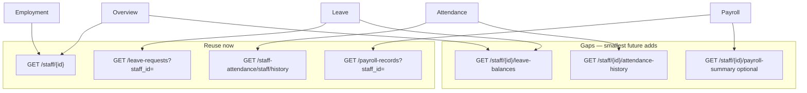

# Staff 360 — Data Source Audit (Sprint 4 Batch 3 Discovery)

**Status:** Complete (read-only discovery)  
**Scope:** Determine whether existing Laravel mobile APIs support leave history, attendance history, employment details, and payroll summary **for one staff member**. Recommend canonical tab sources and the **smallest** future API surface.  
**Constraints:** No UI code. No new APIs in this exercise.

**Sources:** `ApiStaffController`, `ApiLeaveRequestController`, `ApiStaffClockController`, `ApiPayrollRecordsController`, `StaffAttendanceController` (web), `docs/people/01-people-audit.md`, Batch 2 `GET /api/staff/{id}` payload.

---

## Executive summary

| Staff 360 area | Staff-scoped API today | Mobile-ready? | Verdict |
|----------------|----------------------|---------------|---------|
| **Employment details** | `GET /api/staff/{id}` | Yes | **Reuse as-is** |
| **Overview** | Same + optional aggregates | Partial | **Reuse `GET /staff/{id}`**; balances need new read |
| **Leave history** | `GET /api/leave-requests?staff_id=` | Yes (privileged) | **Reuse**; balances **missing** |
| **Attendance history** | `GET /api/staff-attendance/staff/history?staff_id=` | Partial | **Reuse with gaps** (role + caller profile) |
| **Payroll summary** | `GET /api/payroll-records?staff_id=` | Partial | **Reuse list**; no payslip PDF / YTD / structure API |



---

## 1. Staff Leave History

### 1.1 Canonical endpoints

| Method | Route | Controller | Purpose |
|--------|-------|------------|---------|
| GET | `/api/leave-requests` | `ApiLeaveRequestController@index` | Paginated leave requests |
| GET | `/api/leave-types` | `ApiLeaveRequestController@leaveTypes` | Type catalog (labels/codes) |

**Not available on API:** `staff_leave_balances`, leave calendar, cancel leave, single leave `show`.

### 1.2 Permissions

| Actor | List scope | `staff_id` filter |
|-------|------------|-------------------|
| Super Admin, Admin, Secretary | All staff (when filter set) | Allowed |
| Supervisor (`is_supervisor()`) | Subordinates only | Implicit scope; filter must match subordinate |
| Other staff | Own `user.staff.id` only | Ignores `staff_id` if not self → 403 effectively via empty/wrong scope |

**Approve/reject** (`POST /leave-requests/{id}/approve|reject`) exist but are out of Staff 360 read scope.

### 1.3 Staff-scoped filtering

- Query param: **`staff_id`** (integer, exists in `staff` table).
- Additional: **`status`** (`pending`, `approved`, `rejected`, …).
- Pagination: **`page`**, **`per_page`** (default 20).

Admin opening Staff 360 for staff `#42` should call:

`GET /api/leave-requests?staff_id=42&per_page=50` (paginate as needed).

### 1.4 Payload shape (`formatLeave`)

```json
{
  "id": 1,
  "staff_id": 42,
  "staff_name": "Jane Doe",
  "leave_type": "annual",
  "leave_type_name": "Annual Leave",
  "leave_type_id": 3,
  "start_date": "2026-06-01",
  "end_date": "2026-06-05",
  "days": 5,
  "days_count": 5,
  "reason": "Family",
  "status": "approved",
  "created_at": "2026-05-20T10:00:00+00:00",
  "updated_at": "2026-05-21T08:00:00+00:00"
}
```

Envelope: `{ success, data: { data: [...], current_page, last_page, per_page, total, from, to } }`.

**Gaps for Leave tab:**

- No **`approved_by` / `rejection_reason` / `admin_notes`** in API payload (present in DB).
- No **leave balances** (`entitlement`, `used`, `remaining` per type/year) — web only at `/staff/leave-balances/{staff}`.

### 1.5 Mobile suitability

| Aspect | Rating | Notes |
|--------|--------|-------|
| List + filter | Good | Same pattern as Student 360 list APIs |
| Balances header | Poor | Needs new endpoint or embed in staff show |
| Secretary HR view | Good | Secretary included in privileged list |
| Supervisor view | Good | Subordinate-scoped |

---

## 2. Staff Attendance History

### 2.1 Data model note

`staff_attendance` holds **both**:

1. **Geofence clock** — `check_in_*` / `check_out_*` GPS fields (`ApiStaffClockController`).
2. **HR manual marks** — `status` ∈ `present|absent|late|half_day`, optional times, `marked_by` (`StaffAttendanceController` web only).

Clock history API returns rows regardless of source; **status** and **times** are populated for both.

### 2.2 Canonical endpoints

| Method | Route | Controller | Purpose |
|--------|-------|------------|---------|
| GET | `/api/staff-attendance/staff/history` | `ApiStaffClockController@staffHistory` | History for one staff (up to 180 days) |
| GET | `/api/staff-attendance/me/history` | `ApiStaffClockController@history` | Self only (teacher-like) |
| GET | `/api/staff-attendance/me/today` | `ApiStaffClockController@today` | Today punch (self) |
| GET | `/api/staff-attendance/clock-roster` | `ApiStaffClockController@clockRoster` | Team roster (not per-staff history) |

**Web only (not mobile API):** `/staff/attendance/report?staff_id=&start_date=&end_date=` — date-range report with summary counts and pagination.

### 2.3 Permissions (`staffHistory`)

Caller must have **`user.staff`** linked (even Admins).

| Condition | Access to `staff_id` target |
|-----------|----------------------------|
| `Admin` or `Super Admin` | Any staff |
| Self | Own `staff_id` |
| Supervisor | Subordinates (`supervisor_id` + `staff_supervisor` pivot) |
| Secretary | **Not in admin role list** for this endpoint — only if supervisor of target or viewing self |

**Gaps:**

- **Secretary** with `Secretary` role but not `Admin` cannot view arbitrary staff clock history via this API.
- **Admin user without a `staff` row** gets `422` (“No staff profile linked”) before role check.
- **No `start_date` / `end_date`** — only `limit` (max 180), newest first.
- **No summary** (present/absent/late counts) in API.

### 2.4 Staff-scoped filtering

Query params:

| Param | Required | Description |
|-------|----------|-------------|
| `staff_id` | Yes | Target staff PK |
| `limit` | No | Default 90, max 180 |

Response:

```json
{
  "success": true,
  "data": {
    "staff": { "id": 42, "full_name": "Jane Doe" },
    "history": [
      {
        "id": 101,
        "staff_id": 42,
        "date": "2026-06-03",
        "status": "present",
        "check_in_time": "07:58:12",
        "check_out_time": "16:02:44",
        "check_in_distance_meters": 12.5,
        "check_out_distance_meters": 8.1
      }
    ]
  }
}
```

**Not in payload:** `notes`, `marked_by`, lat/lng (available in DB for maps on web).

### 2.5 Mobile suitability

| Aspect | Rating | Notes |
|--------|--------|-------|
| Recent clock timeline | Good | 90-day default sufficient for v1 |
| Full HR attendance report | Poor | Web report not exposed |
| Admin App (Secretary) | Fair | Role gap; fix via expanded roles or dedicated staff route |
| Date-range analytics | Poor | Needs `start_date`/`end_date` or summary endpoint |

---

## 3. Employment Details

### 3.1 Canonical endpoint

| Method | Route | Controller |
|--------|-------|------------|
| GET | `/api/staff/{id}` | `ApiStaffController@show` |

### 3.2 Permissions (`assertCanViewStaffRecord`)

| Role | View staff `{id}` |
|------|-------------------|
| Super Admin, Admin, Secretary | Yes |
| Self | Own record |
| Senior Teacher | Supervised staff only |

Matches People workspace / Staff 360 overseer personas.

### 3.3 Staff-scoped filtering

Path parameter **`{id}`** — single staff primary key (not `staff_id` string).

### 3.4 Payload shape (employment-relevant fields)

From `formatStaffDetail` (extends list shape):

| Field | Employment use |
|-------|----------------|
| `hire_date`, `termination_date` | Tenure |
| `employment_status`, `employment_type` | Status |
| `contract_start_date`, `contract_end_date` | Contract |
| `department_id`, `department` | Org unit |
| `job_title_id`, `job_title`, `designation` | Role title |
| `staff_category_id`, `staff_category` | Category |
| `supervisor_id`, `supervisor_name` | Reporting line |
| `system_role` / `role` | Spatie role |
| `max_lessons_per_week` | Teaching load |
| `id_number`, `gender`, `date_of_birth`, `marital_status` | HR identity |
| `residential_address` | Address |
| `emergency_contact_*` | Emergency |
| `work_email`, `personal_email`, `phone_number` | Contact |
| `basic_salary` | Pay reference (not full payroll) |
| `bank_name`, `bank_branch`, `bank_account` | Payroll banking |
| `kra_pin`, `nssf`, `nhif`, `statutory_exemptions` | Statutory |
| `status` | Record archive flag (`active`/`archived`) |

**Not in API:** `staff_meta`, custom fields, documents list, salary structure breakdown, user account metadata.

### 3.5 Mobile suitability

**Excellent** — Employment tab can be a **read-only slice** of `GET /staff/{id}` with no extra calls.

---

## 4. Payroll Summary

### 4.1 Canonical endpoint

| Method | Route | Controller |
|--------|-------|------------|
| GET | `/api/payroll-records` | `ApiPayrollRecordsController@index` |

**Web only:** payslip PDF (`/hr/payroll/records/{id}/payslip`), payroll periods, salary structures, advances.

### 4.2 Permissions (`assertPayrollApiAccess`)

Allowed roles (any one):

- Teacher-like **or**
- Super Admin, Admin, Secretary, Finance Officer, Accountant

**Privileged list** (may pass `staff_id` for any staff):

- Super Admin, Admin, Secretary, Senior Teacher, Finance Officer, Accountant

Non-privileged teachers: own payslips only (`staff_id` ignored).

### 4.3 Staff-scoped filtering

| Param | Description |
|-------|-------------|
| `staff_id` | Filter to one staff |
| `status` | Record status filter |
| `per_page` | Pagination (default 20) |

Example: `GET /api/payroll-records?staff_id=42&per_page=24`

### 4.4 Payload shape (`formatRecord`)

```json
{
  "id": 501,
  "staff_id": 42,
  "staff_name": "Jane Doe",
  "staff_employee_number": "STAFF1042",
  "month": "2026-05",
  "period_name": "May 2026",
  "basic_salary": 85000,
  "allowances": 15000,
  "deductions": 12000,
  "gross_salary": 100000,
  "net_salary": 88000,
  "status": "paid",
  "payment_date": "2026-06-02T12:00:00+00:00",
  "created_at": "...",
  "updated_at": "..."
}
```

**Not in API:** payslip download URL, deduction line items (`deductions_breakdown`), NSSF/NHIF/PAYE split, YTD totals, active `salary_structures` row, `staff_advances`.

`GET /staff/{id}` includes **`basic_salary`** for a static “current salary” hint only.

### 4.5 Mobile suitability

| Aspect | Rating | Notes |
|--------|--------|-------|
| Payslip list per staff | Good | Paginate `payroll-records` |
| Summary card (latest net / YTD) | Fair | Client-side reduce on first page only; incomplete |
| Payslip PDF | Poor | No mobile route |
| Advances / custom deductions | Poor | Web only |

**Finance sensitivity:** Restrict Payroll tab with `finance.view` (or server payroll permission when wired).

---

## 5. Canonical tab → data source map

| Tab | Primary source (Batch 3) | Secondary / enrichment |
|-----|--------------------------|-------------------------|
| **Overview** | `GET /api/staff/{id}` | Optional: `leave-requests?staff_id=&status=pending` count; `staff-attendance/staff/history?limit=7`; latest `payroll-records?staff_id=&per_page=1` |
| **Employment** | `GET /api/staff/{id}` | None required |
| **Leave** | `GET /api/leave-requests?staff_id=` | `GET /api/leave-types`; **future:** leave balances |
| **Attendance** | `GET /api/staff-attendance/staff/history?staff_id=` | **future:** date range + summary + Secretary access |
| **Payroll** | `GET /api/payroll-records?staff_id=` | `basic_salary` from staff detail; **future:** payslip URL |

**Deferred tabs (no API):** Documents, Performance, Training — see `01-people-audit.md`.

---

## 6. Smallest recommended API surface (future — not built in Batch 3)

Priority order for Staff 360 **read** completeness with minimal churn:

### P0 — Reuse only (no new routes)

Implement tabs using existing four endpoints + `leave-types`. Fix **client-side** workarounds:

- Extend Secretary access by calling attendance history only when `hasRole(Admin|Super Admin)` **or** patch `staffHistory` role list (code change, not new route — out of scope here but note for implementers).
- Admin without `staff` profile: use service account with staff link **or** patch `staffHistory` to drop `user.staff` requirement for global admins.

### P1 — One composite optional (alternative to three micro-endpoints)

| Method | Route | Purpose |
|--------|-------|---------|
| GET | `/api/staff/{id}/360-summary` | Optional single round-trip: pending leave count, leave balances[], last 7 attendance rows, latest payroll net — **only if** tab load latency is unacceptable |

Prefer **separate small reads** below unless profiling proves otherwise.

### P1 — Targeted additions (recommended smallest set)

| Method | Route | Purpose | Replaces |
|--------|-------|---------|----------|
| GET | `/api/staff/{id}/leave-balances` | `staff_leave_balances` + types for active year | Web leave-balances show |
| GET | `/api/staff/{id}/attendance-history` | `start_date`, `end_date`, `summary`, full rows (clock + manual) | Web report + fixes `staffHistory` auth |
| GET | `/api/staff/{id}/payroll-records` | Alias or redirect to paginated records **or** embed last 12 + YTD | Clarifies staff namespace |

**Optional P2:**

| GET | `/api/payroll-records/{id}/payslip-url` | Signed PDF URL |
| GET | `/api/staff/{id}/documents` | `staff_documents` index |

### P1 — Enhance existing (alternative to new routes)

If avoiding new paths:

| Endpoint | Add |
|----------|-----|
| `GET /staff/{id}` | Embed `leave_balances[]`, `attendance_summary_30d`, `latest_payroll` (envelope bloat risk) |
| `GET /leave-requests` | Include `rejection_reason`, `approved_at`, `admin_notes` |
| `GET /staff-attendance/staff/history` | Add `Secretary`, drop `user.staff` requirement for global admins, add `start_date`/`end_date` |

**Recommendation:** Prefer **two new staff-scoped reads** (`leave-balances`, `attendance-history`) over bloating `show`.

---

## 7. TanStack Query sketch (implementation batch — not built here)

| Query key | Endpoint |
|-----------|----------|
| `staff.detail(id)` | `GET /staff/{id}` |
| `staff.leave(id, filters)` | `GET /leave-requests?staff_id=id` |
| `staff.attendance(id, range)` | `GET /staff-attendance/staff/history` (then migrate to P1) |
| `staff.payroll(id, page)` | `GET /payroll-records?staff_id=id` |

**Stale times (align Batch 2):** detail 60s; leave/attendance 45s; payroll 60s. Invalidate on leave approve from inbox elsewhere.

---

## 8. Risks and decisions

| Risk | Impact | Mitigation |
|------|--------|------------|
| `staffHistory` excludes Secretary | Attendance tab empty for Secretary | Patch role check or use P1 `attendance-history` |
| Admin without `staff` row | Cannot load attendance via current API | Link admin users to staff stub or P1 route |
| Clock vs manual attendance unified in one table but web UIs differ | Confusing labels in UI | Show `status` + clock times; label “Manual” when `marked_by` set (needs field in API) |
| Leave list missing balance | Overview/Leave header incomplete | P1 `leave-balances` |
| Payroll list without PDF | Tap payslip not possible | P2 signed URL |
| `basic_salary` on staff ≠ latest payroll | Misleading Overview card | Label “Configured salary”; latest net from payroll-records |
| Sensitive fields on `show` | Bank/statutory on Employment only with RBAC | Hide payroll/bank behind `finance.view` in UI |

---

## 9. Batch 3 implementation checklist (next sprint)

1. **Staff360 shell** — tabs: Overview, Employment, Leave, Attendance, Payroll (read-only).
2. Wire **Employment** + **Overview** header from existing `useStaffDetail`.
3. Wire **Leave** from `useLeaveRequests({ staffId })` + types query.
4. Wire **Attendance** from `staffHistory` (document Secretary/admin caveats in QA).
5. Wire **Payroll** from `usePayrollRecords({ staffId })` gated by `finance.view`.
6. Product decision on P1 endpoints before polishing Attendance/Leave headers.

---

*End of Staff 360 data audit — no APIs or UI were created in this exercise.*
