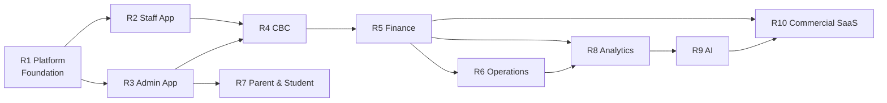
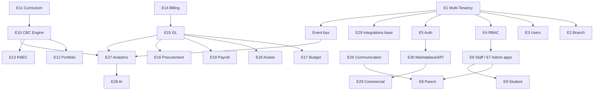

# 02 — Master Product Backlog (Implementation Blueprint)

> **Product vision:** *"A CBC/CBE-native School Operating System for Africa."*
> **Authored as:** Product Manager · SaaS Architect · School ERP Consultant.
> **Sources:** [`../system-audit/MASTER-ERP-AUDIT.md`](../system-audit/MASTER-ERP-AUDIT.md), [`10-future-state.md`](../system-audit/10-future-state.md), all phase audits, [`01-Epic-Breakdown.md`](./01-Epic-Breakdown.md), and [`../app-split/`](../app-split/).
> **Horizon:** 3–5 years. **No code** — this is the planning blueprint that guides development.

---

## 1. Business context & target state

The product is **no longer a single-school ERP**. The target is a **commercial multi-tenant SaaS School Operating System (School OS)**.

| Dimension | Target |
|-----------|--------|
| Education levels | Preschool (PP1–PP2), Primary (Grade 1–6), Junior Secondary (Grade 7–9), with structure extensible to Senior School |
| Tenancy | Multi-school **and** multi-branch within a school group |
| Scale | **5,000+ students per school**, **100+ schools** on the platform |
| Curriculum | **CBC/CBE-native** (KICD designs, competency assessment, portfolios, KNEC) |
| Commercials | Subscription tiers, per-tenant billing, onboarding, white-label, public API & marketplace |
| Region | Africa-first (Kenya CBC lead), multi-currency, EN/SW localization, low-bandwidth/offline resilience |

**Architectural north star** (from future-state): API-first modular core → web portal + **Staff App** + **Admin App** + **Parent/Student** experiences; event-driven; tenant-isolated; real General Ledger; competency-first assessment; analytics + AI as pillars.

---

## 2. How to read this blueprint

**Hierarchy:** `RELEASE → EPIC → FEATURE → USER STORY`.

**Every item carries:** Priority · Business Value · Complexity · Dependencies · Suggested Release.

| Priority | Meaning |
|----------|---------|
| **P0** | Critical — blocker / compliance / financial integrity / security |
| **P1** | High — core value this release |
| **P2** | Medium — schedule after P0/P1 |
| **P3** | Future — differentiator |

| Complexity | Indicative effort |
|-----------|-------------------|
| **L** Low / **M** Medium / **H** High / **XH** Very High |

**IDs:** Epic `E##`, Feature `E##.#`, Story `E##.#.#`. Stories show `(Priority · Release)`. Epics may span releases; the **Home release** is where the epic's core lands.

---

## 3. Release roadmap (10 releases)

| Release | Theme | Core epics | Exit criteria |
|---------|-------|-----------|---------------|
| **R1** | Platform Foundation | E1 Multi-Tenancy, E2 Branch Mgmt, E3 User Mgmt, E4 RBAC, E5 Auth, E29 Integrations (base), platform/observability | Two tenants + branches isolated; canonical RBAC; secure auth; hardened webhooks; one API contract |
| **R2** | Staff App | E6 Staff App (+ teacher workspace, offline) | Teachers/parents/students/drivers operate on a focused, offline-tolerant app on shared core |
| **R3** | Admin App | E7 Admin App (+ approvals, dashboards) | Management roles run school back-office on a dedicated app |
| **R4** | CBC Transformation | E10 CBC Engine, E11 Curriculum, E12 Portfolio, E13 KNEC | Competency-first assessment + portfolios + CBC report card + KNEC export live |
| **R5** | Finance Transformation | E14 Billing, E15 GL, E16 Procurement, E17 Budgeting, E18 Assets, E19 Payroll | Real double-entry GL + statements; unified billing; budgets; payroll→GL |
| **R6** | Operations Platform | E20 HR, E21 Transport, E22 Library, E23 Inventory, E24 Clinic, E25 Visitor | All operational modules with proper roles + workflows |
| **R7** | Parent & Student Experience | E8 Parent App, E9 Student App, E26 Communication | Parent/student apps + real-time chat + financial portal + live transport |
| **R8** | Analytics Platform | E27 Analytics | Warehouse + role/board dashboards + CBC & finance analytics |
| **R9** | AI Platform | E28 AI | Curriculum AI, payment matching, early-warning, drafting, NL analytics |
| **R10** | Commercial SaaS Platform | E30 Marketplace/API, E29 (commercial), subscriptions/onboarding/white-label | Self-serve onboarding, billing, public API, partner marketplace |

---

## 4. Epic → release map

| Epic | Home | Also in |
|------|------|---------|
| E1 Multi-Tenancy | R1 | R10 |
| E2 Branch Management | R1 | R6, R8 |
| E3 User Management | R1 | R7 |
| E4 RBAC | R1 | R3, R5 |
| E5 Authentication | R1 | R7, R10 |
| E6 Staff App | R2 | R4, R6 |
| E7 Admin App | R3 | R5, R6, R8 |
| E8 Parent App | R7 | — |
| E9 Student App | R7 | — |
| E10 CBC Assessment Engine | R4 | R8 |
| E11 Curriculum Management | R4 | R9 |
| E12 Portfolio Management | R4 | R7 |
| E13 KNEC Reporting | R4 | R8 |
| E14 Finance Billing | R5 | R1, R7 |
| E15 General Ledger | R5 | R8 |
| E16 Procurement | R5 | R6 |
| E17 Budgeting | R5 | R8 |
| E18 Assets | R5 | R6 |
| E19 Payroll | R5 | R6 |
| E20 HR | R6 | R5 |
| E21 Transport | R6 | R7 |
| E22 Library | R6 | R7 |
| E23 Inventory | R6 | R5 |
| E24 Clinic | R6 | R7 |
| E25 Visitor Management | R6 | — |
| E26 Communication | R7 | R1, R6 |
| E27 Analytics | R8 | — |
| E28 AI | R9 | — |
| E29 Integrations | R1 | R10 |
| E30 Marketplace/API | R10 | — |

---

# RELEASE 1 — Platform Foundation
> Goal: a secure, multi-tenant, multi-branch, API-first foundation with canonical identity, RBAC, and integrations base. Everything else depends on this.

## EPIC 1 — Multi-Tenancy
**Home:** R1 · **Priority:** P0 · **Complexity:** XH
**Business value:** Unlocks the entire commercial thesis (100+ schools on one platform); without it the product cannot scale beyond one school.
**Dependencies:** none (foundational); informs every other epic.

### Feature 1.1 — Tenant model & isolation (P0 · R1 · XH)
*Value: hard data isolation is the #1 trust requirement for SaaS.*
- **E1.1.1** *(P0·R1)* As a platform owner, I want a `tenant` entity so every record belongs to exactly one school group.
- **E1.1.2** *(P0·R1)* As a security lead, I want automatic tenant-scoping on all queries so cross-tenant reads are impossible.
- **E1.1.3** *(P0·R1)* As an architect, I want a documented tenancy strategy (row-level `tenant_id` with optional DB-per-tenant for large schools) so scale paths are clear.
- **E1.1.4** *(P1·R1)* As an SRE, I want tenant-aware caching/queues/storage prefixes so noisy tenants don't leak or starve others.

### Feature 1.2 — Tenant configuration & branding (P1 · R1 · M)
*Value: each school feels like its own product.*
- **E1.2.1** *(P1·R1)* As a school admin, I want per-tenant branding (logo, colors, name) reflected in web + both mobile apps.
- **E1.2.2** *(P1·R1)* As a school admin, I want per-tenant settings (calendar, grading, locale, currency) isolated from other tenants.
- **E1.2.3** *(P1·R1)* As a platform owner, I want per-tenant feature flags/module toggles so tiers/rollouts are controlled.

### Feature 1.3 — Tenant lifecycle (P1 · R1 · H)
*Value: operational ability to onboard/scale tenants.*
- **E1.3.1** *(P1·R1)* As a platform operator, I want to provision a new tenant (seed roles, settings) in minutes.
- **E1.3.2** *(P1·R1)* As a platform operator, I want tenant-scoped backup/restore with no cross-tenant bleed.
- **E1.3.3** *(P2·R10)* As a platform operator, I want suspend/resume/offboard with data export so commercial lifecycle is supported. *(matures in R10)*

### Feature 1.4 — Data platform & event backbone (P1 · R1 · H)
*Value: foundation for analytics, notifications, and consistency.*
- **E1.4.1** *(P1·R1)* As a data team, I want a domain event bus so changes propagate to analytics/notifications.
- **E1.4.2** *(P0·R1)* As a data architect, I want schema consolidation (retire duplicate/legacy tables, derived balances) so there's one source of truth. *(carries audit tech-debt fixes)*

---

## EPIC 2 — Branch Management
**Home:** R1 · **Priority:** P1 · **Complexity:** H
**Business value:** Multi-branch schools (common in Kenya) need consolidated + per-branch operation; today only a `campus` enum exists.
**Dependencies:** E1.

### Feature 2.1 — Branch hierarchy (P1 · R1 · H)
- **E2.1.1** *(P1·R1)* As a group director, I want schools and branches modeled as a hierarchy so structure mirrors reality.
- **E2.1.2** *(P1·R1)* As an admin, I want users/students/staff/finance scoped to a branch so each branch operates independently.
- **E2.1.3** *(P1·R1)* As a director, I want cross-branch consolidated views (with permission) so I can manage the whole group.

### Feature 2.2 — Branch operations (P2 · R6 · M)
- **E2.2.1** *(P2·R6)* As a branch admin, I want branch-specific calendars, fee structures, and timetables.
- **E2.2.2** *(P2·R6)* As a director, I want inter-branch student/staff transfer with history preserved.
- **E2.2.3** *(P2·R8)* As a director, I want branch-comparative analytics (enrollment, fees, performance). *(matures in R8)*

---

## EPIC 3 — User Management
**Home:** R1 · **Priority:** P0 · **Complexity:** M
**Business value:** Clean identity model (staff, parent, student, guardian) is prerequisite to RBAC, apps, comms.
**Dependencies:** E1.

### Feature 3.1 — Unified identity (P0 · R1 · M)
- **E3.1.1** *(P0·R1)* As an architect, I want one canonical person/identity model so parent data isn't split across three tables.
- **E3.1.2** *(P0·R1)* As an admin, I want guardian modeled as a relationship (not a role) so family linking is correct.
- **E3.1.3** *(P1·R1)* As an admin, I want student↔user linkage so students can have logins (student app).

### Feature 3.2 — Lifecycle & profiles (P1 · R1 · M)
- **E3.2.1** *(P1·R1)* As an admin, I want user invite/activate/deactivate with audit.
- **E3.2.2** *(P1·R7)* As a parent, I want self-service profile + child linking (verified). *(matures R7)*
- **E3.2.3** *(P2·R1)* As an admin, I want bulk user import with validation.

---

## EPIC 4 — RBAC
**Home:** R1 · **Priority:** P0 · **Complexity:** H
**Business value:** Least-privilege + segregation of duties (critical for finance); fixes fragmented/bypassed RBAC found in audit.
**Dependencies:** E1, E3.

### Feature 4.1 — Canonical roles & permissions (P0 · R1 · H)
- **E4.1.1** *(P0·R1)* As an architect, I want one idempotent role/permission taxonomy so RBAC is predictable per tenant.
- **E4.1.2** *(P0·R1)* As a security lead, I want permission-first enforcement (`permission:` + policies), not role-string checks.
- **E4.1.3** *(P0·R1)* As a security lead, I want broad Gate bypasses removed (single explicit super-admin bypass only).

### Feature 4.2 — Complete role coverage (P1 · R1 · M)
- **E4.2.1** *(P1·R1)* As an HR admin, I want all real roles available (Board Member, Principal, Deputy Principal, Head Teacher, Academic/Finance Director, Bursar, Receptionist, Transport Manager, Nurse, Librarian, Store Keeper, Security Officer, HR Officer).
- **E4.2.2** *(P1·R1)* As a tenant admin, I want custom roles/permission sets per tenant.

### Feature 4.3 — Scoping & controls (P1 · R1 · H)
- **E4.3.1** *(P1·R1)* As a senior teacher, I want campus/class-scoped permissions so I see only my supervised scope.
- **E4.3.2** *(P1·R5)* As a finance director, I want maker-checker on financial actions. *(enforced with E14/E15)*

---

## EPIC 5 — Authentication
**Home:** R1 · **Priority:** P0 · **Complexity:** M
**Business value:** Secure, low-friction access across web + apps; supports African connectivity realities (OTP/SMS).
**Dependencies:** E1, E3.

### Feature 5.1 — Core auth (P0 · R1 · M)
- **E5.1.1** *(P0·R1)* As a user, I want password + Google + phone/OTP login.
- **E5.1.2** *(P1·R1)* As a staff member, I want biometric/WebAuthn passkey login on mobile/web.
- **E5.1.3** *(P0·R1)* As a security lead, I want session/token policy (expiry, refresh, revoke) consistent across web + apps.

### Feature 5.2 — Account security (P1 · R1 · M)
- **E5.2.1** *(P1·R1)* As a user, I want secure password reset (email/SMS/OTP) and change.
- **E5.2.2** *(P1·R1)* As an admin, I want app-scoped login (staff vs admin app) with mismatch redirect.
- **E5.2.3** *(P2·R10)* As a tenant admin, I want SSO/SAML/OAuth for institutional sign-in. *(matures R10)*
- **E5.2.4** *(P2·R1)* As a security lead, I want MFA option + lockout/anomaly detection.

---

## EPIC 29 — Integrations (foundation slice in R1)
**Home:** R1 (base) · **Priority:** P0/P1 · **Complexity:** H
**Business value:** Payments + comms are core to school operations; must be secure and reliable from day one.
**Dependencies:** E1, E5.

### Feature 29.1 — Payment gateway hardening (P0 · R1 · H)
- **E29.1.1** *(P0·R1)* As a finance owner, I want M-Pesa STK/C2B webhooks authenticated (IP + signature + idempotency).
- **E29.1.2** *(P0·R1)* As a finance owner, I want a unified payment-gateway abstraction so adding gateways (Jenga, card, others) is consistent.
- **E29.1.3** *(P1·R5)* As an accountant, I want M-Pesa/Jenga refunds + disbursements with maker-checker. *(matures R5)*

### Feature 29.2 — Communication providers (P1 · R1 · M)
- **E29.2.1** *(P1·R1)* As an admin, I want SMS/WhatsApp/email providers behind one abstraction with delivery tracking + authenticated webhooks.
- **E29.2.2** *(P1·R1)* As a mobile user, I want push registration with deep-link payloads and token cleanup.

### Feature 29.3 — Storage, docs & secrets (P1 · R1 · M)
- **E29.3.1** *(P1·R1)* As an SRE, I want S3 (tenant-prefixed) storage with signed URLs.
- **E29.3.2** *(P0·R1)* As a security lead, I want secrets in a vault/KMS (no keys on disk).
- **E29.3.3** *(P1·R1)* As staff, I want PDF/Excel generation/import services hardened (no remote file access, async for large jobs).

*(Commercial integration marketplace continues in E30/R10.)*

---

# RELEASE 2 — Staff App
> Goal: refactor the existing app into a focused, offline-tolerant Staff App on the shared core (teachers, parents, students, drivers, staff self-service).

## EPIC 6 — Staff App
**Home:** R2 · **Priority:** P1 · **Complexity:** H
**Business value:** Mobile-first capture by teachers/drivers drives data quality + adoption; parents/students get day-to-day touchpoints.
**Dependencies:** E1, E4, E5. **Reference:** [`../app-split/`](../app-split/).

### Feature 6.1 — Shared core & app carve-out (P1 · R2 · H)
- **E6.1.1** *(P1·R2)* As a mobile team, I want `@erp/core` + `@erp/ui` so Staff/Admin apps share API/auth/branding/components.
- **E6.1.2** *(P1·R2)* As a staff user, I want the existing app stripped of admin functions (no dead links; admin roles redirected).
- **E6.1.3** *(P1·R2)* As a user, I want role-adaptive bottom tabs (teacher/parent/student/driver).

### Feature 6.2 — Offline-first capture (P1 · R2 · H)
- **E6.2.1** *(P1·R2)* As a teacher, I want offline attendance + marks with auto-sync and pending indicators.
- **E6.2.2** *(P1·R2)* As a teacher, I want lesson-plan drafts offline; submit on reconnect.
- **E6.2.3** *(P1·R2)* As a driver, I want trip/pickup data buffered offline.

### Feature 6.3 — Teacher workspace (P1 · R2→R4 · M)
- **E6.3.1** *(P1·R2)* As a teacher, I want a daily cockpit (next class, tasks due, quick actions, clock-in).
- **E6.3.2** *(P1·R2)* As a subject teacher, I want matrix marks entry with validation + autosave.
- **E6.3.3** *(P1·R4)* As a teacher, I want CBC rubric-grid formative capture. *(lands with E10/R4)*
- **E6.3.4** *(P2·R2)* As a teacher, I want gradebook + homework with submissions.

### Feature 6.4 — Staff self-service & push (P1 · R2 · M)
- **E6.4.1** *(P1·R2)* As staff, I want GPS clock-in/out, leave, payslip, requisitions on mobile.
- **E6.4.2** *(P1·R2)* As a user, I want deep-linked push that opens the right screen + respects preferences.
- **E6.4.3** *(P2·R2)* As a senior teacher, I want scoped review queues (lesson plans, supervised classes/staff/fee balances).

---

# RELEASE 3 — Admin App
> Goal: a dedicated management app — role dashboards, unified approvals, back-office workflows.

## EPIC 7 — Admin App
**Home:** R3 · **Priority:** P1 · **Complexity:** H
**Business value:** Gives management a focused, secure cockpit; separates admin power from the staff app surface.
**Dependencies:** E1, E4, E6 (shared core).

### Feature 7.1 — Role-aware dashboards (P1 · R3 · M)
- **E7.1.1** *(P1·R3)* As a principal/admin, I want a role dashboard (attendance, fees, approvals, alerts) with period filters.
- **E7.1.2** *(P1·R3)* As an accountant/academic admin, I want role-specific dashboard variants.

### Feature 7.2 — Unified approvals & workflow (P1 · R3 · H)
- **E7.2.1** *(P1·R3)* As an approver, I want one inbox for all approvals (leave, advances, lesson plans, requisitions, expenses, concessions, admissions).
- **E7.2.2** *(P1·R3)* As an admin, I want a configurable multi-step workflow engine so approvals adapt per tenant.
- **E7.2.3** *(P1·R3)* As an approver, I want decisions to notify requesters and write an audit trail.

### Feature 7.3 — Back-office management (P1 · R3→R6 · M)
- **E7.3.1** *(P1·R3)* As a registrar, I want student registry management (enroll, edit, bulk, archive, promote).
- **E7.3.2** *(P1·R3)* As an academic admin, I want exam/result publishing controls.
- **E7.3.3** *(P1·R5)* As a finance officer, I want finance back-office (invoices, payments, reconciliation) in-app. *(with R5)*
- **E7.3.4** *(P2·R6)* As an ops manager, I want library/inventory/transport/hostel/clinic/visitor management surfaces. *(with R6)*

### Feature 7.4 — Store release (P2 · R3 · M)
- **E7.4.1** *(P2·R3)* As a product owner, I want both apps released via OTA with staged rollout + crash monitoring.

---

# RELEASE 4 — CBC Transformation
> Goal: move from exam-driven to **competency-first** CBC — the academic core of the product vision.

## EPIC 10 — CBC Assessment Engine
**Home:** R4 · **Priority:** P0 · **Complexity:** H
**Business value:** The defining differentiator: genuine CBC/CBE compliance; addresses the audit's biggest academic gap.
**Dependencies:** E11 (curriculum), E6 (capture UX).

### Feature 10.1 — Outcome-level competency model (P0 · R4 · H)
- **E10.1.1** *(P0·R4)* As a teacher, I want to assess each sub-strand/outcome at a performance level (**E.E./M.E./A.E./B.E.**) with evidence — not a percentage.
- **E10.1.2** *(P0·R4)* As an academic director, I want formative vs summative separated in one assessment engine (`type = formative|summative|national`).
- **E10.1.3** *(P1·R4)* As a teacher, I want core competencies assessed per task via rubrics (no manual JSON).

### Feature 10.2 — Assessment capture (P1 · R4 · M)
- **E10.2.1** *(P1·R4)* As a teacher, I want mobile rubric grids per sub-strand (online + offline).
- **E10.2.2** *(P1·R4)* As a teacher, I want continuous assessment that aggregates into term performance.

### Feature 10.3 — CBC report card (P0 · R4 · M)
- **E10.3.1** *(P0·R4)* As a parent, I want an official-format CBC report (areas → strands → competencies → narrative) with summative appendix + portfolio summary.
- **E10.3.2** *(P1·R4)* As an academic admin, I want batch generation, publish, and controlled parent access.

### Feature 10.4 — Performance analytics (P2 · R8 · M)
- **E10.4.1** *(P2·R8)* As leadership, I want competency-level distributions and trends. *(with R8)*

## EPIC 11 — Curriculum Management
**Home:** R4 · **Priority:** P1 · **Complexity:** M
**Business value:** Authoritative KICD curriculum is the backbone of CBC assessment, schemes, and coverage.
**Dependencies:** E1.

### Feature 11.1 — Curriculum library (P1 · R4 · M)
- **E11.1.1** *(P1·R4)* As an academic admin, I want a verified curriculum tree (learning areas/strands/sub-strands/competencies) per grade.
- **E11.1.2** *(P1·R4)* As an academic admin, I want LLM-assisted + human-verified ingestion of KICD curriculum PDFs (replacing regex).

### Feature 11.2 — Schemes & coverage (P1 · R4 · M)
- **E11.2.1** *(P1·R4)* As a teacher, I want schemes generated from curriculum with week-by-week breakdown.
- **E11.2.2** *(P1·R4)* As an academic director, I want delivery-vs-plan coverage % and "behind schedule" flags.

### Feature 11.3 — Lesson plans (P1 · R4 · M)
- **E11.3.1** *(P1·R4)* As a teacher, I want author→submit→approve lesson plans with web/mobile parity, templates, and term cloning.

## EPIC 12 — Portfolio Management
**Home:** R4 · **Priority:** P1 · **Complexity:** M
**Business value:** Portfolios are the primary evidence trail in CBC; currently optional/secondary.
**Dependencies:** E10.

### Feature 12.1 — Learner portfolios (P1 · R4 · M)
- **E12.1.1** *(P1·R4)* As a teacher, I want to attach evidence (photos/files/observations) to outcomes in a learner's portfolio.
- **E12.1.2** *(P1·R7)* As a parent/student, I want to view the portfolio. *(surfaced R7)*
- **E12.1.3** *(P2·R4)* As an academic director, I want portfolio completeness tracking.

## EPIC 13 — KNEC Reporting
**Home:** R4 · **Priority:** P1 · **Complexity:** M
**Business value:** National assessment compliance (KPSEA/KJSEA) and credible reporting to authorities/parents.
**Dependencies:** E10.

### Feature 13.1 — National assessment capture & export (P1 · R4 · M)
- **E13.1.1** *(P1·R4)* As an exams officer, I want to capture national/summative assessment data with validated KNEC numbers.
- **E13.1.2** *(P1·R4)* As an exams officer, I want KNEC-format export packs.
- **E13.1.3** *(P2·R8)* As leadership, I want cohort/national reporting analytics. *(with R8)*

---

# RELEASE 5 — Finance Transformation
> Goal: from a billing tool to a **real finance system** — unified billing + double-entry GL + budgets + procurement + assets + payroll.

## EPIC 14 — Finance Billing
**Home:** R5 · **Priority:** P0 · **Complexity:** H
**Business value:** Reliable, single-source-of-truth fee billing & collection at scale (5,000+ students/school).
**Dependencies:** E1, E4, E29.

### Feature 14.1 — Fee catalog & posting (P0 · R5 · H)
- **E14.1.1** *(P0·R5)* As a finance officer, I want voteheads/structures/versioning with auditable posting (runs + diffs) per branch.
- **E14.1.2** *(P1·R5)* As a finance officer, I want all fee types posted to invoices (incl. hostel/mess/transport/uniform/activity/swimming).

### Feature 14.2 — Unified transactions & reconciliation (P0 · R5 · H)
- **E14.2.1** *(P0·R5)* As an accountant, I want one transactions model (channel discriminator) + relational allocations (retire JSON splits).
- **E14.2.2** *(P1·R5)* As an accountant, I want automated reconciliation/smart matching with an unmatched queue.
- **E14.2.3** *(P1·R5)* As an accountant, I want refunds (incl. M-Pesa) with approval.

### Feature 14.3 — Collection & parent payment (P0 · R5 · M)
- **E14.3.1** *(P0·R5)* As a parent, I want verified STK payment → receipt → statement update (idempotent). *(parent UI surfaces R7)*
- **E14.3.2** *(P1·R5)* As an accountant, I want payment plans, reminders, concessions/discounts with approval.

## EPIC 15 — General Ledger
**Home:** R5 · **Priority:** P0 · **Complexity:** XH
**Business value:** Statutory statements, audit, board confidence; closes the audit's #1 finance gap (no double-entry today).
**Dependencies:** E14.

### Feature 15.1 — Chart of accounts & journals (P0 · R5 · XH)
- **E15.1.1** *(P0·R5)* As a finance director, I want a configurable chart of accounts (per tenant/branch).
- **E15.1.2** *(P0·R5)* As an accountant, I want balanced journal entries (debits=credits), immutable once posted, fully audited.

### Feature 15.2 — Auto-posting from subledgers (P0 · R5 · XH)
- **E15.2.1** *(P0·R5)* As an accountant, I want fees/payments/expenses/payroll/bank to auto-post to the GL (double-entry, idempotent, reversible by contra).

### Feature 15.3 — Statements & close (P0 · R5 · H)
- **E15.3.1** *(P0·R5)* As a finance director, I want trial balance, P&L, balance sheet, cash flow for any period.
- **E15.3.2** *(P1·R5)* As a finance director, I want period close/lock (permissioned reopen).
- **E15.3.3** *(P2·R5)* As a bursar, I want petty cash management; *(P3·R10)* multi-currency.

## EPIC 16 — Procurement
**Home:** R5 · **Priority:** P2 · **Complexity:** M
**Business value:** Controlled spending, vendor governance, audit; commitment control vs budget.
**Dependencies:** E15, E23 (inventory), E17 (budgeting).

### Feature 16.1 — Requisition → PO → GRN (P2 · R5 · M)
- **E16.1.1** *(P2·R5)* As staff, I want requisition→approval→PO→goods-receipt→stock update.
- **E16.1.2** *(P2·R5)* As a procurement officer, I want vendor management (terms, performance).

### Feature 16.2 — Three-way match (P2 · R5 · M)
- **E16.2.1** *(P2·R5)* As an accountant, I want PO/GRN/invoice matching before payment with exception routing.

## EPIC 17 — Budgeting
**Home:** R5 · **Priority:** P1 · **Complexity:** M
**Business value:** Financial planning, cost control, board accountability.
**Dependencies:** E15.

### Feature 17.1 — Budgets & variance (P1 · R5 · M)
- **E17.1.1** *(P1·R5)* As a finance director, I want budgets per account/department/branch/period with approval + versioning.
- **E17.1.2** *(P1·R5)* As a manager, I want real-time budget vs actual with drill-down + overspend alerts.

### Feature 17.2 — Commitment control (P2 · R5 · M)
- **E17.2.1** *(P2·R5)* As a finance officer, I want encumbrance so approved POs reserve budget and block over-budget per policy.

## EPIC 18 — Assets
**Home:** R5 · **Priority:** P2 · **Complexity:** M
**Business value:** Fixed-asset accountability, depreciation, insurance/audit.
**Dependencies:** E15.

### Feature 18.1 — Register & depreciation (P2 · R5 · M)
- **E18.1.1** *(P2·R5)* As a bursar, I want a fixed-asset register (category, location, custodian, value, QR tag, transfers, disposal).
- **E18.1.2** *(P2·R5)* As an accountant, I want automated depreciation posting + net book value.

### Feature 18.2 — Maintenance & verification (P3 · R6 · M)
- **E18.2.1** *(P3·R6)* As an ops manager, I want maintenance logs + periodic physical verification with variance.

## EPIC 19 — Payroll
**Home:** R5 · **Priority:** P1 · **Complexity:** M
**Business value:** Payroll integrity + statutory compliance + GL posting.
**Dependencies:** E15, E20.

### Feature 19.1 — Payroll → GL & statutory (P1 · R5 · M)
- **E19.1.1** *(P1·R5)* As a finance director, I want payroll to post salary expense + PAYE/NSSF/NHIF liabilities to the GL.
- **E19.1.2** *(P1·R5)* As staff, I want payslips with YTD earnings, deductions, and statutory forms.
- **E19.1.3** *(P2·R5)* As HR, I want advances/loans with payroll recovery.

---

# RELEASE 6 — Operations Platform
> Goal: complete operational modules with proper roles and workflows.

## EPIC 20 — HR
**Home:** R6 · **Priority:** P1 · **Complexity:** M
**Business value:** Full staff lifecycle, leave, performance, compliance.
**Dependencies:** E4, E19.

### Feature 20.1 — Staff lifecycle & leave (P1 · R6 · M)
- **E20.1.1** *(P1·R6)* As HR, I want staff records, documents, and lifecycle (hire→transfer→exit) with audit.
- **E20.1.2** *(P1·R6)* As HR, I want leave balances/accrual, who's-out calendar, multi-level approval, cover assignment.

### Feature 20.2 — Performance & onboarding (P2 · R6 · M)
- **E20.2.1** *(P2·R6)* As HR, I want TPAD-aligned appraisal cycles (self→supervisor→moderation, goals, evidence).
- **E20.2.2** *(P3·R6)* As HR, I want recruitment/onboarding checklists with contract e-sign.

## EPIC 21 — Transport
**Home:** R6 · **Priority:** P1 · **Complexity:** H
**Business value:** Safety differentiator; parent trust; operational control at scale.
**Dependencies:** E6, E26.

### Feature 21.1 — Live tracking (P1 · R6 · H)
- **E21.1.1** *(P1·R6)* As a driver, I want background GPS broadcast during trips (battery/policy compliant, offline buffer).
- **E21.1.2** *(P1·R6)* As a parent, I want a live map + ETA + arrival alerts for my child's route. *(parent UI R7)*

### Feature 21.2 — Verified pickup & fleet (P1 · R6 · M)
- **E21.2.1** *(P1·R6)* As a school, I want QR/OTP pickup verification with unauthorized-pickup alerts.
- **E21.2.2** *(P2·R6)* As a transport manager, I want map-based route/vehicle management + utilization + fee integration.

## EPIC 22 — Library
**Home:** R6 · **Priority:** P2 · **Complexity:** L
**Business value:** Resource stewardship; learner self-service.
**Dependencies:** E4.

### Feature 22.1 — Circulation & self-service (P2 · R6 · L)
- **E22.1.1** *(P2·R6)* As a librarian, I want catalog/cards/circulation with overdue automation + fines (Librarian role).
- **E22.1.2** *(P2·R7)* As a student/parent, I want catalog browse + "my borrowings" + reservations. *(surfaced R7)*
- **E22.1.3** *(P3·R8)* As a librarian, I want utilization/overdue analytics.

## EPIC 23 — Inventory
**Home:** R6 · **Priority:** P2 · **Complexity:** M
**Business value:** Stock accuracy, consumption control, school shop revenue.
**Dependencies:** E4, E16.

### Feature 23.1 — Stock control (P2 · R6 · M)
- **E23.1.1** *(P2·R6)* As a store keeper, I want items/stock/adjustments/movements with low-stock alerts (Store Keeper role).
- **E23.1.2** *(P2·R6)* As a store keeper, I want valuation + consumption + reorder reports.

### Feature 23.2 — Requirements & POS (P2 · R6 · M)
- **E23.2.1** *(P2·R6)* As a class teacher, I want to collect student requirements against templates.
- **E23.2.2** *(P2·R6)* As a shop operator, I want POS + public shop + uniforms integrated to finance/GL.

## EPIC 24 — Clinic
**Home:** R6 · **Priority:** P2 · **Complexity:** M
**Business value:** Learner welfare, duty of care, parent trust.
**Dependencies:** E4, E26.

### Feature 24.1 — Visits & medical records (P2 · R6 · M)
- **E24.1.1** *(P2·R6)* As a nurse, I want to log clinic visits/treatments with parent notification (Nurse role).
- **E24.1.2** *(P2·R6)* As a nurse, I want per-student medical profiles (allergies, immunizations, conditions, emergency contacts); parent maintains via portal.
- **E24.1.3** *(P3·R6)* As a nurse, I want medication schedules + administration logs.

## EPIC 25 — Visitor Management
**Home:** R6 · **Priority:** P2 · **Complexity:** M
**Business value:** Campus security, compliance, front-desk efficiency.
**Dependencies:** E2 (security/integrations), E4.

### Feature 25.1 — Check-in/out & gate pass (P2 · R6 · M)
- **E25.1.1** *(P2·R6)* As a receptionist/security officer, I want visitor check-in/out with host notification, QR badge, blacklist.
- **E25.1.2** *(P2·R6)* As security, I want student/staff gate passes + incident reporting with audit.

---

# RELEASE 7 — Parent & Student Experience
> Goal: dedicated family experiences + real-time communication.

## EPIC 8 — Parent App
**Home:** R7 · **Priority:** P1 · **Complexity:** M
**Business value:** Engagement, fee collection, satisfaction, safety; a key commercial selling point.
**Dependencies:** E6, E14, E21, E26.

### Feature 8.1 — Per-child dashboard (P1 · R7 · M)
- **E8.1.1** *(P1·R7)* As a parent, I want a per-child overview (attendance, results, fees, transport, portfolio).
- **E8.1.2** *(P1·R7)* As a parent with several children, I want a child switcher + consolidated views.

### Feature 8.2 — Financial portal (P1 · R7 · M)
- **E8.2.1** *(P1·R7)* As a parent, I want balances, invoices, statement, pay-now (STK), receipts, history, plans per child.

### Feature 8.3 — Engagement & safety (P1 · R7 · M)
- **E8.3.1** *(P1·R7)* As a parent, I want chat with assigned teachers + circulars/announcements with read receipts.
- **E8.3.2** *(P1·R7)* As a parent, I want live bus tracking + pickup confirmation + boarded/alighted alerts.
- **E8.3.3** *(P2·R7)* As a parent, I want permission-slip e-sign + report-card access + CBC portfolio view.

## EPIC 9 — Student App
**Home:** R7 · **Priority:** P2 · **Complexity:** M
**Business value:** Learner ownership of academics; future-proofing for senior grades.
**Dependencies:** E6, E10, E22.

### Feature 9.1 — Academics (P2 · R7 · M)
- **E9.1.1** *(P2·R7)* As a student, I want timetable, homework (with submission), and published results.
- **E9.1.2** *(P2·R7)* As a student, I want my CBC portfolio + competency progress.

### Feature 9.2 — Resources (P3 · R7 · M)
- **E9.2.1** *(P3·R7)* As a student, I want learning resources (offline download) + "my borrowings".

## EPIC 26 — Communication
**Home:** R7 (full) · **Priority:** P1 · **Complexity:** H
**Business value:** Engagement, timely alerts, reduced manual messaging; differentiator vs spreadsheets/SMS-only.
**Dependencies:** E1, E29.

### Feature 26.1 — Real-time chat (P1 · R7 · H)
- **E26.1.1** *(P1·R7)* As a parent/teacher, I want real-time 1:1 + group chat with read receipts, attachments, moderation.

### Feature 26.2 — Announcements & circulars (P1 · R7 · M)
- **E26.2.1** *(P1·R7)* As an admin, I want targeted, scheduled announcements/circulars with acknowledgment tracking.

### Feature 26.3 — Multi-channel orchestration (P1 · R6→R7 · H)
- **E26.3.1** *(P1·R6)* As an admin, I want one composer → SMS/WhatsApp/email/push with templates, delivery tracking, opt-outs/quiet hours, credit-aware sending (consolidate logs).
- **E26.3.2** *(P2·R7)* As an admin, I want automated event-driven comms (attendance, fees, results) tied to the event bus.

---

# RELEASE 8 — Analytics Platform

## EPIC 27 — Analytics
**Home:** R8 · **Priority:** P1 · **Complexity:** H
**Business value:** Data-driven leadership/board decisions; cross-school benchmarking (a SaaS-scale advantage); early-warning.
**Dependencies:** E1 (events), E14/E15 (finance data), E10/E13 (academic data).

### Feature 27.1 — Data platform (P1 · R8 · H)
- **E27.1.1** *(P1·R8)* As a data team, I want a tenant-scoped warehouse fed by domain events with conformed dimensions.
- **E27.1.2** *(P1·R8)* As a platform owner, I want cross-tenant (anonymized) benchmarking with strict isolation.

### Feature 27.2 — Dashboards & board pack (P1 · R8 · M)
- **E27.2.1** *(P1·R8)* As a board member/principal, I want executive dashboards + exportable board pack (enrollment/retention trends, collection rate + forecast, performance trends, attendance/turnover, risk register).
- **E27.2.2** *(P1·R8)* As an academic director, I want CBC analytics (coverage %, performance-level distribution by strand, portfolio completeness).
- **E27.2.3** *(P1·R8)* As a finance director, I want financial statement analytics + budget variance + collection forecasting.

### Feature 27.3 — Self-service & delivery (P2 · R8 · M)
- **E27.3.1** *(P2·R8)* As an analyst, I want a self-service report builder with saved filters + scheduled email + Excel/PDF.
- **E27.3.2** *(P2·R8)* As leadership, I want branch-comparative and cohort analysis.

---

# RELEASE 9 — AI Platform

## EPIC 28 — AI
**Home:** R9 · **Priority:** P3 · **Complexity:** H
**Business value:** Differentiation + efficiency + early intervention; AI-native School OS positioning.
**Dependencies:** E27, E11, E26. **Governance:** data-privacy policy, local-model option, consent, PII redaction.

### Feature 28.1 — Curriculum & content intelligence (P3 · R9 · H)
- **E28.1.1** *(P3·R9)* As a teacher, I want AI-assisted scheme/lesson/assessment + rubric suggestions (human-reviewed; usage audited).
- **E28.1.2** *(P3·R9)* As a teacher, I want AI-assisted CBC report narratives from competency data (human-approved).

### Feature 28.2 — Finance & operations AI (P3 · R9 · H)
- **E28.2.1** *(P3·R9)* As an accountant, I want ML payment matching (auto high-confidence, review low-confidence, learns from corrections).
- **E28.2.2** *(P3·R9)* As leadership, I want explainable early-warning (at-risk learners from attendance/performance/fees) triggering tasks.

### Feature 28.3 — Assistants (P3 · R9 · M)
- **E28.3.1** *(P3·R9)* As an admin, I want AI-drafted comms with EN/SW translation + tone (human approval).
- **E28.3.2** *(P3·R9)* As an admin, I want natural-language analytics ("fee collection vs last term") — governed, tenant-scoped.

---

# RELEASE 10 — Commercial SaaS Platform

## EPIC 30 — Marketplace / API
**Home:** R10 · **Priority:** P2 · **Complexity:** H
**Business value:** Ecosystem leverage + integration revenue + stickiness; turns the product into a platform.
**Dependencies:** E1, E5, E29.

### Feature 30.1 — Public API & developer platform (P2 · R10 · H)
- **E30.1.1** *(P2·R10)* As a partner developer, I want a documented, versioned public API with OAuth scopes + rate limits.
- **E30.1.2** *(P2·R10)* As a partner, I want webhooks/event subscriptions so external systems react to school events.
- **E30.1.3** *(P3·R10)* As a developer, I want sandbox tenants + API keys + a developer portal.

### Feature 30.2 — Marketplace & extensibility (P3 · R10 · H)
- **E30.2.1** *(P3·R10)* As a school, I want an app/integration marketplace (payments, e-learning, biometrics) to extend my School OS.
- **E30.2.2** *(P3·R10)* As a tenant admin, I want to install/configure marketplace integrations per branch.

## EPIC 29 — Integrations (commercial layer)
**Home:** R10 (commercial) · **Priority:** P2 · **Complexity:** H
**Business value:** Breadth of payment/comms/identity integrations = market fit across diverse schools.
**Dependencies:** E29 base (R1), E30.

### Feature 29.4 — Payment & banking breadth (P2 · R10 · H)
- **E29.4.1** *(P2·R10)* As a finance officer, I want multiple gateways (M-Pesa, Jenga, cards, bank APIs, other mobile money) behind one abstraction with reconciliation.
- **E29.4.2** *(P2·R10)* As a tenant admin, I want per-tenant gateway configuration + settlement reporting.

### Feature 29.5 — Identity & ecosystem (P2 · R10 · M)
- **E29.5.1** *(P2·R10)* As a tenant, I want SSO/SAML + Google Workspace/Microsoft integration.
- **E29.5.2** *(P3·R10)* As a school, I want LMS/e-learning, biometric device, and government (NEMIS/KNEC) connectors.

### Feature 29.6 — Commercial platform services (P1 · R10 · H)
- **E29.6.1** *(P1·R10)* As a platform owner, I want subscription plans/tiers + per-tenant billing + dunning.
- **E29.6.2** *(P1·R10)* As a prospective school, I want self-serve onboarding (sign-up → configure → import → go live).
- **E29.6.3** *(P2·R10)* As a reseller/group, I want white-label branding + group billing.
- **E29.6.4** *(P2·R10)* As a platform operator, I want usage metering, SLAs, and a status page.

---

## 5. Cross-cutting non-functional requirements (apply to all releases)

| NFR | Target |
|-----|--------|
| **Scale** | 5,000+ students/school; 100+ schools; horizontal scaling; tenant-aware caching/queues |
| **Performance** | API p95 < 500ms on hot paths; mobile cold start < 3s; large reports async |
| **Availability** | 99.9% platform uptime; tenant-scoped backup/restore; DR plan |
| **Security** | Tenant isolation, permission-first RBAC, signed/idempotent webhooks, KMS secrets, full audit trail, PII redaction |
| **Offline** | Staff/driver capture works offline with sync + write queue |
| **Localization** | EN/SW; multi-currency; locale-aware dates/numbers |
| **Connectivity** | Low-bandwidth resilience; SMS/USSD fallbacks for payments/comms |
| **Compliance** | CBC/KNEC alignment; Kenya statutory payroll/tax; data-protection (Kenya DPA) |
| **Observability** | Logs/metrics/traces; crash reporting; per-tenant health |
| **Data governance** | AI consent + redaction; data residency options; export/portability |

---

## 6. Dependency backbone (build order rationale)

**Rule:** nothing ships before its tenant scope (E1) and RBAC (E4) exist; finance modules require the GL (E15) before budgets/assets/payroll posting; CBC engine (E10) requires the curriculum library (E11); analytics (E27) requires the event bus (E1.4) + finance/academic data; AI (E28) requires analytics; commercial API/marketplace (E30/E29) requires stable auth + integrations.

---

## 7. Priority rollup

- **P0 (Critical):** E1 (tenancy + schema/balances), E3 (identity), E4 (RBAC + bypass removal), E5 (core auth), E29.1/29.3 (webhooks/secrets), E10 (CBC core + report), E14 (billing + transactions + STK), E15 (GL core + statements).
- **P1 (High):** E2, E6, E7, E11, E12, E13, E14.2/14.3, E17, E19, E20, E21, E26, E27, E29.6 (subscriptions/onboarding).
- **P2 (Medium):** E8 (parts), E9, E16, E18, E22, E23, E24, E25, E27.3, E30, E29.4/29.5.
- **P3 (Future):** E9.2, E15.3.3 (multi-currency), E18.2, E20.2.2, E24.1.3, E28 (all), E30.2.

---

## 8. Suggested 3–5 year delivery cadence (indicative)

| Year | Releases | Outcome |
|------|----------|---------|
| **Year 1** | R1, R2, R3 | Multi-tenant foundation + Staff App + Admin App live; one flagship school group on the platform |
| **Year 2** | R4, R5 | CBC-native assessment + real finance/GL → defensible product differentiation; early paying schools |
| **Year 3** | R6, R7 | Full operations + parent/student engagement → competitive completeness; scale to dozens of schools |
| **Year 4** | R8, R9 | Analytics + AI → leadership value + efficiency; 100+ schools |
| **Year 5** | R10 | Commercial SaaS platform (API, marketplace, white-label, self-serve) → ecosystem & growth flywheel |

> Releases overlap (parallel squads): platform/infra, academics/CBC, finance, mobile, operations, data/AI. This blueprint is the backlog spine; companion artifacts to follow: `03-Release-Plan.md` (sprint/quarter + capacity), `04-NFRs.md`, `05-Data-Migration-Plan.md`, `06-Go-To-Market.md`.
