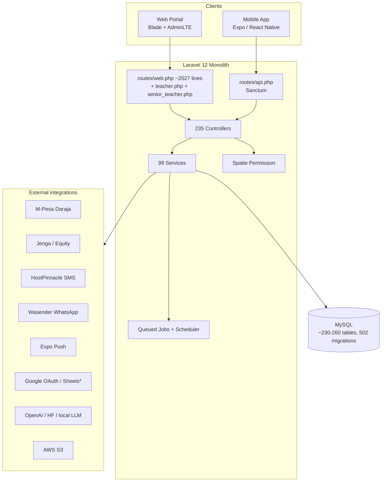

# 01 — System Overview

> **Full Business System Audit of the School ERP Platform**
> Prepared as: Senior ERP Consultant · SMS Architect · Business Analyst · Product Manager · Database Architect · Laravel Architect · React Native Architect.
> Purpose: establish the factual foundation for a Master PRD governing the next-generation platform.

---

## 1. System purpose

The platform is a **single-school (single-tenant) School ERP** for a Kenyan school operating the **CBC/CBE** curriculum. It manages the full operational lifecycle of the institution:

- **Academics** — admissions, classes/streams, CBC curriculum, timetabling, exams, assessment, report cards.
- **Finance** — fee structures, invoicing, multi-channel collection (M-Pesa, bank, Jenga), allocation, statements, expenses, payroll.
- **Operations** — transport, library, inventory/requisitions, POS, hostel, swimming, activities.
- **People** — students, families/guardians, staff/HR, roles & permissions.
- **Communication** — SMS, WhatsApp, email, push, announcements, scheduled & automated messaging.

It exposes two front-ends over one Laravel backend:
1. **Web portal** (Blade + AdminLTE + Vite/Bootstrap/Tailwind) — the back-office / management system.
2. **Mobile app** (Expo / React Native) — teachers, parents, students, drivers, and staff self-service, consuming `routes/api.php`.

---

## 2. High-level architecture

| Layer | Technology |
|-------|-----------|
| Framework | Laravel **12** (PHP 8.2+) |
| API auth | Laravel **Sanctum** (token) + Socialite (Google) + Laragear **WebAuthn** (passkeys) |
| RBAC | **spatie/laravel-permission** (guard `web`) + custom `DirectorRoleMiddleware` |
| Web UI | Blade, **AdminLTE 3**, laravel/ui, Vite, Bootstrap 5, Tailwind 4, SASS |
| Mobile | Expo SDK 54, React Native 0.81, React Navigation v6 (see `docs/app-split/`) |
| PDF / Excel | barryvdh/laravel-dompdf, smalot/pdfparser, maatwebsite/excel |
| Realtime | pusher/pusher-php-server + laravel-echo (**installed but dormant**) |
| Storage | league/flysystem-aws-s3 (public + private disks) |
| AI | OpenAI / HuggingFace / local (curriculum parsing + RAG assistant), pgvector |
| Queue/Sched | DB queue; `queue:work` invoked every minute from `routes/console.php` |

**Scale indicators:** 235 controllers · 242 models · **502 migrations** · 99 services · ~230–260 application tables · 6 web route files + mobile API.

**Deployment posture:** single database per school (no `tenant_id`); only a `campus` enum (`lower`/`upper`) partitions data within the school. EC2 + Nginx + supervisor worker (per `docs/EC2_DEPLOYMENT.md`, `config/supervisor-erp-worker.conf`).

---

## 3. Major modules (high level — detailed in [`02-module-inventory.md`](./02-module-inventory.md))

| Domain | Modules |
|--------|---------|
| **Academics** | Admissions (online + manual), Academic calendar, Classes/Streams, Subjects/Learning Areas, Teacher assignment, Timetable (whole-school engine), Attendance, Homework/Diary, Lesson Plans, Schemes of Work, Assessments, Exams, **CBC** (strands/substrands/competencies/performance levels/portfolios/curriculum AI), Report Cards |
| **Finance** | Voteheads & Fee Structures, Optional/Transport/Uniform/Activity/Swimming fees, Invoicing & Posting, Payments (M-Pesa/Jenga/bank/cash), Allocation, Balances/Arrears, Credit/Debit notes, Concessions/Discounts, Bank statement reconciliation, Fee plans & reminders, Expenses & vouchers, Payroll, Legacy finance import |
| **People** | Students, Families/Guardians, Staff/HR, Leave, Advances, Performance (schema), Roles & Permissions |
| **Operations** | Transport (routes/vehicles/trips/pickups), Library, Inventory/Requisitions, POS (+ public shop), Hostel/Mess, Swimming, Extra-curricular activities |
| **Communication** | SMS, WhatsApp, Email, Push, Announcements, Templates/Placeholders, Scheduled & automated fee comms, Parent notification blocks |
| **Documents** | Document store, Templates, Generated documents, Receipts/Statements/Report cards (PDF) |
| **Platform** | Settings/Branding, Backup & restore, Activity & system logs, Dashboards, Reports |

> **Notably absent as first-class modules:** Visitor Management, dedicated Clinic/Health (medical records exist only under students), Fixed-Asset register, standalone Procurement, Events ticketing, Discipline as a workflow (records only), General-Ledger accounting.

---

## 4. Major user groups

Effective groups (detailed in [`04-role-audit.md`](./04-role-audit.md)):

| Group | Seeded roles (Spatie, Title Case) |
|-------|-----------------------------------|
| Executive / system | Super Admin, Director, (System Admin via Gate) |
| Administration | Admin, Secretary, Academic Administrator |
| Finance | Accountant, Finance Officer |
| Teaching | Teacher, Senior Teacher, Deputy Senior Teacher, Supervisor |
| Transport | Driver |
| Community | Parent, Student |
| Demo/legacy only | bursar, chef, janitor, security, receptionist, administrator, staff |

**Reality check:** roles are **inconsistently seeded** (multiple overlapping seeders, Title-Case vs lowercase duplicates), and several org roles in a full school (Principal, Deputy Principal, Head Teacher, Bursar, Nurse, Librarian, Store Keeper, Security Officer, HR Officer, Transport Manager, Board Member) **do not exist** as roles.

---

## 5. Existing strengths

1. **Breadth of functionality.** Very few school-ERP domains are missing; the system already covers academics, finance, HR, transport, library, inventory, POS, hostel, swimming, and communication.
2. **Sophisticated fee engine.** Votehead-based catalog → versioned fee structures → auditable posting (`FeePostingRun` + `PostingDiff`) → per-term invoices → line-level `payment_allocations` with FIFO/oldest-first allocation and **sibling payment sharing**.
3. **Strong payment ingestion & reconciliation.** M-Pesa C2B inbox + bank statement import + `MpesaSmartMatchingService` (admission/invoice/phone/name matching with learned matches).
4. **CBC-aware data model.** Learning areas, strands, sub-strands, core competencies, performance levels, portfolios, and a **curriculum-AI ingestion + RAG assistant** pipeline.
5. **Whole-school timetable engine** with feasibility validation, generation runs, slot locks/overrides.
6. **Multi-channel communication** (SMS/WhatsApp/email/push) with scheduling, automation, delivery reports, and pause/credit-aware sending.
7. **Operational maturity:** backup/restore, activity & system logs, financial audit commands, transaction-fix audit trail, family-integrity tooling, phone normalization.
8. **Modern auth options:** Sanctum tokens, Google OAuth, OTP login, WebAuthn passkeys.

---

## 6. Existing weaknesses

1. **No general-ledger accounting.** "Journals", "postings", "ledger" refer to **fee adjustments**, not double-entry books. No chart of accounts, trial balance, P&L, balance sheet, cash flow, budgeting, or period close (see [`07-finance-audit.md`](./07-finance-audit.md)).
2. **RBAC is fragmented and unsafe.** Multiple seeders create conflicting roles; Title-Case vs lowercase duplicates break `role:` middleware; broad `Gate::before` and `can_access()` bypasses effectively make Super Admin/Admin/teacher-like users superusers for many checks. Mobile `guardian`, `finance`, `transport` don't map to seeded roles.
3. **CBC is schema-deep but practice-shallow.** Day-to-day assessment and report cards still revolve around **numeric `ExamMark` averages**; performance levels are derived from percentages (codes `E/M/A/B`, not KICD `E.E./M.E./A.E./B.E.` per learning outcome). No KNEC/national assessment reporting; portfolios are optional.
4. **Unauthenticated webhooks.** M-Pesa STK/C2B, SMS DLR, and WhatsApp webhooks accept unverified requests (M-Pesa signature/IP verification is configured but **not enforced**); full payloads logged.
5. **Reporting gaps for leadership.** No enrollment/retention trends, financial statements, budget vs actual, fee forecasting, teacher workload, curriculum-coverage %, KNEC/CBC compliance, or board/governance dashboards.
6. **Dormant / stubbed features.** Pusher realtime (commented out), Google Sheets fee sync (TODO stubs, package not installed), M-Pesa refund (not implemented), Jenga initiator RSA credential (TODO), some scheduled commands defined in `Kernel.php` but **not** wired into `routes/console.php`.
7. **Single-tenant ceiling.** No `tenant_id` anywhere — the platform cannot serve multiple schools/branches without re-architecture.

---

## 7. Technical debt

| Area | Debt |
|------|------|
| **Migrations** | 502 migrations with many `Schema::hasColumn` guards and an `ensure_all_foreign_keys` best-effort (swallows exceptions) → heterogeneous production schemas; long migrate times. |
| **Duplicate schema** | Overlapping tables: `parent_info`/`families`/`users.parent_id`; `payments`/`payment_transactions`/`mpesa_c2b_transactions`/`bank_statement_transactions`; `classroom_subject`/`classroom_subjects`; `staff_meta`/`staff_metas`; `trip`/`trips`/`transport`; `classes`/`classrooms`; legacy finance import tables alongside live finance. |
| **Denormalized balances** | `invoices.balance/paid_amount`, `swimming_wallets.balance` + `swimming_ledger.balance_after` require transactional sync; legacy `year`/`term` ints coexist with `academic_year_id`/`term_id` FKs (data migration incomplete). |
| **RBAC seeders** | No single source of truth; `syncPermissions` ordering can overwrite; broken `RoleSeeder` references a non-existent `App\Models\Role`. |
| **Route duplication** | `teacher.php`/`senior_teacher.php` duplicate `attendance`, `home`, `exam-marks` paths with parallel role gates. |
| **Scheduler split** | Active schedule lives in `routes/console.php`; `app/Console/Kernel.php` schedules (fee-clearance recompute, lesson-plan reminders, backup prune) may **not run**. |
| **Security** | Open webhooks, verbose financial logging, DomPDF remote/local file access enabled, default `MAIL_MAILER=log`, RSA TODOs in payment initiators. |
| **JSON-as-relation** | `shared_allocations`, `linked_payment_ids`, `matching_suggestions`, `classroom_ids`, exam `competency_scores` stored as JSON instead of relational tables. |
| **Dead/partial code** | Imported-but-unrouted controllers (`FeeStatementController`, `ReceiptController`); orphaned views (`SwimmingReportController::dailyAttendance`); dropped-then-recreated tables (diary, senior-teacher assignments). |

---

## 8. Document set

| Doc | Scope |
|-----|-------|
| [`02-module-inventory.md`](./02-module-inventory.md) | Every module: purpose, features, screens, APIs, tables, roles, dependencies, gaps |
| [`03-database-audit.md`](./03-database-audit.md) | Schema, relationships, FKs, indexes, ownership, normalization & performance findings |
| [`04-role-audit.md`](./04-role-audit.md) | Roles, permissions, inheritance, enforcement, missing roles |
| [`05-business-processes.md`](./05-business-processes.md) | End-to-end workflows with actors/inputs/outputs/approvals/pain points |
| [`06-academic-audit.md`](./06-academic-audit.md) | Academic functions vs Kenya CBC/CBE requirements |
| [`07-finance-audit.md`](./07-finance-audit.md) | Finance vs full accounting requirements |
| [`08-integrations.md`](./08-integrations.md) | Every integration: purpose, flow, dependencies, risks |
| [`09-reporting.md`](./09-reporting.md) | Report inventory + missing reports |
| [`10-future-state.md`](./10-future-state.md) | The platform the ERP should become |
| [`MASTER-ERP-AUDIT.md`](./MASTER-ERP-AUDIT.md) | Consolidated PRD foundation |
