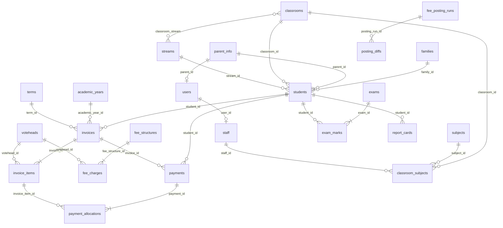

# 03 — Database Audit

> Schema audit derived from **502 migrations** and **~242 models**. Estimated **~230–260 application tables** + Laravel/Spatie infrastructure. MySQL, single database per school.

---

## 1. Table inventory by domain

### Students / Family / Admissions
`students`, `student_categories`, `student_siblings`, `parent_info`, `families`, `family_update_links`, `family_update_audits`, `family_receipt_links`, `online_admissions`, `student_medical_records`, `student_disciplinary_records`, `student_academic_history`, `student_extracurricular_activities`, `student_followups`, `student_term_fee_clearances`, `statement_links`, `otp_verifications`, `phone_number_normalization_logs`, `archive_audits`.

### Academics
- **Calendar:** `academic_years`, `terms`, `term_days`, `school_days`
- **Structure:** `classrooms`, `streams`, `classroom_stream`, `classes` (legacy), `class_teacher_assignments`
- **Subjects/staffing:** `subjects`, `classroom_subjects`, `classroom_subject` (legacy), `subject_teacher`, `stream_teacher`, `classroom_teacher`
- **Exams/marks:** `exams`, `exam_types`, `exam_groups`, `exam_sessions`, `exam_marks`, `exam_items`, `exam_schedules`, `exam_class_subject`, `exam_grades` (legacy)
- **Grading/reports:** `grading_schemes`, `grading_bands`, `grading_scheme_mappings`, `report_cards`, `report_card_skills`, `student_skill_grades`, `behaviours`, `student_behaviours`
- **CBC:** `learning_areas`, `competencies`, `cbc_strands`, `cbc_substrands`, `cbc_core_competencies`, `cbc_performance_levels`
- **Planning:** `schemes_of_work`, `lesson_plans`, `portfolio_assessments`, `homework`, `homework_student`, `homework_diaries`
- **Diaries:** `diaries`, `student_diaries`, `diary_entries`
- **Timetable:** `timetables`, `time_periods`, `timetable_layout_templates`, `timetable_layout_periods`, `timetable_stream_layouts`, `timetable_stream_subject_requirements`, `timetable_stream_subject_teachers`, `timetable_stream_activity_requirements`, `timetable_stream_activity_teachers`, `timetable_generation_runs`, `timetable_generated_slots`, `timetable_slot_locks`, `timetable_slot_overrides`
- **Curriculum AI:** `curriculum_designs`, `curriculum_pages`, `curriculum_embeddings`, `curriculum_extraction_audits`, `suggested_experiences`, `assessment_rubrics`
- **Form reports:** `academic_report_templates`, `academic_report_questions`, `academic_report_assignments`, `academic_report_submissions`, `academic_report_answers`
- **Other:** `assessments`, `subject_reports`, `class_reports`, `extra_curricular_activities`, `activity_fee_attendances`, `campus_senior_teachers`, `senior_teacher_classroom_assignments`

### Attendance
`attendance`, `attendance_reason_codes`, `attendance_recipients`, `staff_attendance`, `hostel_attendance`, `trip_attendances`, `swimming_attendance`.

### Finance
- **Catalog/structures:** `voteheads`, `votehead_categories`, `fee_structures`, `fee_charges`, `fee_structure_versions`, `optional_fees`, `optional_fee_imports`, `transport_fees`, `transport_fee_revisions`, `transport_fee_imports`
- **Invoicing/posting:** `invoices`, `invoice_items`, `fee_posting_runs`, `posting_diffs`
- **Payments:** `payments`, `payment_allocations`, `receipts`, `payment_methods`, `bank_accounts`, `payment_links`, `payment_transactions`, `payment_webhooks`, `payment_thresholds`
- **Gateways/recon:** `mpesa_c2b_transactions`, `bank_statement_transactions`, `transaction_fix_audit`, `manual_match_learnings`
- **Adjustments:** `journals`, `credit_notes`, `debit_notes`, `credit_debit_note_imports`, `fee_concessions`, `discount_templates`
- **Plans/reminders:** `fee_payment_plans`, `fee_payment_plan_installments`, `fee_payment_plan_invoices`, `fee_reminders`, `scheduled_fee_communications`
- **Legacy:** `legacy_finance_import_batches`, `legacy_statement_terms`, `legacy_statement_lines`, `legacy_statement_line_edit_history`, `balance_brought_forward_imports`, `fees_comparison_previews` (note: `legacy_ledger_postings`, `legacy_votehead_mappings` **dropped**)
- **Swimming money:** `swimming_wallets`, `swimming_ledger`, `swimming_transaction_allocations`
- **Expenses/GL:** `expense_categories`, `vendors`, `expenses`, `expense_lines`, `expense_approvals`, `payment_vouchers`, `expense_payments`, `expense_attachments`, `ledger_postings`

### HR / Payroll
`staff`, `staff_meta`/`staff_metas`, `staff_categories`, `departments`, `job_titles`, `custom_fields`, `staff_documents`, `staff_profile_changes`, `staff_attendance`, `staff_supervisor`, `staff_statutory_exemptions`, `staff_advances`, `leave_types`, `leave_requests`, `staff_leave_balances`, `salary_structures`, `salary_history`, `payroll_periods`, `payroll_records`, `deduction_types`, `custom_deductions`, `performance_reviews`, `performance_goals`, `performance_feedback`, `training_courses`, `training_records`, `training_requests`, `staff_skills`, `staff_qualifications`, `staff_certifications`, `staff_weeklies`.

### Transport
`vehicles`, `routes`, `route_vehicle`, `drop_off_points`, `drop_off_point_vehicle`, `trips`, `trip` (legacy), `trip_stops`, `trip_attendances`, `transport` (legacy stub), `student_assignments`, `transport_special_assignments`, `driver_change_requests`, `transport_import_logs`, `student_daily_pickups`.

### Library / Inventory / POS / Hostel
- Library: `books`, `book_copies`, `book_borrowings`, `book_reservations`, `library_cards`, `library_fines`
- Inventory: `inventory_types`, `inventory_items`, `inventory_transactions`, `requisitions`, `requisition_items`, `requirement_types`, `requirement_templates`, `requirement_template_classrooms`, `requirement_template_assignments`, `student_requirements`, `item_receipts`
- POS: `pos_products`, `pos_product_variants`, `pos_orders`, `pos_order_items`, `pos_discounts`, `pos_public_shop_links`
- Hostel: `hostels`, `hostel_rooms`, `hostel_allocations`, `hostel_fees`, `hostel_attendance`, `mess_menus`, `mess_subscriptions`

### Communication / Documents / Settings / Auth
- Communication: `communication_templates`, `communication_logs`, `communication_placeholders`, `custom_placeholders`, `scheduled_communications`, `scheduled_fee_communications`, `sms_logs`, `announcements`
- Documents: `documents`, `document_templates`, `generated_documents`
- Settings/System: `settings`, `general_settings`, `branding_settings`, `regional_settings`, `module_settings`, `backup_settings`, `system_settings`, `audit_logs`, `activity_logs`, `operations_facilities`, `gallery_images`, `events`, `kitchen_recipients`
- Auth/Roles: `users`, `password_reset_tokens`, `sessions`, `admins`, `teachers`, `personal_access_tokens`, `user_device_tokens`, `webauthn_credentials`, Spatie (`permissions`, `roles`, `role_has_permissions`, `model_has_roles`, `model_has_permissions`)
- Queue/cache: `jobs`, `job_batches`, `failed_jobs`, `cache`, `cache_locks`

---

## 2. Core relationships (ERD spine)

**Fee posting flow:** `fee_posting_runs` (year+term scoped) → create/update `invoices`/`invoice_items` → `posting_diffs` (per student+votehead, action add/update/remove).

**Payment rails (parallel, not mutually exclusive):**
- `payments` — canonical receipt (links `invoice_id`, `family_id`, `payment_transaction_id`)
- `payment_transactions` — online gateway attempts (`reference`, `transaction_id` unique)
- `mpesa_c2b_transactions` — C2B webhook inbox (`trans_id` unique)
- `bank_statement_transactions` — imported lines (`linked_payment_ids` JSON)

**Staff/teaching spine:** `users` ↔ `staff.user_id`; `classroom_subjects` (unique on class+stream+subject+year+term).

### Polymorphic / pseudo-polymorphic
| Pattern | Columns | Use |
|---------|---------|-----|
| `documents` morph | `documentable_type/id` | student/parent/staff attachments |
| `audit_logs` | `auditable_type/id`, `user_type/id` | change auditing |
| `activity_logs` | `model_type/model_id` | user activity |
| `swimming_ledger` | `source_type/id` (`morphTo`) | wallet credits/debits |
| `ledger_postings` | `source_type/id` | expense GL postings |

**Soft polymorphism (JSON, not FK):** `bank_statement_transactions.shared_allocations`/`linked_payment_ids`, `payment_transactions.shared_allocations`, `mpesa_c2b_transactions.matching_suggestions`, `attendance_recipients.classroom_ids`, exam `competency_scores`/`component_scores`.

---

## 3. Indexes & constraints (representative)

| Table | Constraint |
|-------|-----------|
| `students` | `admission_number` unique |
| `invoices` | `invoice_number` unique; one per (student, year, term) |
| `payment_transactions` | `transaction_id`, `reference` unique; indexes on student/invoice/gateway/status/created_at |
| `mpesa_c2b_transactions` | `trans_id` unique; indexes on bill_ref/allocation_status/status/(student,created) |
| `staff_attendance` | unique (staff_id, date) |
| `swimming_wallets` | `student_id` unique |
| `fee_structure_versions` | unique (fee_structure_id, version_number) |
| `classroom_subjects` | unique (classroom_id, stream_id, subject_id, academic_year_id, term_id) |
| `posting_diffs` | index (posting_run_id, student_id), action |
| `payment_allocations` | index payment_id, invoice_item_id |
| `ledger_postings` | index (source_type, source_id), (account_code, posting_date) |
| `journals` | `journal_number` unique; student/votehead/invoice indexed **without FK** |

**Gap pattern:** `journals` and several columns use `unsignedBigInteger` + index without declared FK; a catch-all `ensure_all_foreign_keys` migration adds FKs best-effort but **swallows exceptions** → inconsistent FK coverage across deployments.

---

## 4. Data ownership / multi-tenancy

**Single-tenant.** No `school_id` / `tenant_id` / `organization_id` / `branch_id` anywhere.

- Only partition: `classrooms.campus` enum (`lower`/`upper`), echoed on `class_reports`, `subject_reports`, `staff_weeklies`, `student_followups`, `operations_facilities`, `campus_senior_teachers`.
- Branding/settings tables imply **one school per database**.

**Implication:** multi-school/multi-branch SaaS requires either DB-per-tenant or a `tenant_id` retrofit across ~250 tables — a major architectural decision for the future state.

---

## 5. Audit findings

### 5.1 Duplicate / overlapping data
1. **Parent triad:** `parent_info` + `families` + `users.parent_id` — contact info can diverge across three stores.
2. **Payment rails:** `payments` / `payment_transactions` / `mpesa_c2b_transactions` / `bank_statement_transactions` (multiple `mpesa_receipt_number` columns) → reconciliation + `transaction_fix_audit` indicate ongoing data-quality remediation.
3. **Legacy finance stack** parallels live `invoices`/`payments` (`legacy_statement_*`).
4. **`classroom_subject` vs `classroom_subjects`** — two sources for "which subjects in which class".
5. **`staff_meta` vs `staff_metas`**, **`trip`/`trips`/`transport`**, **`classes`/`classrooms`** — legacy + modern coexist.
6. **`exam_grades` vs `grading_schemes`/`grading_bands`** — legacy copied into new.
7. **Diary churn** (`diary_messages` created then dropped).
8. **Senior-teacher assignment tables** dropped/recreated (in-flight refactor).

### 5.2 Denormalization / weak normalization
- `invoices.total/paid_amount/balance/discount_amount` alongside `invoice_items` → must stay in sync (`Invoice::recalculate()`).
- `swimming_wallets.balance/total_credited/total_debited` **and** `swimming_ledger.balance_after` — double materialization.
- `invoices` retains legacy `year`/`term` ints **and** `academic_year_id`/`term_id` FKs (data migration incomplete).
- `fee_structure_versions.structure_snapshot` full JSON; coverage arrays on schemes; JSON-as-relation for payment splits.

### 5.3 Missing / inconsistent relationships
- `journals` indexed FKs not enforced.
- No DB link from `students` to `users` for a student login (parents use `users.parent_id`).
- `ensure_all_foreign_keys` best-effort → production FK coverage uncertain.

### 5.4 Performance risks
- High-volume tables: `attendance`, `exam_marks`, `activity_logs`, `audit_logs`, `communication_logs`, `sms_logs`, `mpesa_c2b_transactions`, `bank_statement_transactions`, `payment_allocations`. `attendance` lacks a guaranteed (student_id, date) composite from creation.
- Balance recomputation across `payments`→`payment_allocations`→`invoice_items` and swimming wallets needs transactional integrity; `version` columns suggest concurrency concerns.
- 502 migrations + `hasColumn` guards → heterogeneous schemas, slow migrate, hard to reason about.

### 5.5 Positive patterns
- `payment_allocations` proper line-level M:N.
- `fee_posting_runs` + `posting_diffs` auditable dry-run/commit/reversal.
- `staff_attendance` unique (staff_id, date).
- Spatie RBAC + separate `staff` HR record linked to `users`.

---

## 6. Recommendations (for future-state DB)

1. **Introduce `tenant_id`** (or DB-per-tenant) before scaling beyond one school.
2. **Consolidate the parent model** into one `guardians` entity (or make `families` the single billing/contact root; `users` purely auth).
3. **Unify payment ingestion** into one `transactions` table with a `channel` discriminator + a relational `transaction_allocations`/`shares` table (retire JSON splits).
4. **Make `invoices`/wallet balances derived** (views/materialized + event-sourced ledger) rather than hand-synced columns.
5. **Complete the year/term FK migration**, drop legacy `year`/`term` ints, and retire confirmed-dead legacy tables (`classes`, `classroom_subject`, `trip`, `transport`, `staff_meta`).
6. **Replace JSON-as-relation** (splits, classroom scopes, competency scores) with proper child tables for query/index integrity.
7. **Add a real General Ledger** (chart of accounts + balanced `journal_entries`/`journal_lines`) fed by the fees subledger, expenses, payroll, and bank (see [`07-finance-audit.md`](./07-finance-audit.md)).
8. **Squash migrations** to a baseline schema dump + forward migrations; enforce FK coverage explicitly.
9. **Index the hot paths**: (student_id, date) on `attendance`, FK columns on `journals`, matching columns on bank statements.

> **Verification recommended before remediation:** run `SHOW TABLES` / `php artisan schema:dump` on a migrated production DB to confirm which legacy tables/columns still physically exist, since many are conditionally created/dropped.
