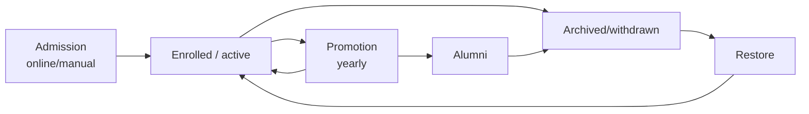

# 05 — Business Process Audit

> End-to-end workflows as implemented. For each: **Actors · Inputs · Outputs · Approvals · Dependencies · Pain points.** State machines quoted from code where visible.

---

## Approval workflow summary (state machines)

| Process | Field | States |
|---------|-------|--------|
| Leave request | `status` | pending → approved / rejected (cancellable while pending) |
| Expense | `status` | draft → submitted → approved / rejected → (voucher) → paid |
| Staff profile change | `status` | pending → approved / rejected |
| Driver change request | `status` | pending → approved / rejected |
| Transport special assignment | `status` | pending → active / cancelled |
| Requisition | `status` | pending → approved → fulfilled / rejected |
| Lesson plan | `submission_status` | draft → submitted → approved / rejected |
| Online admission | `application_status` | pending → under_review → enrolled / rejected / waitlisted |
| Fee concession | `approval_status` | pending → approved / rejected |
| Fee payment plan | `status` | active → compliant / overdue / broken / completed (cron) |
| Salary advance | `status` | pending → approved → active |
| Curriculum design | `status` | processing → processed / failed |

**Pain point (cross-cutting):** approvals are **fragmented** — each lives in its own controller/screen with bespoke status logic. There is **no unified approvals inbox**, no configurable multi-step workflow engine, and no consistent notification on decision.

---

## 1. Student Admission
- **Actors:** Prospective parent (online) or Secretary/Admin (manual); reviewer (Admin/Secretary).
- **Inputs:** Application form (bio, class, guardian), documents.
- **Process:** `online_admissions` (pending → under_review → enrolled/rejected/waitlisted). On enroll: create `Student`, link family (`FamilyLinkingService`), set KNEC number, welcome comms, initial fee posting (`FeePostingService::chargeFeesForNewStudent`).
- **Outputs:** Student record (`status=active`), family link, first invoice, admission SMS/email.
- **Approvals:** Admin review of online applications.
- **Dependencies:** Finance, Communication, Family.
- **Pain points:** No application fee; no document checklist/verification; no offer letter; no intake/cohort entity; waitlist is positional only.

## 2. Student Enrollment / Class Placement
- **Actors:** Secretary/Admin.
- **Inputs:** Class, stream, category, transport/drop-point.
- **Process:** `StudentController::store/update`; assign `classroom_id`/`stream_id`/`category_id`; fee posting reflects placement.
- **Outputs:** Placed student; fees aligned to class structure.
- **Pain points:** Two class-subject sources of truth; placement and fee structure coupling is manual.

## 3. Class Promotion
- **Actors:** Admin.
- **Inputs:** Source class, academic year.
- **Process:** `StudentPromotionController` — bulk promote to `next_class_id` + matched stream, or to alumni (`is_alumni=true`, `alumni_date`). Writes `student_academic_history` (`promoted`/`graduated`/`demoted`). Guard: one promotion per class per year.
- **Outputs:** Updated placements; academic history; alumni cohort.
- **Pain points:** No cohort analytics; demotion/repeat handling thin; no fee-structure auto-rollover validation.

## 4. Attendance
- **Actors:** Class/Subject Teacher (mark); Admin/Secretary (notifications); Parent (recipient).
- **Inputs:** Date, class/stream, present/absent/late + reason codes.
- **Process:** `AttendanceController::mark` (validates school day via `StudentAttendanceCalendarService`); analytics via `AttendanceAnalyticsService`; parent notification rules (`AttendanceNotificationController`, `attendance_recipients`).
- **Outputs:** `attendance` rows; at-risk/consecutive-absence reports; parent alerts.
- **Approvals:** None.
- **Pain points:** Once-per-day in practice (schema supports period-level); no offline marking; no biometric/QR; notifications rule-based, not real-time.

## 5. Assessment & Marks Entry
- **Actors:** Subject Teacher (enter); Academic Admin/Senior Teacher (publish).
- **Inputs:** Exam, class/subject, marks (bulk/matrix), optional competency/CAT scores.
- **Process:** `ExamMarkController` / `ApiAcademicsController` batch + matrix; grading via `GradingScheme`/`GradingBand`; CBC level from %.
- **Outputs:** `exam_marks`; computed grades/levels; feeds report cards.
- **Approvals:** Publish gate (`ExamPublishingController`).
- **Pain points:** CBC competency capture relies on manual JSON; two assessment systems (`assessments` vs `exams`); no moderation workflow; no per-outcome rubric marking.

## 6. Report Card Generation
- **Actors:** Academic Admin/Teacher (generate); Parent/Student (view).
- **Inputs:** Class/term; exam marks, skills, behaviours, remarks, attendance.
- **Process:** `ReportCardBatchService::generateForClass` → `report_cards` (+ CBC JSON) → publish (`public_token`) → PDF (DomPDF). Parent access gated by fee balance (`ReportCardAccessService`).
- **Outputs:** Published report cards, PDF, public links, optional notify.
- **Approvals:** Publish step.
- **Pain points:** Exam-driven body, not official MoE/KICD layout; fee-gating may block legitimate access; no teacher-comment approval chain.

## 7. Fee Billing (Posting)
- **Actors:** Accountant/Finance/Admin.
- **Inputs:** Fee structures + optional/transport/uniform/activity fees, year/term.
- **Process:** `PostingController` → `FeePostingService` with `FeePostingRun` (dry-run preview) + `PostingDiff` (add/update/remove) → `invoices`/`invoice_items`; discounts applied (`DiscountService`).
- **Outputs:** Per-student/term invoices; auditable posting run.
- **Approvals:** Implicit (commit step).
- **Pain points:** Hostel fees not posted; legacy BBF coexists; balance denormalization must stay in sync.

## 8. Fee Collection
- **Actors:** Parent (pay), Accountant/Secretary (record), system (gateways).
- **Inputs:** Cash, M-Pesa STK/C2B, bank transfer, Jenga.
- **Process:** Manual `PaymentController::store`, or STK (`MpesaPaymentController`/`ApiMpesaPaymentController` → webhook), or C2B inbox (`mpesa_c2b_transactions`), or bank import (`BankStatementController`). Receipts via `ReceiptService`/`ReceiptNumberService`.
- **Outputs:** `payments` + `payment_transactions`; receipts; SMS/WhatsApp confirmation.
- **Approvals:** Reconciliation confirm/reject for unmatched transactions.
- **Pain points:** Multiple payment tables; **unauthenticated webhooks**; no automated refund (M-Pesa `refund()` unimplemented).

## 9. Payment Allocation & Reconciliation
- **Actors:** Accountant/Finance.
- **Inputs:** Payment, target invoices/voteheads; bank/C2B unmatched lines.
- **Process:** `PaymentAllocationService` (FIFO, oldest-invoice-first, votehead-level), sibling sharing (`sharePaymentAcrossSiblings`, `ProcessSiblingPaymentsJob`), smart matching (`MpesaSmartMatchingService` + learned matches). `TransactionFixAudit` for corrections.
- **Outputs:** `payment_allocations`; recalculated balances; reconciled transactions; sibling receipts.
- **Approvals:** Confirm/reject/share on `bank_statement_transactions`.
- **Pain points:** Heavy manual reconciliation; JSON split storage; balance recompute concurrency.

## 10. Procurement / Inventory Requests (Requisition)
- **Actors:** Teacher/Staff (raise); approver (Admin/Store); fulfiller.
- **Inputs:** Requisition items, quantities.
- **Process:** `RequisitionController` — pending → approved → fulfilled (creates `InventoryTransaction` out) / rejected.
- **Outputs:** Stock movement; fulfilled requisition.
- **Pain points:** No PO/vendor procurement; no stock valuation; no Store Keeper role.

## 11. Payroll
- **Actors:** HR/Finance.
- **Inputs:** Salary structures, attendance/advances/deductions, period.
- **Process:** `PayrollPeriodController` generate → `PayrollCalculationService` (PAYE/NSSF/NHIF) → `payroll_records` → process → lock → payslips (PDF). Advances repaid via `CustomDeduction`.
- **Outputs:** Payroll records, payslips, salary history.
- **Approvals:** Period lock.
- **Pain points:** No GL posting of payroll expense; statutory remittance not tracked as accounting; period lock ≠ financial close.

## 12. Leave Approval
- **Actors:** Staff (apply); approver (Admin/Secretary or supervisor via `is_my_subordinate`).
- **Inputs:** Leave type, dates, reason.
- **Process:** `LeaveRequestController`/`ApiLeaveRequestController` — pending → approved/rejected; updates `staff_leave_balances`.
- **Outputs:** Leave record; balance adjustment.
- **Pain points:** No leave calendar/cover assignment; single-level approval; balance accrual policy thin.

## 13. Expense Approval & Payment
- **Actors:** Requester; approver; finance (voucher/pay).
- **Process:** `ExpenseWorkflowService::decide()` — draft → submitted → approved/rejected → voucher → paid; `expense_approvals` records decisions; stub `ledger_postings` (EXPENSE/CASH_BANK).
- **Outputs:** Approved expense, payment voucher, payment, basic ledger stub.
- **Pain points:** No budget check/encumbrance; GL is a 2-account stub, not double-entry.

## 14. Transport Assignment & Daily Operations
- **Actors:** Transport admin (assign); Driver (operate); Class Teacher (verify pickup); Parent.
- **Process:** `StudentAssignmentController` assigns students to routes/drop-points; `TransportSpecialAssignment` (pending → active/cancelled) and `DriverChangeRequest` (pending → approved/rejected) handle exceptions; `TripAttendanceController` + `student_daily_pickups` + `teacher/transport/pickups` capture boarding/handover; `DailyTransportListController` prints rosters.
- **Outputs:** Assignments, trips, pickup records, daily lists.
- **Pain points:** No live GPS/ETA; pickup verification basic (no QR/OTP); legacy transport tables.

## 15. Library Borrowing
- **Actors:** Librarian (Admin/Teacher today); Student/Parent.
- **Process:** `BookBorrowingController` — borrow → return/renew; `library_cards`; `library_fines`.
- **Outputs:** Borrowing records, fines.
- **Pain points:** No Librarian role; no overdue automation/notifications; minimal student self-service; no analytics.

## 16. Visitor Management
- **Status:** ❌ **Not implemented.** No visitor module/tables. Security exists only as a demo role.
- **Pain point:** Gap for front-desk/security operations.

## 17. Discipline
- **Actors:** Teacher/Admin.
- **Process:** `student_disciplinary_records` CRUD under student; no case workflow, no merit/demerit, no parent-notification workflow.
- **Pain points:** Records only, not a managed process.

## 18. Communication / Notifications
- **Actors:** Admin/Secretary (compose); system (scheduled/automated); Parent/Staff (recipients).
- **Process:** `CommunicationController` → queued `BulkSendSMS`/`BulkSendEmail`/`BulkSendWhatsAppMessages`; scheduled (`SendScheduledCommunicationsJob`) and automated fee comms (`ProcessScheduledFeeCommunicationsJob`, `SendFeeRemindersJob`); pause/credit-aware (`CommunicationPauseService`); DLR reconciliation; `parent_notification_blocks` for opt-outs.
- **Outputs:** `communication_logs`, delivery status, push (Expo).
- **Pain points:** No two-way chat; push has no deep-link routing; SMS log duplication; webhooks unauthenticated.

## 19. Graduation / Student Exit
- **Actors:** Admin.
- **Process:** Promotion to alumni (`is_alumni`), or archive (`ArchiveStudentService`: `archive=1`, soft-delete related academic/finance records, delete unpaid current-term invoices, `ArchiveAudit`, family archive cascade). Restore via `RestoreStudentService`. Sibling balance transfer (`SiblingBalanceTransferService`) moves archived balances to active sibling.
- **Outputs:** Alumni/archived status; preserved history; transferred balances.
- **Pain points:** Two exit concepts (alumni vs archive) with overlapping semantics; no formal clearance/exit checklist (library, finance, property return).

---

## Lifecycle overview

## Cross-cutting process pain points (carry-forward to future state)
1. **No unified approvals inbox / workflow engine** — every approval is bespoke.
2. **Reconciliation is labor-intensive** — multiple payment rails + manual matching.
3. **No segregation of duties** — broad role bypasses undermine financial controls.
4. **Scheduler reliability** — key automations defined in `Kernel.php` may not run (only `routes/console.php` schedules execute).
5. **No formal clearance/exit checklists** (finance/library/property) for graduation or staff offboarding.
6. **CBC assessment workflow** is exam-shaped, not competency-shaped (see [`06-academic-audit.md`](./06-academic-audit.md)).
