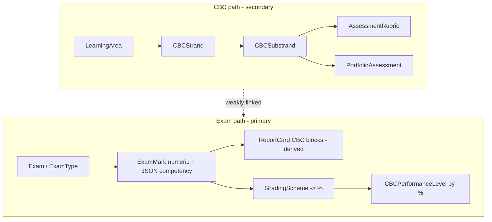

# 06 — Academic System Audit (Kenya CBC/CBE Focus)

> Deep analysis of academic functions vs **Kenya CBC/CBE (KICD)** requirements. Verdict: the system is a **traditional exam-based ERP with a CBC-aware schema and report-card enrichments**, not a competency-assessment-first CBC platform.

---

## 1. Function-by-function status

| Function | Status | Implementation |
|----------|--------|----------------|
| **Admissions** (online + manual) | ✅ EXISTS | `OnlineAdmission` + `StudentController::store`; CBC class ordering (PP1–Grade 9); KNEC assessment number captured |
| **Academic calendar** | ✅ EXISTS | `AcademicYear`, `Term` (open/close, midterm, expected days), `SchoolDay` (auto Kenyan holidays) |
| **Classes/Streams + campus** | ✅ EXISTS | `Classroom` (`campus` lower/upper, `next_class_id`, class teacher), `Stream` (M:N) |
| **Subjects / learning areas** | ✅ EXISTS | `Subject` (`learning_area`), `LearningArea`, KICD rationalized sync (`CbcRationalizedSubjectSyncService`); `subject_groups` **dropped** |
| **Teacher assignment** | ✅ EXISTS | Class teacher (`ClassTeacherAssignment`), subject teacher (`classroom_subjects.staff_id`) |
| **Timetable** | ✅ EXISTS (substitutions ⚠️) | Legacy + optimization + **whole-school generator** (`WholeSchoolGenerator`, `FeasibilityValidator`), slot locks/overrides; substitutions not applied to live published timetables |
| **Attendance** | ✅ EXISTS (period ⚠️) | Daily class marking; schema supports period/subject but unused in practice |
| **Homework / diary** | ✅ EXISTS | `Homework`, `HomeworkDiary` (submit/mark), student & parent diaries |
| **Lesson plans** | ✅ EXISTS (web submit ⚠️) | CBC fields (substrand, core competencies, outcomes); draft→submitted→approved/rejected; review queue; AI assist; submit is mobile-only |
| **Schemes of work** | ✅ EXISTS | Auto-gen from learning areas/strands (`SchemeOfWorkAutoGenerationService`); coverage as JSON arrays |
| **Assessments (formative/summative)** | ⚠️ PARTIAL | Two parallel systems: `Assessment` (numeric, no strand link) + `Exam`/`ExamMark` (primary) |
| **Exams** | ✅ EXISTS | Types/groups/sessions/schedules, bulk+matrix marks, grading schemes/bands, publishing, analytics |
| **CBC: learning areas / strands / sub-strands / competencies / performance levels** | ✅ schema / ⚠️ practice | All tables exist; levels computed from % (codes `E/M/A/B`) |
| **CBC report cards** | ⚠️ PARTIAL | CBC JSON blocks derived from exam marks, not strand-level formative grids |
| **Portfolio assessments** | ✅ EXISTS (optional) | `PortfolioAssessment` with evidence + rubric JSON |
| **Rubrics** | ⚠️ PARTIAL | `AssessmentRubric` tied to substrand; not the main marking instrument |
| **Curriculum designs (PDF + AI)** | ✅ EXISTS | `CurriculumDesign`/`CurriculumPage`/`CurriculumEmbedding`; parse via `CurriculumParsingService` (regex + Smalot PDF), RAG assistant via `CurriculumAssistantController` + `LLMService` |
| **Performance tracking / heatmaps** | ⚠️ PARTIAL | Exam analytics + assessment heatmaps by subject; not strand/competency-level |
| **Report cards** | ✅ EXISTS | Skills, behaviours, remarks, batch, publish, public token, PDF, fee-gated parent access |

---

## 2. CBC/CBE compliance gap analysis

Kenya CBC/CBE (KICD designs, competency assessment, formative + summative, performance levels **E.E./M.E./A.E./B.E.**, learner portfolios, KNEC/national assessment reporting) vs the codebase:

### What aligns reasonably well
1. Curriculum structure tables (`learning_areas`, `cbc_strands`, `cbc_substrands`, `cbc_core_competencies`) linked to lesson plans & schemes.
2. KICD rationalized subject catalogue sync.
3. Portfolio entity with evidence + rubric JSON.
4. Report-card CBC columns (`performance_summary`, `core_competencies`, `learning_areas_performance`, `cat_breakdown`, `portfolio_summary`).
5. Curriculum PDF ingestion + embeddings + RAG assistant.
6. Administrative identifier `students.knec_assessment_number`.

### Specific gaps

| KICD / KNEC expectation | Gap |
|-------------------------|-----|
| **Assess each learning outcome / sub-strand by rubric (E.E./M.E./A.E./B.E.)** | `cbc_performance_levels` use codes `E/M/A/B` computed from **exam percentages** (`CBCPerformanceLevel::getByScore`), not the four-band MoE descriptors applied per outcome |
| **Continuous formative assessment separate from summative** | `assessments` is numeric weekly scores with no `strand_id`/`substrand_id`/`performance_level_id`; no class-wide formative grid per sub-strand |
| **Summative/national assessment (KPSEA/KJSEA) reporting** | No KNEC export/submission workflow — only a number field on the student |
| **Learner portfolio as primary evidence trail** | `PortfolioAssessment` optional; grades & rankings use `ExamMark` first |
| **Official KICD curriculum fidelity** | `CBCCurriculumGeneratorService` uses templates; PDF parse is **regex/heuristic**, not LLM → risk of incomplete/incorrect strand trees |
| **CBC report-card format (areas/strands/competencies/teacher narrative per area)** | Report body is subject score list from exams; CBC sections are aggregated JSON, not strand-level formative tables |
| **Core competencies assessed per task** | `ExamMark.competency_scores` depends on manual JSON during mark entry; no rubric UI per `CBCCoreCompetency` |
| **Rubric-based marking from curriculum** | `AssessmentRubric` populated on parse but not used in `AssessmentController`/`ExamMarkController`/parent views |
| **SBA / CA weighting per KICD** | `Exam.sba_weight`/`is_cat`/`cat_number` exist but weighting is per-school, not KICD-enforced |
| **Lesson observation / TPAD / syllabus coverage %** | Lesson-plan submission analytics only; no school-wide coverage % vs `cbc_substrands` |
| **Period-level competency-lesson attendance** | Daily attendance only in practice |
| **Web lesson-plan submission for supervision** | Web has approve/reject but **no submit route** (submit is mobile API) |
| **Competency-level heatmaps/analytics** | `HeatmapController` uses subject `Assessment.score_percent`, not strands/levels |

---

## 3. Two parallel assessment systems (root cause)

The **exam path drives report cards and rankings**; the **CBC path (strands/rubrics/portfolios) is metadata** that is not the primary grading instrument. True CBC requires the CBC path to be primary, with summative exams as one input.

---

## 4. Recommendations (CBC/CBE strategy)

**Make competency assessment the primary model** (detailed in [`10-future-state.md`](./10-future-state.md) §14):

1. **Outcome-level assessment store:** a `learning_outcome_assessments` table keyed to learner × sub-strand/outcome × occasion, recording a **performance level (E.E./M.E./A.E./B.E.)** + evidence, not a percentage.
2. **Correct performance-level descriptors** to the four MoE bands per outcome; keep numeric exams as a separate summative input.
3. **Formative capture UX:** mobile-first rubric grids per sub-strand (the Staff App teacher flow) feeding portfolios.
4. **Portfolio-first report card** in official CBC layout (learning areas → strands → competencies → teacher narrative), with summative results appended.
5. **Curriculum coverage tracking:** scheme/lesson delivery vs `cbc_substrands` → coverage % reports (KICD pacing).
6. **KNEC/national assessment module:** capture & export KPSEA/KJSEA data; cohort reporting.
7. **LLM-assisted (not regex) curriculum parsing** with human verification, to guarantee strand-tree fidelity to KICD PDFs.
8. **Period/competency-lesson attendance** to support per-lesson competency evidence.
9. **Single assessment system:** retire `assessments` vs `exams` duplication into one assessment engine with `type = formative|summative|national` and consistent strand linkage.

---

## 5. Primary academic tables (reference)
`online_admissions`, `students`, `academic_years`, `terms`, `school_days`, `classrooms`, `streams`, `subjects`, `learning_areas`, `classroom_subjects`, `class_teacher_assignments`, `lesson_plans`, `schemes_of_work`, `homework`, `attendance`, `assessments`, `exams`, `exam_marks`, `grading_schemes`, `grading_bands`, `cbc_strands`, `cbc_substrands`, `cbc_core_competencies`, `cbc_performance_levels`, `portfolio_assessments`, `assessment_rubrics`, `curriculum_designs`, `curriculum_embeddings`, `report_cards`, `report_card_skills`, `timetable_*`.
