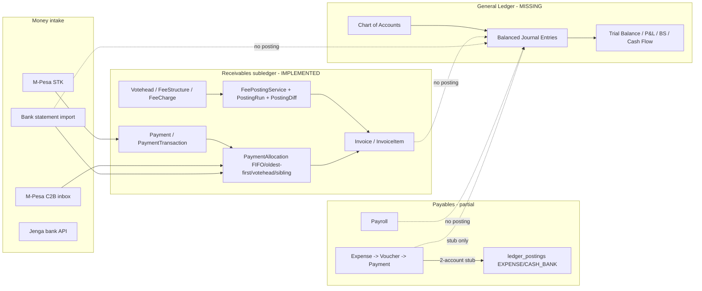

# 07 — Finance System Audit

> Verdict: a **production-grade student billing & collections platform** (receivables subledger) with **expense vouchers** and **payroll** — **not** a double-entry accounting system. The names `Journal`, `LedgerPosting`, `PostingService` refer to **fee billing**, not GL books.

---

## 1. Capability matrix

| Capability | Status | Implementation / Notes |
|------------|--------|------------------------|
| **Voteheads / fee chart** | ✅ Strong | `Votehead`, `VoteheadCategory` (`is_mandatory`, `is_optional`, `is_activity_fee`, `charge_type`, `preferred_term`) |
| **Fee structures** | ✅ Strong | `FeeStructure`, `FeeStructureVersion` (snapshot), `FeeCharge` (votehead+term+amount), per class/year/term/stream/category |
| **Optional fees** | ✅ | `OptionalFee` (billed/exempt), bulk import |
| **Transport fees** | ✅ | `TransportFee`, `TransportFeeRevision`, integrated into posting |
| **Uniform fees** | ✅ | `UniformFeeService` (manual/custom lines) |
| **Activity fees** | ✅ | `ActivityBillingService` from extracurricular enrollment |
| **Swimming fees** | ✅ (separate) | Wallet/ledger model (`swimming_wallets`, `swimming_ledger`), `SWIM-` receipts — **not** standard voteheads |
| **Hostel fees** | ⚠️ Partial | `HostelFee` rate cards only — **not wired** to invoice posting |
| **Invoicing** | ✅ | One invoice per (student, year, term); `InvoiceService::ensure()`; `NumberSeries`/`DocumentNumberService` |
| **Fee posting** | ✅ Strong | `FeePostingService` + `FeePostingRun` + `PostingDiff` (dry-run/commit/reverse, per student+votehead) |
| **Payments (cash/bank/M-Pesa)** | ✅ | `Payment`, `PaymentTransaction`, `MpesaGateway`, `MpesaC2BTransaction` |
| **Jenga (bank)** | ⚠️ Partial | `JengaService` (account inquiry/balance/statement, STK, disbursement) — not a full fee-collection flow |
| **Receipts & numbering** | ✅ | `ReceiptService`, `ReceiptNumberService`, sibling receipt suffixes |
| **Payment allocation** | ✅ Sophisticated | `PaymentAllocationService` (FIFO, BBF-first, term preference), `OldestInvoiceFirstAllocator`, votehead-level, sibling sharing & transfer |
| **Balances & arrears** | ✅ (denormalized) | `invoices.balance/paid_amount`; `Invoice::recalculate()`; `StudentBalanceService`; legacy BBF; clearance snapshots (`StudentTermFeeClearance`) |
| **Credit notes** | ✅ | `CreditNote` + `JournalService` credit + item amount edits |
| **Debit notes** | ✅ | `DebitNote`, import |
| **Discounts / concessions / bursaries** | ✅ | `FeeConcession`, `DiscountTemplate`, `DiscountService` (approval, family/sibling rules) — no dedicated bursary/scholarship tables |
| **Refunds** | ⚠️/❌ | Payment reversal (operational undo) exists; **M-Pesa gateway refund not implemented** |
| **Bank statement import** | ✅ | `BankStatementParser`, `BankStatementController` (import/confirm/reject/share/swimming reclass) |
| **Reconciliation / smart matching** | ✅ (ops-level) | `MpesaSmartMatchingService` (admission/invoice/phone/name + learned), `UnifiedTransactionService`, `TransactionFixAudit` |
| **Expenses & vouchers** | ✅ | `Expense`/`ExpenseLine`/`ExpenseApproval`/`PaymentVoucher`/`ExpensePayment`/`Vendor`, `ExpenseWorkflowService` |
| **Payroll** | ✅ | `SalaryStructure`, `PayrollPeriod` (lock), `PayrollRecord`, `PayslipController`, Kenya PAYE/NSSF/NHIF via `PayrollCalculationService` |
| **Salary advances** | ✅ | `StaffAdvance`, repaid via `CustomDeduction` |
| **Legacy finance import** | ✅ | `LegacyFinanceImportService`, `legacy_statement_*`, BBF imports, fees comparison |
| **Financial audit trail** | ✅ (partial) | `FinancialAuditService`, `finance:audit` command, `transaction_fix_audit`, posting diffs, `AuditLog` |

---

## 2. What's MISSING for a real finance/accounts office

| Capability | Verdict | Why it matters |
|------------|---------|----------------|
| **Chart of Accounts (COA)** | ❌ | Voteheads ≠ COA; only 2 hardcoded codes (`EXPENSE`, `CASH_BANK`) in expense stub |
| **Double-entry GL** | ❌ | Student money is subledger-only; no balanced debit/credit journal engine |
| **Trial balance** | ❌ | — |
| **Profit & Loss / Income statement** | ❌ | — |
| **Balance sheet** | ❌ | — |
| **Cash flow statement** | ❌ | — |
| **Budgeting & budget vs actual** | ❌ | No `Budget` model/tables |
| **Accounting period close/lock** | ❌ | Only payroll **period** lock; no financial-year close |
| **Petty cash** | ❌ | No model/controller |
| **Staff loans (beyond advances)** | ❌ | Only `StaffAdvance` |
| **Fixed assets & depreciation** | ❌ | Inventory is supplies/stock, not a fixed-asset register |
| **Multi-currency** | ❌ | Expense `currency` defaults KES; operations single-currency |
| **Automated refunds (M-Pesa)** | ❌ | `MpesaGateway::refund()` throws "not implemented" |
| **True bank reconciliation to GL** | ⚠️ | Operational matching only; no two-sided journal entries, outstanding-items, book-vs-bank |
| **Comprehensive GL audit trail** | ⚠️ | Strong on payments/transactions, absent for books (no books exist) |
| **Hostel fees on invoices** | ⚠️ | Rates exist, not posted |

---

## 3. Architecture (as-is)

---

## 4. Risks (financial controls)

1. **No segregation of duties** — broad role bypasses (see [`04-role-audit.md`](./04-role-audit.md)) mean Admins can perform end-to-end finance actions without checks.
2. **Unauthenticated payment webhooks** (M-Pesa STK/C2B) — signature/IP verification configured but **not enforced**; replay/forgery risk; full payloads logged.
3. **Denormalized balances** require transactional integrity; reconciliation + `transaction_fix_audit` suggest historical drift.
4. **Multiple payment rails** complicate a single source of truth for "what was paid".
5. **No period close** — historical figures can change retroactively (posting reversals, item edits) with no locked accounting period.
6. **No GL** — the school cannot produce auditable statutory financial statements from the system; finance staff must export and rebuild books externally.

---

## 5. Recommendations (accounting strategy → see [`10-future-state.md`](./10-future-state.md) §15)

1. **Add a real General Ledger** (chart of accounts + balanced `journal_entries`/`journal_lines`) and keep the existing `Invoice`/`Payment`/`PaymentAllocation` model as the **receivables subledger** that *posts into* the GL (not replaces it).
2. **Auto-post** from fees (revenue/receivables), payments (cash/bank), expenses (expense/payables), payroll (salary expense + statutory liabilities), and bank import (cash) — double-entry.
3. **Add budgeting** (budget lines per COA + budget vs actual) and **period close/lock**.
4. **Statutory financial statements:** trial balance, P&L, balance sheet, cash flow.
5. **Petty cash, fixed assets + depreciation, multi-currency** modules.
6. **Unify payment ingestion** into one transactions table + relational allocations (retire JSON splits, dedupe rails).
7. **Complete M-Pesa refunds** and harden webhooks (HMAC/IP allowlist/idempotency).
8. **Wire hostel/mess fees** into invoice posting.
9. **Enforce segregation of duties** with permission-first RBAC (maker/checker on payments, vouchers, journals).
