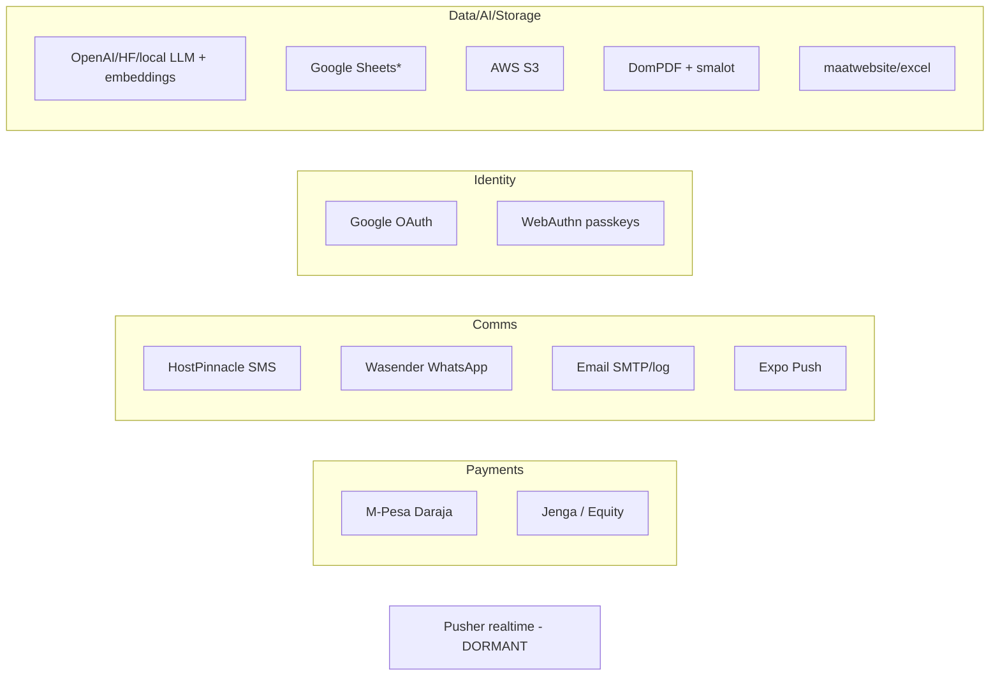

# 08 — Integrations Audit

> Every external integration: **Purpose · Flow · Dependencies · Risks.** Class names and config keys are from the codebase.

---

## Integration map

---

## 1. M-Pesa (Safaricom Daraja)
- **Purpose:** Fee & swimming payments via STK Push; paybill C2B deposits with finance allocation.
- **Flow:** STK: `PaymentService`/`MpesaPaymentController`/`ApiMpesaPaymentController` → `MpesaGateway::initiatePayment()` → callback `/webhooks/payment/mpesa` → `PaymentWebhookController::handleMpesa()` → `Payment` via `PaymentAllocationService` + `ReceiptService`. C2B: `/webhooks/payment/c2b` → `MpesaPaymentController::handleC2BCallback()` → `MpesaC2BTransaction` → smart/manual matching. C2B URL registration via `MpesaGateway::registerC2BUrls()`.
- **Dependencies:** Laravel HTTP client (no SDK). `config/mpesa.php` + `config/services.php`. Env: `MPESA_ENVIRONMENT/CONSUMER_KEY/CONSUMER_SECRET/SHORTCODE/PASSKEY/CALLBACK_URL/VALIDATION_URL/CONFIRMATION_URL/INITIATOR_*/VERIFY_WEBHOOK_IP`.
- **Risks:** 🔴 `verifyWebhookSignature()` always returns `true`; IP verification **not enforced**; webhooks public + full payload logging (PII/financial). C2B handler returns success even on errors (hides failures). `generateSecurityCredential()` is base64 (RSA TODO) → reversal/balance/status may fail in prod. Refund unimplemented. Dual config source.

## 2. Jenga (Equity / Finserve)
- **Purpose:** Bank-side ops for finance: account inquiry, balance, statements, STK/USSD to Equity, disbursements (mobile wallet / internal / RTGS).
- **Flow:** `POST /api/jenga/*` (Sanctum) → `ApiJengaController::authorizeFinance()` (Super Admin/Admin/Secretary/Finance Officer/Accountant) → `JengaService` (Bearer + RSA `Signature`).
- **Dependencies:** HTTP + OpenSSL signing. `config/jenga.php`. Env: `JENGA_ENVIRONMENT/API_KEY/MERCHANT_CODE/CONSUMER_SECRET/PRIVATE_KEY_PATH/*_BASE_URL`.
- **Risks:** 🟠 High-impact disbursement APIs; private key on disk must be secured; token endpoint exposes presence; caller-supplied STK callback URL (no documented in-app handler).

## 3. Google
### 3a. OAuth (Socialite)
- **Purpose:** Link existing staff to Google (no auto-provision).
- **Flow:** Web `/auth/google/redirect` → `SocialAuthController`; Mobile `POST /api/login/google` → `AuthApiController::loginWithGoogle()` validates `id_token` via tokeninfo, checks `aud`.
- **Dependencies:** `laravel/socialite`; `services.google.*`. User fields `google_id`, `google_email`.
- **Risks:** 🟡 Legacy tokeninfo endpoint; account must pre-exist; stateless OAuth on web.
### 3b. Google Sheets fee sync
- **Status:** 🟡 **Non-functional stub.** `GoogleSheetsFeeSyncService` methods are TODOs; `google/apiclient` **not installed**; `config/google_sheets.php` advertises config that does nothing.

## 4. SMS — HostPinnacle
- **Purpose:** Bulk/transactional SMS (reminders, OTP, payment notices, admissions).
- **Flow:** `CommunicationController::sendSMS()` → queued `BulkSendSMS` → `SMSService::sendSMS()` (cURL, `apikey`) → `communication_logs`. DLR: `/webhooks/sms/dlr` → updates logs by provider id.
- **Dependencies:** `services.sms.*` (`SMS_API_URL/API_KEY/USER_ID/PASSWORD/SENDER_ID/SENDER_ID_FINANCE`). Provider URL `smsportal.hostpinnacle.co.ke`.
- **Risks:** 🟡 DLR webhook unauthenticated; sends proceed even if balance check fails; `sms_logs` vs `communication_logs` duplication.

## 5. WhatsApp — Wasender
- **Purpose:** Bulk WhatsApp + inbound logging.
- **Flow:** `BulkSendWhatsAppMessages` → `WhatsAppService::sendMessage()` (`/send-message`); sessions via `WasenderSessionController`; inbound `/webhooks/whatsapp/wasender` → `WhatsAppWebhookController` → `communication_logs`.
- **Dependencies:** `services.wasender.*` (`WASENDER_API_BASE/API_KEY/PERSONAL_ACCESS_TOKEN/WEBHOOK_TOKEN`).
- **Risks:** 🟠 If `WASENDER_WEBHOOK_TOKEN` unset, all webhooks accepted; `sleep()`-based rate limiting; third-party WhatsApp session (ToS/compliance risk).

## 6. Email
- **Purpose:** Templated mail via `EmailService::send()` → `GenericMail`.
- **Dependencies:** Laravel Mail; `config/mail.php` (default `MAIL_MAILER=log`).
- **Risks:** 🟡 Default `log` driver → silent non-delivery if env not set; errors only logged.

## 7. Push — Expo
- **Purpose:** Mobile push (announcements, transport/attendance reminders).
- **Flow:** `ExpoPushService` → `https://exp.host/--/api/v2/push/send`; tokens in `user_device_tokens` (`ApiDeviceTokenController`).
- **Dependencies:** `services.expo.access_token` (optional).
- **Risks:** 🟡 No invalid-token cleanup; announcements broadcast to all tokens (no per-user targeting); **no server-side FCM** integration; no deep-link routing payloads.

## 8. PDF — DomPDF + smalot
- **Purpose:** Receipts, report cards, statements, schemes/lesson plans, expense reports, generated docs (DomPDF); curriculum PDF parsing (smalot).
- **Classes:** `PDFExportService`, `DocumentGeneratorService`, `ReceiptService`, `GeneratePDFJob`; parsing `CurriculumParsingService`.
- **Risks:** 🟠 DomPDF remote/local file access enabled → SSRF/path risk if HTML user-controlled; large PDFs memory-heavy.

## 9. Excel — maatwebsite/excel
- **Purpose:** Imports/exports (students, staff, exams, POS, transport, finance, fees comparison).
- **Classes:** `ExcelExportService`, `app/Exports/*`, `app/Imports/*`, `GenerateExcelJob`, `config/excel.php`.
- **Risks:** 🟡 Some imports run synchronously (timeout/memory); uploaded spreadsheets are a trust boundary.

## 10. AI / LLM — Curriculum Assistant
- **Purpose:** Parse CBC curriculum PDFs, embed (RAG), generate schemes/lessons/assessments.
- **Providers (config-driven):** LLM `openai`/`hf`/`local` (`LLMService`); embeddings `openai`/`hf`/`local` default local (`EmbeddingService`); vector store default `pgvector`; prompts (`PromptTemplateService`).
- **Flow:** upload → `ParseCurriculumDesignJob` → `CurriculumParsingService::parse()` → `CurriculumAssistantController::generate()/chat()`.
- **Dependencies:** `config/curriculum_ai.php` (`OPENAI_API_KEY/MODEL`, `HF_API_KEY`, `EMBEDDING_PROVIDER`, `CURRICULUM_LLM_PROVIDER`, OCR `TESSERACT_PATH`), smalot.
- **Risks:** 🟠 Curriculum/student context sent to 3rd-party LLMs (data governance); API keys in env; `local` provider may be misconfigured; parsing is regex (fidelity risk); permission gate only on some actions.

## 11. AWS S3
- **Purpose:** Object storage — public assets + private docs.
- **Dependencies:** `league/flysystem-aws-s3-v3`; `config/filesystems.php` disks `s3`/`s3_public`/`s3_private`; env `AWS_*`. Helpers `public_storage()`/`private_storage()`; `MigrateFilesToS3` command.
- **Risks:** 🟡 Private visibility on ACL-less buckets relies on bucket policy/CloudFront; `throw=>false` hides upload failures.

## 12. WebAuthn (passkeys)
- **Purpose:** Passwordless staff login.
- **Dependencies:** `laragear/webauthn`; `config/webauthn.php` (`WEBAUTHN_NAME/ID/ORIGINS`); `webauthn_credentials` table.
- **Risks:** 🟡 `WEBAUTHN_ID`/origins must match host; CSRF-exempt WebAuthn JSON posts.

## 13. Pusher (realtime)
- **Status:** 🟡 **Dormant.** Package installed; Echo/Pusher commented out in `bootstrap.js`; `BROADCAST_CONNECTION=log`; only `App.Models.User.{id}` channel; **no `ShouldBroadcast` events.** Not used for SMS/WhatsApp progress (those poll cache).

---

## Risk register (priority)

| Priority | Integration | Issue | Recommendation |
|----------|-------------|-------|----------------|
| 🔴 High | M-Pesa | Webhook signature/IP verification not enforced; verbose logging | Enforce IP allowlist + idempotency; redact logs; implement signature check |
| 🟠 High | Jenga | Powerful disbursement APIs; key on disk | Vault/KMS for key; maker-checker on disbursements; audit every call |
| 🟠 Med | WhatsApp | Webhook open if token unset; ToS | Require token; rate-limit via queue not sleep; consider official WhatsApp Business API |
| 🟠 Med | AI/LLM | Student/curriculum data to 3rd parties | Data-governance policy; on-prem/local option; consent; redact PII |
| 🟠 Med | PDF | DomPDF remote file access | Disable remote; sanitize HTML |
| 🟡 Med | SMS DLR | Unauthenticated webhook | Auth/secret on DLR endpoint |
| 🟡 Low | Google Sheets | Advertised, not implemented | Implement or remove config |
| 🟡 Low | Email | Defaults to `log` | Enforce SMTP in prod; alert on failure |
| 🟡 Low | Pusher | Installed, unused | Wire up for realtime (chat/notifications) or remove |
| 🟡 Low | Expo | No deep-link routing / token cleanup | Add payload routing + invalid-token pruning |

---

## Package reference
| Integration | Package |
|-------------|---------|
| M-Pesa / Jenga | (HTTP; Jenga + OpenSSL) |
| Google OAuth | `laravel/socialite` |
| Google Sheets | (`google/apiclient` — **not installed**) |
| PDF | `barryvdh/laravel-dompdf`, `smalot/pdfparser` |
| Excel | `maatwebsite/excel` |
| WebAuthn | `laragear/webauthn` |
| S3 | `league/flysystem-aws-s3-v3` |
| Realtime | `pusher/pusher-php-server` (unused) |
