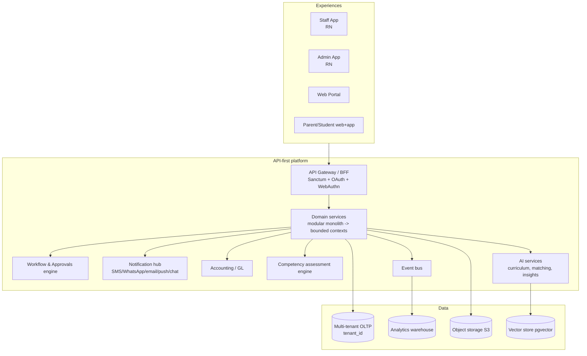

# 10 — Future State Design

> The platform the School ERP **should become**. Not constrained by current implementation. This is the design layer that the Master PRD will turn into requirements.

---

## 1. Platform vision

> **A multi-tenant, API-first, competency-aware School Management Platform for African schools — with real accounting, real-time communication, and intelligence built in.**

- **Multi-tenant SaaS** (today it is single-school): one platform serving many schools/branches, with per-tenant branding, data isolation, and configuration.
- **API-first core** with a clean domain model; web portal, two mobile apps (Staff + Admin — see `docs/app-split/`), and parent/student experiences all consume the same contract.
- **CBC/CBE-native** assessment, **double-entry accounting**, and **analytics** as first-class pillars, not bolt-ons.
- **Composable modules** that schools can switch on/off per their needs and tier.

## 2. Product vision

| Pillar | Outcome |
|--------|---------|
| **Run the school** | One system for academics, finance, HR, transport, and operations — no spreadsheets, no parallel books. |
| **Engage families** | Parents see attendance, results, fees, transport, and chat with teachers in real time. |
| **Empower teachers** | Mobile-first capture (attendance, CBC assessment, lesson plans) that works offline. |
| **Inform leadership** | Board/executive dashboards with trends, risk, finance, and academic performance. |
| **Stay compliant** | CBC/KNEC alignment, statutory accounting & payroll, audit trails. |
| **Be intelligent** | AI for curriculum, communication drafting, payment matching, early-warning, and insights. |

## 3. Recommended modules

**Keep & strengthen:** Admissions, Students/Families, Academics, CBC, Attendance, Exams, Report Cards, Fees/Billing, Payments/Reconciliation, Transport, Library, Inventory, POS, Hostel, Communication, Documents, HR, Payroll, Settings/Branding.

**Add (new):**
- **Accounting / General Ledger** (COA, journals, trial balance, P&L, BS, cash flow, budgets, period close, petty cash, fixed assets).
- **Unified Approvals & Workflow Engine** (configurable multi-step, one inbox).
- **Real-time Chat / Messaging** (parent↔teacher, staff↔staff).
- **Live Transport Tracking** (GPS, ETA, pickup verification).
- **Clinic / Health** (visits, medical records, medication, immunization).
- **Visitor Management & Security** (check-in/out, gate pass, incidents).
- **Discipline & Behavior** (case workflow, merit/demerit).
- **Procurement** (POs, vendors, GRN) on top of inventory.
- **Fixed Assets register**.
- **Analytics & BI** (warehouse + dashboards).
- **Events & Calendar** (full lifecycle, RSVPs).
- **Performance/Appraisals (TPAD)** and **Recruitment/Onboarding**.
- **Learning Resources / LMS-lite** (resources, homework submission, grading).

## 4. Recommended architecture

**Principles:**
1. **Modular monolith → bounded contexts** (Academics, Finance/Accounting, People/HR, Operations, Communication, Platform). Extract to services only if scale demands.
2. **Multi-tenancy** via `tenant_id` (row-level) + per-tenant config/branding; option for DB-per-tenant for large schools.
3. **Server-state via events** (event bus) feeding the analytics warehouse and notifications.
4. **API contract first**; versioned; OpenAPI-documented; one client SDK reused by both mobile apps.
5. **Security by default:** permission-first RBAC, signed/idempotent webhooks, secrets in KMS, full audit trail.
6. **Offline-first mobile** (sync + write queue) for teachers/drivers.

## 5. Recommended roles

A single canonical taxonomy with permission-first RBAC (resolving [`04-role-audit.md`](./04-role-audit.md) issues):

**Governance:** Board Member, Director.
**Executive:** Principal, Deputy Principal.
**Academic leadership:** Head Teacher, Academic Director, Senior Teacher, HoD/Subject Lead.
**Teaching:** Class Teacher, Subject Teacher (as assignments on a Teacher role).
**Finance:** Finance Director, Bursar, Accountant.
**Administration:** Admin, Secretary, Receptionist, HR Officer.
**Operations:** Transport Manager, Driver, Librarian, Store Keeper, Nurse, Security Officer.
**Community:** Parent/Guardian (relationship, not bypass), Student.

With **campus/class scoping**, **maker-checker** on financial actions, and an explicit super-admin bypass only.

## 6. Recommended workflows

- **Unified approvals inbox** + configurable workflow engine (leave, expenses, advances, requisitions/POs, lesson plans/schemes, concessions, admissions, profile changes, transport changes, journals).
- **Maker-checker** for payments, vouchers, journals, disbursements.
- **Clearance checklists** for graduation/exit and staff offboarding (finance, library, property, IT).
- **Curriculum delivery workflow:** scheme → lesson plan → delivery → coverage tracking → portfolio evidence.
- **Early-warning workflows:** attendance/fees/performance thresholds → auto-tasks/notifications.

## 7. Mobile ecosystem
Two apps on a shared core (see `docs/app-split/`): **Staff App** (teachers/parents/students/drivers/self-service) and **Admin App** (management). Offline-first, push deep-linking, real-time chat, biometric login, per-tenant branding.

## 8. Parent ecosystem
A focused **Parent experience** (in Staff App + web): per-child dashboard (attendance, results, fees, transport), **financial portal** (balances, pay now, statements, plans, receipts), **live bus tracking + pickup verification**, **chat with teachers**, permission slips/consent e-sign, report-card access, announcements/circulars with read receipts.

## 9. Teacher ecosystem
Mobile-first teaching cockpit: timetable & next-class, **offline attendance**, **CBC formative capture (rubric grids per sub-strand)**, marks entry, lesson plans & schemes with coverage tracking, homework + submissions, diaries, portfolios, gradebook, requisitions, self-service HR (clock, leave, payslip), supervised reviews for senior teachers.

## 10. Admin ecosystem
Management cockpit: role-aware dashboards, **unified approvals**, registry & HR administration, **finance back-office + GL**, exam/result publishing, fleet/library/inventory/POS/hostel/clinic/visitor management, broadcasting & circulars, documents, analytics & board pack, tenant settings/branding/feature flags.

## 11. Transport ecosystem
Driver app (background GPS, trip start/stop, per-stop boarding scan, incident reporting), parent live map + ETA + arrival alerts, **QR/OTP pickup verification**, route/vehicle management with map editor, utilization analytics, transport fee integration, Transport Manager role.

## 12. Analytics ecosystem
- **Warehouse** fed by domain events; **role dashboards** (board, executive, finance, academic, operations, HR).
- **Leadership pack:** enrollment & retention trends, fee-collection rate + forecast, academic performance trends, attendance/turnover, risk register.
- **CBC analytics:** coverage %, performance-level distribution by strand, portfolio completeness.
- **Financial statements** (post-GL): trial balance, P&L, BS, cash flow, budget vs actual.
- **Self-service report builder** with scheduled delivery; embedded BI.

## 13. AI opportunities
1. **Curriculum intelligence** (LLM-verified KICD parsing; scheme/lesson/assessment generation; rubric suggestions) — extend existing `CurriculumAssistantController`.
2. **Payment matching** — upgrade `MpesaSmartMatchingService` with ML + learned matches for auto-reconciliation.
3. **Early-warning** — predict at-risk learners (attendance/performance/fees) and dropout risk.
4. **Communication drafting** — AI-composed announcements/circulars/reminders with tone/translation (EN/SW).
5. **Report-card narratives** — AI-assisted teacher comments from competency data (human-approved).
6. **Conversational assistants** — parent FAQ bot; admin natural-language analytics ("show fee collection vs last term").
7. **Document intelligence** — auto-extract from uploaded admission/HR docs.
8. **Timetable optimization** — strengthen the existing engine with solver/ML.
> Govern with data-privacy policy, on-prem/local model option, consent, and PII redaction (see [`08-integrations.md`](./08-integrations.md) §10).

## 14. CBC/CBE strategy
Make **competency assessment primary** (from [`06-academic-audit.md`](./06-academic-audit.md)):
1. **Outcome-level assessment store** (learner × sub-strand/outcome × occasion → **E.E./M.E./A.E./B.E.** + evidence).
2. **Correct MoE performance-level descriptors** per outcome; numeric exams become one summative input.
3. **Mobile rubric-grid capture** feeding **learner portfolios** as the primary evidence trail.
4. **Official CBC report-card layout** (learning areas → strands → competencies → narrative) + summative appendix.
5. **Curriculum coverage tracking** vs `cbc_substrands` (KICD pacing) with coverage % reports.
6. **KNEC/national assessment module** (KPSEA/KJSEA capture + export + cohort reporting).
7. **LLM-assisted, human-verified curriculum ingestion** for KICD fidelity.
8. **Single assessment engine** (`type = formative|summative|national`) replacing the `assessments`/`exams` duplication.

## 15. Accounting strategy
Add a **real General Ledger** while keeping the strong receivables subledger (from [`07-finance-audit.md`](./07-finance-audit.md)):
1. **Chart of Accounts** + balanced **journal entries/lines**.
2. **Auto-posting** from fees (revenue/receivables), payments (cash/bank), expenses (expense/payables), payroll (salary expense + statutory liabilities), bank import (cash) — double-entry, idempotent.
3. **Financial statements:** trial balance, P&L, balance sheet, cash flow.
4. **Budgeting** (per COA) + budget vs actual + encumbrance.
5. **Period close/lock**; immutable posted entries; full audit trail.
6. **Petty cash, fixed assets + depreciation, multi-currency**.
7. **Unify payment ingestion** into one transactions model + relational allocations.
8. **Maker-checker** + segregation of duties for all financial actions; **complete M-Pesa refunds**; **harden webhooks**.

---

## Transformation themes (what changes most)
| Theme | From | To |
|-------|------|----|
| Tenancy | Single school | Multi-tenant SaaS |
| Accounting | Receivables subledger | Subledger + real GL + statements |
| CBC | Exam-driven w/ CBC metadata | Competency-first w/ portfolios + KNEC |
| RBAC | Fragmented seeders + bypasses | Canonical permission-first RBAC |
| Approvals | Bespoke per module | Unified inbox + workflow engine |
| Communication | One-way broadcast | + Real-time chat + deep-linked push |
| Transport | Static assignments | Live tracking + verified pickup |
| Analytics | Operational screens | Warehouse + board/exec BI + AI |
| Mobile | One mixed app | Staff + Admin apps on shared core |
| Reliability/Security | Open webhooks, split scheduler, denormalized balances | Hardened, event-driven, derived balances |
