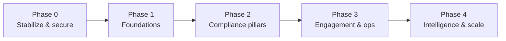

# MASTER ERP AUDIT — PRD Foundation

> **Full Business System Audit of the School ERP Platform.**
> Consolidated foundation for the Master Product Requirements Document governing the next-generation platform.
> Prepared as: Senior ERP Consultant · SMS Architect · Business Analyst · Product Manager · Database Architect · Laravel Architect · React Native Architect.
> Companion: `docs/app-split/` (mobile two-app split design).

---

## 0. Document index

| Phase | Document | Question answered |
|-------|----------|-------------------|
| 1 | [`01-system-overview.md`](./01-system-overview.md) | Purpose, architecture, strengths, weaknesses, tech debt |
| 2 | [`02-module-inventory.md`](./02-module-inventory.md) | Every module: features, screens, APIs, tables, roles, gaps |
| 3 | [`03-database-audit.md`](./03-database-audit.md) | Schema, relationships, normalization, performance |
| 4 | [`04-role-audit.md`](./04-role-audit.md) | Roles, permissions, enforcement, missing roles |
| 5 | [`05-business-processes.md`](./05-business-processes.md) | End-to-end workflows & pain points |
| 6 | [`06-academic-audit.md`](./06-academic-audit.md) | Academics vs CBC/CBE |
| 7 | [`07-finance-audit.md`](./07-finance-audit.md) | Finance vs full accounting |
| 8 | [`08-integrations.md`](./08-integrations.md) | Integrations: flow & risk |
| 9 | [`09-reporting.md`](./09-reporting.md) | Report inventory & gaps |
| 10 | [`10-future-state.md`](./10-future-state.md) | Target platform design |

---

## 1. Executive summary

The School ERP is a **large, mature, single-school (single-tenant) platform** built on **Laravel 12** with a **Blade/AdminLTE web portal** and an **Expo/React Native mobile app**. It is one of the broadest school systems we have audited:

- **235 controllers · 242 models · 502 migrations · 99 services · ~230–260 tables · ~40 web modules · full mobile API.**
- Covers academics, **CBC schema**, finance (receivables), HR/payroll, transport, library, inventory, POS, hostel, swimming, and multi-channel communication.

**The system's true strengths** are its **fee engine** (votehead → structure → auditable posting → line-level allocation with sibling sharing), its **payment ingestion & reconciliation** (M-Pesa C2B + bank import + smart matching), its **whole-school timetable engine**, and its **CBC-aware data model with curriculum-AI ingestion**.

**The system's defining gaps** are structural, not cosmetic:
1. **No double-entry accounting / GL** — it is a billing system, not a finance system.
2. **CBC is schema-deep but exam-driven in practice** — not competency-first; no KNEC reporting.
3. **Fragmented, partially-bypassed RBAC** — no segregation of duties; several org roles missing.
4. **Single-tenant ceiling** — cannot serve multiple schools without re-architecture.
5. **Security & reliability debt** — unauthenticated webhooks, split scheduler, denormalized balances, schema duplication.

**Strategic recommendation:** evolve toward a **multi-tenant, API-first, competency-aware platform with real accounting and analytics** (see [`10-future-state.md`](./10-future-state.md)), delivered via a **shared-core architecture** feeding the web portal and the two mobile apps (`docs/app-split/`).

---

## 2. System at a glance

| Dimension | Reality |
|-----------|---------|
| Backend | Laravel 12, PHP 8.2, Sanctum, Spatie permissions, DomPDF, maatwebsite/excel, S3, Pusher (dormant) |
| Frontend | Web (Blade + AdminLTE + Vite/Bootstrap/Tailwind); Mobile (Expo RN — see `docs/app-split/`) |
| Tenancy | Single school; `campus` enum (lower/upper) only |
| Scale | 235 controllers, 242 models, 502 migrations, 99 services |
| Integrations | M-Pesa, Jenga, HostPinnacle SMS, Wasender WhatsApp, Google OAuth, Expo push, OpenAI/HF LLM, S3, WebAuthn |
| Auth | Password, Google, OTP, biometric/WebAuthn |
| State mgmt (mobile) | React Context + local state (no Redux/Query) |

---

## 3. Consolidated strengths

1. **Functional breadth** — few school domains are entirely absent.
2. **Sophisticated receivables engine** — voteheads, versioned structures, auditable posting (runs + diffs), FIFO/oldest-first/votehead-level allocation, sibling sharing & balance transfer.
3. **Strong payment intake & reconciliation** — M-Pesa STK/C2B, bank import, smart matching with learned matches, transaction-fix audit.
4. **Whole-school timetable engine** with feasibility validation, locks, overrides.
5. **CBC-aware schema** + **curriculum-AI** (PDF ingestion, embeddings, RAG assistant).
6. **Multi-channel communication** with scheduling, automation, pause/credit-awareness, delivery reports.
7. **Operational maturity** — backup/restore, audit/activity logs, financial-audit commands, family-integrity & phone-normalization tooling.
8. **Modern auth** — Sanctum, Google, OTP, WebAuthn passkeys.

## 4. Consolidated weaknesses & risks

| # | Weakness | Severity | Reference |
|---|----------|----------|-----------|
| W1 | No double-entry GL / financial statements / budgets / period close | 🔴 Critical | [07](./07-finance-audit.md) |
| W2 | CBC exam-driven, not competency-first; no KNEC reporting | 🔴 Critical | [06](./06-academic-audit.md) |
| W3 | Fragmented RBAC + broad bypasses; missing org roles; no segregation of duties | 🔴 Critical | [04](./04-role-audit.md) |
| W4 | Single-tenant; no `tenant_id` | 🟠 High | [03](./03-database-audit.md) |
| W5 | Unauthenticated payment/comms webhooks; verbose financial logging | 🔴 High | [08](./08-integrations.md) |
| W6 | Schema duplication (parent triad, payment rails, legacy tables) | 🟠 High | [03](./03-database-audit.md) |
| W7 | Denormalized balances needing hand-sync | 🟠 High | [03](./03-database-audit.md), [07](./07-finance-audit.md) |
| W8 | No unified approvals/workflow engine | 🟠 Medium | [05](./05-business-processes.md) |
| W9 | Reporting gaps for leadership/board (trends, statements, forecasts, compliance) | 🟠 Medium | [09](./09-reporting.md) |
| W10 | Dormant/stubbed features (Pusher, Google Sheets, M-Pesa refund, RSA initiator) | 🟡 Medium | [08](./08-integrations.md) |
| W11 | Split scheduler (`Kernel.php` vs `routes/console.php`) → some automations may not run | 🟠 Medium | [05](./05-business-processes.md) |
| W12 | Missing modules: Accounting, Visitor Mgmt, Clinic, Fixed Assets, Discipline workflow, Procurement | 🟠 Medium | [02](./02-module-inventory.md) |

## 5. Module coverage (one-line verdicts)

✅ Strong: Admissions, Students, Academics, Exams, Report Cards, Fees/Billing, Payments/Reconciliation, Payroll, Timetable, Lesson Plans, Schemes, Communication, Documents, HR, Transport (ex-tracking), POS, Library, Inventory, Hostel, Swimming.
⚠️ Partial: CBC/CBE (schema vs practice), Procurement (requisitions only), Clinic (records only), Events (calendar only), Discipline (records only), Approvals (fragmented).
❌ Missing: Accounting/GL, Visitor Management, Security, Fixed Assets, Realtime Chat, Live Transport Tracking, Analytics/BI, multi-tenancy.

## 6. Roles — current vs target

**Current (seeded, inconsistent):** Super Admin, Director, Admin, Secretary, Academic Administrator, Teacher (+`teacher`), Senior Teacher*, Deputy Senior Teacher, Supervisor, Accountant, Finance Officer, Driver, Parent, Student (+ demo bursar/chef/janitor/security).

**Missing for a full school:** Board Member, Principal, Deputy Principal, Head Teacher, Academic Director, Finance Director, Bursar (core), Receptionist (core), Transport Manager, Nurse, Librarian, Store Keeper, Security Officer, HR Officer.

**Target:** one canonical, permission-first taxonomy with campus/class scoping and maker-checker (see [`10-future-state.md`](./10-future-state.md) §5).

## 7. Future-state pillars (the platform it should become)

1. **Multi-tenant, API-first** platform (one core → web + Staff App + Admin App + parent/student).
2. **Competency-first CBC** with portfolios, correct MoE performance levels, coverage tracking, KNEC module.
3. **Real accounting** (GL + statements + budgets + period close) atop the existing receivables subledger.
4. **Permission-first RBAC** with all org roles and segregation of duties.
5. **Unified approvals & workflow engine.**
6. **Real-time communication** (chat + deep-linked push) + multi-channel.
7. **Live transport tracking** + verified pickup.
8. **Analytics & BI** (warehouse + board/exec dashboards) + **AI** (curriculum, matching, early-warning, drafting).
9. **New modules:** Clinic, Visitor/Security, Fixed Assets, Procurement, Discipline workflow, LMS-lite.
10. **Hardened & reliable:** signed/idempotent webhooks, event-driven derived balances, consolidated schema, unified scheduler.

## 8. Recommended PRD roadmap (phasing)

| Phase | Theme | Key initiatives |
|-------|-------|-----------------|
| **0 — Stabilize & secure** | Risk reduction | Harden webhooks (HMAC/IP/idempotency); fix scheduler; consolidate RBAC seeders to one canonical source; redact financial logs; resolve case-duplicate roles |
| **1 — Foundations** | Architecture | Introduce `tenant_id` (or DB-per-tenant) plan; permission-first RBAC + missing roles; unify payment ingestion; make balances derived; shared mobile core (`docs/app-split/`) |
| **2 — Compliance pillars** | Finance + CBC | General Ledger + financial statements + budgets + period close; competency-first CBC (outcome store, portfolios, MoE levels, KNEC); coverage tracking |
| **3 — Engagement & ops** | Experience | Unified approvals/workflow engine; real-time chat + push deep-linking; live transport tracking + pickup verification; parent financial portal; Clinic, Visitor/Security, Discipline, Procurement, Fixed Assets |
| **4 — Intelligence & scale** | Differentiation | Analytics warehouse + board/exec BI; AI (curriculum, matching, early-warning, drafting); multi-tenant GA; LMS-lite; i18n (EN/SW) |

> Mobile delivery (Staff App refactor → Admin App build → shared system → advanced features → Play Store) is specified in `docs/app-split/07-implementation-roadmap.md` and runs in parallel with Phases 1–3.

## 9. Top 10 PRD priorities (board-ready)

1. **General Ledger & financial statements** (close the accounting gap; statutory + board reporting).
2. **Competency-first CBC + KNEC reporting** (curriculum compliance).
3. **Canonical permission-first RBAC + missing roles + segregation of duties** (control & security).
4. **Webhook & data security hardening** (financial integrity).
5. **Multi-tenancy** (growth/SaaS enablement).
6. **Unified approvals & workflow engine** (operational efficiency).
7. **Real-time chat + deep-linked push + parent financial portal** (family engagement).
8. **Live transport tracking + verified pickup** (safety differentiator).
9. **Analytics/BI + leadership/board dashboards** (decision support).
10. **Schema consolidation + derived balances + unified scheduler** (reliability/tech-debt).

## 10. Assumptions, scope & verification notes

- **Audit basis:** static analysis of the Laravel codebase (routes, controllers, models, migrations, services, configs, seeders) + the prior mobile-app audit (`docs/app-split/`). No runtime/database inspection was performed.
- **Verification recommended before remediation:** confirm physical schema (`SHOW TABLES`/`schema:dump`) since many tables/columns are conditionally created/dropped across 502 migrations; confirm which seeders are actually run in production (RBAC is run-order-dependent); confirm which `Kernel.php` schedules execute.
- **Out of scope here:** code-level remediation (this is a consultant/architect deliverable; "do not write code"). Implementation plans live in the future-state and roadmap sections and in `docs/app-split/`.
- This document set is the **foundation for the Master PRD**: each weakness/gap maps to a requirement, and each future-state pillar maps to an epic.
